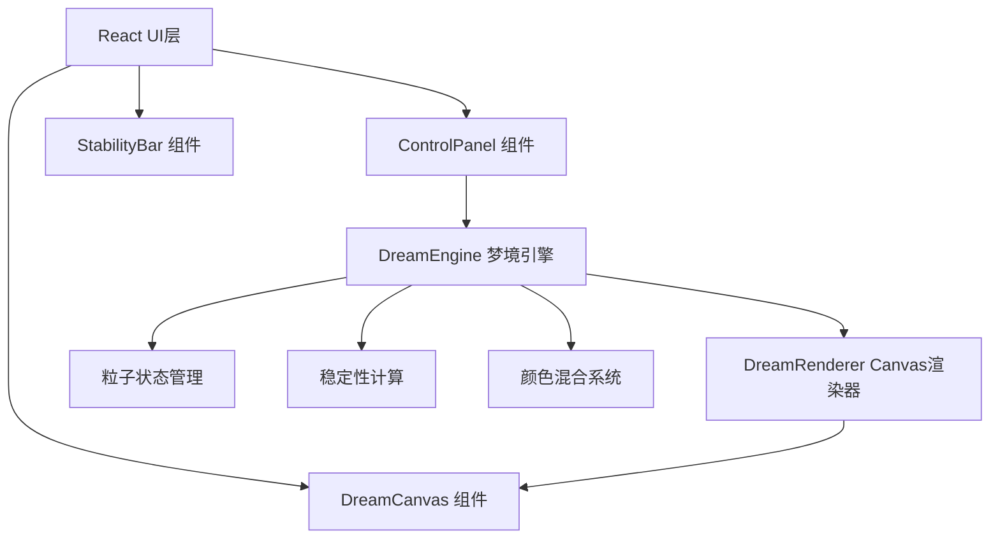

## 1. 架构设计



## 2. 技术描述

- **前端框架**：React 18 + TypeScript
- **构建工具**：Vite
- **渲染技术**：Canvas 2D API
- **状态管理**：React useState/useRef
- **样式方案**：原生CSS + CSS变量

**项目初始化**：Vite + React + TypeScript 模板

## 3. 文件结构与数据流向

### 3.1 文件结构

```
src/
├── dreamEngine.ts      # 梦境粒子系统状态管理
├── dreamRenderer.ts    # Canvas粒子渲染器
├── controlPanel.tsx   # 控制面板React组件
├── App.tsx           # 主应用组件
├── main.tsx          # 入口文件
└── index.css         # 全局样式
```

### 3.2 数据流向

1. **ControlPanel → DreamEngine**：用户交互事件 → 更新频率/颜色参数
2. **DreamEngine → DreamRenderer**：粒子位置、大小、透明度数组
3. **DreamRenderer → Canvas**：调用Canvas API渲染粒子
4. **DreamEngine → StabilityBar**：稳定性数值
5. **DreamRenderer → Performance**：帧率反馈

## 4. 核心模块说明

### 4.1 DreamEngine (dreamEngine.ts)

**职责**：梦境粒子系统的状态管理

**输入**：
- Alpha波频率 (8-12Hz)
- Theta波频率 (4-8Hz)
- Delta波频率 (0.5-4Hz)
- 颜色参数

**输出**：
- 粒子数组（位置、大小、透明度、颜色）
- 稳定性数值
- 帧率数据

**核心功能**：
- 粒子生成与生命管理
- 粒子运动物理（随机游走）
- 颜色混合计算
- 稳定性计算
- 破裂效果触发

### 4.2 DreamRenderer (dreamRenderer.ts)

**职责**：Canvas粒子渲染

**输入**：DreamEngine提供的粒子数据
**输出**：Canvas渲染结果、帧率数据

**核心功能**：
- 每帧渲染粒子
- 粒子外观绘制（颜色渐变、透明度脉动）
- 背景微光效果
- 光晕效果
- 梦境崩塌效果

### 4.3 ControlPanel (controlPanel.tsx)

**职责**：用户交互控制面板

**输入**：当前频率参数
**输出**：更新后的频率参数

**核心功能**：
- 三个频率滑块（Alpha/Theta/Delta）
- 数值显示
- 工具提示
- 开始/停止按钮
- 响应式折叠面板

### 4.4 StabilityBar (组件)

**职责**：稳定性指示条

**输入**：稳定性数值 (0-100%)
**输出**：可视化指示条 + 百分比文字

## 5. 性能约束

- Canvas渲染帧率稳定在60FPS
- 粒子数上限150个
- 单帧渲染耗时不超过10ms
- 频率调节滑块响应延迟小于50ms

## 6. 技术要点

1. 使用requestAnimationFrame进行动画循环
2. 使用useRef管理Canvas和引擎实例避免重渲染
3. 粒子对象池优化内存分配
4. 离屏canvas优化渲染性能
5. 防抖处理移动端触摸事件
