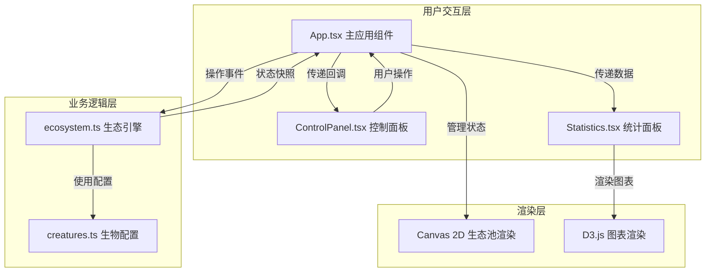

## 1. 架构设计



**文件调用关系和数据流向**：

1. [creatures.ts](file:///d:/Pro/tasks/auto66/src/creatures.ts) → 被 [ecosystem.ts](file:///d:/Pro/tasks/auto66/src/ecosystem.ts) 导入
   - 提供生物类型定义、属性配置、视觉参数

2. [ecosystem.ts](file:///d:/Pro/tasks/auto66/src/ecosystem.ts) → 被 [App.tsx](file:///d:/Pro/tasks/auto66/src/App.tsx) 调用
   - 接收用户操作事件（添加生物、更新参数、重置）
   - 每帧更新生物状态（位置、能量、繁殖、死亡）
   - 输出状态快照给App.tsx用于渲染

3. [ControlPanel.tsx](file:///d:/Pro/tasks/auto66/src/ControlPanel.tsx) → 被 [App.tsx](file:///d:/Pro/tasks/auto66/src/App.tsx) 导入
   - 用户操作通过回调函数传递给App.tsx
   - App.tsx再调用ecosystem.ts的方法

4. [Statistics.tsx](file:///d:/Pro/tasks/auto66/src/Statistics.tsx) → 被 [App.tsx](file:///d:/Pro/tasks/auto66/src/App.tsx) 导入
   - 从App.tsx接收生态状态数据
   - 使用D3绘制种群数量曲线图

**数据流向总览**：
```
用户操作 → ControlPanel → App.tsx → ecosystem.ts → 状态更新 → 
App.tsx → [Canvas渲染 + Statistics图表]
```

## 2. 技术描述

- **前端框架**：React 18 + TypeScript 5 + Vite 5
- **构建工具**：Vite 5 + @vitejs/plugin-react
- **状态管理**：React useState + useRef（生态引擎实例）+ requestAnimationFrame循环
- **渲染技术**：Canvas 2D API（生态池）、D3.js v7（统计图表）
- **辅助库**：uuid（生物唯一标识）
- **CSS方案**：原生CSS + CSS变量，不使用Tailwind（根据用户具体需求）
- **后端**：无，纯前端应用

## 3. 技术选型说明

| 技术 | 选型理由 |
|------|----------|
| Canvas 2D | 相比DOM元素，Canvas渲染数百个移动对象时性能更优，支持发光效果和粒子拖影 |
| D3.js | 强大的SVG图表库，支持实时折线图、渐变填充、动画过渡 |
| uuid | 生成生物唯一标识符，便于追踪和日志记录 |
| requestAnimationFrame | 确保60fps流畅动画，与浏览器刷新率同步 |
| Web Workers（可选） | 可将生态引擎逻辑移至Worker，避免阻塞主线程（500+生物时） |

## 4. 核心数据结构

### 4.1 生物实体 (Creature)

```typescript
interface Creature {
  id: string;
  type: 'producer' | 'consumer' | 'decomposer';
  x: number;
  y: number;
  targetX: number;
  targetY: number;
  energy: number;
  speed: number;
  rotation: number;
  isAlive: boolean;
  deathTime: number | null;
  trail: { x: number; y: number; alpha: number }[];
}
```

### 4.2 粒子特效 (Particle)

```typescript
interface Particle {
  id: string;
  x: number;
  y: number;
  vx: number;
  vy: number;
  radius: number;
  color: string;
  alpha: number;
  life: number;
  maxLife: number;
}
```

### 4.3 生态状态快照 (EcosystemSnapshot)

```typescript
interface EcosystemSnapshot {
  creatures: Creature[];
  corpses: Creature[];
  particles: Particle[];
  stats: {
    producerCount: number;
    consumerCount: number;
    decomposerCount: number;
    corpseCount: number;
    totalEnergy: number;
  };
  events: LogEvent[];
}
```

### 4.4 日志事件 (LogEvent)

```typescript
interface LogEvent {
  id: string;
  timestamp: number;
  message: string;
  type: 'eat' | 'decompose' | 'reproduce' | 'death';
}
```

### 4.5 生态参数 (EcosystemParams)

```typescript
interface EcosystemParams {
  poolWidth: number;
  poolHeight: number;
  energyDecayRate: number;
  reproductionThresholdMultiplier: number;
  movementSpeedMultiplier: number;
}
```

## 5. 核心算法

### 5.1 生物AI行为

| 生物类型 | 行为逻辑 |
|---------|----------|
| 生产者 | 原地缓慢旋转，每2秒能量+5，不移动 |
| 消费者 | 寻找最近生产者，距离<50像素时吞噬并获取能量 |
| 分解者 | 寻找最近尸体，接触时分解尸体获取能量 |

### 5.2 碰撞检测

- 使用欧几里得距离计算生物间距离
- 空间分区优化：将生态池划分为网格，只检测相邻网格内的生物

### 5.3 繁殖与死亡

- 能量超过繁殖阈值时分裂，能量减半传递给子代
- 能量低于0时变为尸体，5秒后完全消失
- 分裂时产生圆形扩散粒子特效

### 5.4 性能优化

- 生物数量400-500时粒子拖影长度减半，特效数量减半
- 统计图表使用节流，每秒更新一次
- requestAnimationFrame中只做状态更新和渲染，不做复杂计算

## 6. 项目文件结构

```
d:\Pro\tasks\auto66\
├── .trae\documents\
│   ├── PRD_数字生态模拟器.md
│   └── 技术架构_数字生态模拟器.md
├── package.json
├── vite.config.js
├── tsconfig.json
├── index.html
└── src\
    ├── App.tsx              # 主应用组件，状态管理，Canvas渲染
    ├── ecosystem.ts         # 生态引擎，生物AI，碰撞检测，能量流动
    ├── creatures.ts         # 生物类型定义，属性配置
    ├── ControlPanel.tsx     # 用户控制面板
    ├── Statistics.tsx       # 统计面板，D3图表
    └── index.css            # 全局样式
```

## 7. 性能预算

| 资源 | 预算 |
|------|------|
| 首屏JS体积 | < 300KB gzipped |
| 生物数量上限 | 500个 |
| 帧率 | 60fps（≤400生物），30-60fps（400-500生物）|
| 内存占用 | < 200MB |
| 主线程阻塞 | 单帧处理时间 < 16ms |
