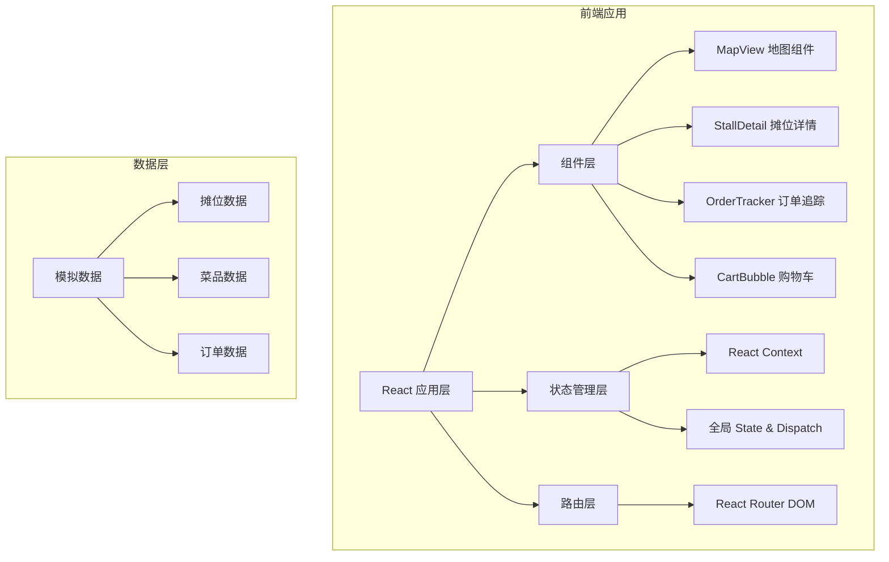

# 街头美食市集商户入驻与订单聚合系统 技术架构文档

## 1. 架构设计



## 2. 技术选型

- **前端框架**：React 18 + TypeScript
- **构建工具**：Vite 5 + @vitejs/plugin-react
- **路由管理**：react-router-dom 6
- **状态管理**：React Context + useReducer
- **唯一ID生成**：uuid
- **样式方案**：CSS Modules / 内联样式（动画用CSS keyframes）

## 3. 路由定义

| 路由路径 | 页面组件 | 用途说明 |
|-----------|----------|----------|
| `/` | MapView | 首页市集地图 |
| `/stall/:id` | StallDetail | 摊位详情页 |
| `/orders` | OrderTracker | 订单追踪列表页 |

## 4. 数据模型

### 4.1 类型定义

```typescript
// 摊位类型
interface Stall {
  id: string;
  name: string;
  cuisine: string;
  cuisineColor: string;
  waitTime: number;
  position: { x: number; y: number };
  description: string;
}

// 菜品类型
interface MenuItem {
  id: string;
  stallId: string;
  name: string;
  price: number;
  description: string;
  image: string;
  stock: number;
  stockStatus: '充足' | '紧张' | '售罄';
}

// 购物车项
interface CartItem {
  menuItemId: string;
  stallId: string;
  name: string;
  price: number;
  quantity: number;
  image: string;
}

// 订单状态枚举
enum OrderStatus {
  PLACED = '已下单',
  PREPARING = '制作中',
  READY = '已完成',
  PICKED_UP = '已取餐'
}

// 订单类型
interface Order {
  id: string;
  stallId: string;
  items: CartItem[];
  totalPrice: number;
  status: OrderStatus;
  createdAt: Date;
}
```

### 4.2 数据结构设计

- 10个摊位，每个摊位6-8道菜品
- 初始库存随机分配（充足/紧张/售罄）
- 初始订单示例数据

## 5. 项目文件结构

```
d:\Pro\tasks\auto67/
├── package.json
├── vite.config.js
├── tsconfig.json
├── index.html
└── src/
    ├── types.ts          # 类型定义
    ├── data.ts           # 模拟数据
    ├── App.tsx           # 主应用组件
    └── components/
        ├── MapView.tsx       # 首页地图组件
        ├── StallDetail.tsx   # 摊位详情组件
        ├── OrderTracker.tsx  # 订单追踪组件
        └── CartBubble.tsx    # 购物车气泡组件
```

## 6. 性能指标

- 订单状态轮询间隔：3秒
- 购物车操作响应时间：≤ 100ms
- 动画帧率：60fps
- 首屏加载时间：优化资源加载

## 7. 核心交互实现

### 7.1 动画实现
- CSS transitions 用于基础过渡
- CSS @keyframes 用于复杂动画（弹跳、脉冲、浮动）
- React 状态驱动动画触发

### 7.2 状态管理
- 使用 React Context 提供全局状态
- useReducer 管理复杂状态变更
- 购物车、订单列表为全局共享状态
