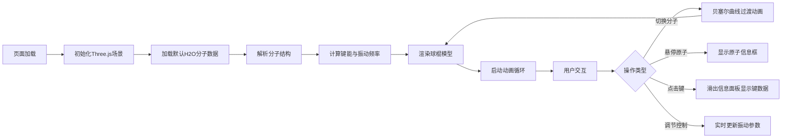

## 1. 产品概述

化学分子结构与键能交互可视化应用，为化学学习者和研究者提供沉浸式三维分子模型展示与键能数据分析工具。通过直观的球棍模型、实时振动动画和键能数据面板，帮助用户理解分子空间结构与化学键特性。

- **核心价值**：将抽象的分子结构和化学键概念转化为可交互的三维可视化体验
- **目标用户**：化学专业学生、教师、科研人员及化学爱好者
- **技术亮点**：Three.js三维渲染、实时键能计算、正弦波振动模拟、事件驱动架构

## 2. 核心功能

### 2.1 功能模块

1. **分子渲染模块**：三维球棍模型渲染、OrbitControls交互、自适应缩放
2. **数据交互模块**：分子结构解析、键能计算、振动频率生成
3. **用户交互模块**：分子切换、原子悬停、键点击、全局控制
4. **动画模块**：分子切换贝塞尔过渡、原子振动动画、UI面板滑入滑出

### 2.2 页面详情

| 页面名称 | 模块名称 | 功能描述 |
|-----------|-------------|---------------------|
| 主页面 | 3D场景区域 | 全屏展示分子球棍模型，支持旋转、缩放、平移交互 |
| 主页面 | 左侧工具栏 | 分子选择下拉菜单，快速切换H2O、CO2、CH4分子 |
| 主页面 | 右侧信息面板 | 显示选中键的详细数据（键型、键长、键能、振动频率） |
| 主页面 | 顶部控制栏 | 振动幅度滑块、振动动画开关按钮 |
| 主页面 | 原子悬停提示 | 显示原子类型和笛卡尔坐标 |
| 主页面 | 波形图 | 实时绘制键伸缩振动的正弦波形 |

## 3. 核心流程

## 4. 用户界面设计

### 4.1 设计风格

- **主色调**：深色科技风，主背景#1a1a2e，面板背景#16213e
- **文字颜色**：浅灰色#e0e0e0，高亮色#0f3460，强调色#e94560
- **原子颜色**：CPK标准配色（碳灰、氧红、氮蓝、氢白）
- **按钮样式**：悬浮上浮效果（translateY(-1px)，150ms过渡）
- **字体**：system-ui字体栈
- **圆角**：面板10px内边距，文本框5px圆角

### 4.2 页面设计概述

| 页面区域 | 模块名称 | UI元素 |
|-----------|-------------|-------------|
| 中央区域 | 3D场景 | 径向渐变深灰到黑色背景、球棍模型、环境光+双色方向光 |
| 左侧边缘 | 工具栏 | 50px宽垂直栏、分子下拉选择器、图标按钮 |
| 右侧边缘 | 信息面板 | 300px宽固定面板、键数据列表、200x80波形Canvas |
| 顶部边缘 | 控制栏 | 50px高渐变栏、范围滑块、开关按钮 |
| 原子上方 | 悬停提示 | 半透明白色背景文本框、黑色12px文字 |

### 4.3 响应式设计

- **桌面端（≥768px）**：右侧信息面板固定宽度300px，从右侧滑入
- **移动端（<768px）**：右侧面板变为底部抽屉，高度自适应，从底部滑入；工具栏变为全宽横向滚动栏（40px高）
- **触摸优化**：增大点击区域，支持触摸旋转缩放

### 4.4 3D场景指导

- **环境**：深灰到黑色径向渐变背景，营造太空/科技氛围
- **光照**：白色环境光 + 左上角暖色方向光 + 右下角冷色方向光，突出分子立体感
- **相机**：PerspectiveCamera，初始距离5，视场角75度
- **材质**：MeshPhongMaterial带光泽，原子高光明显，键半透明
- **后处理**：原子悬停时加法混合发光效果（强度0.3）
- **动画**：分子切换贝塞尔曲线飞行（1.5秒），原子正弦波伸缩振动

## 5. 性能指标

- **帧率**：稳定30fps以上
- **交互延迟**：鼠标响应<50ms
- **动画流畅度**：分子切换无卡顿，60fps过渡动画
- **内存管理**：切换分子时正确清理Three.js对象
