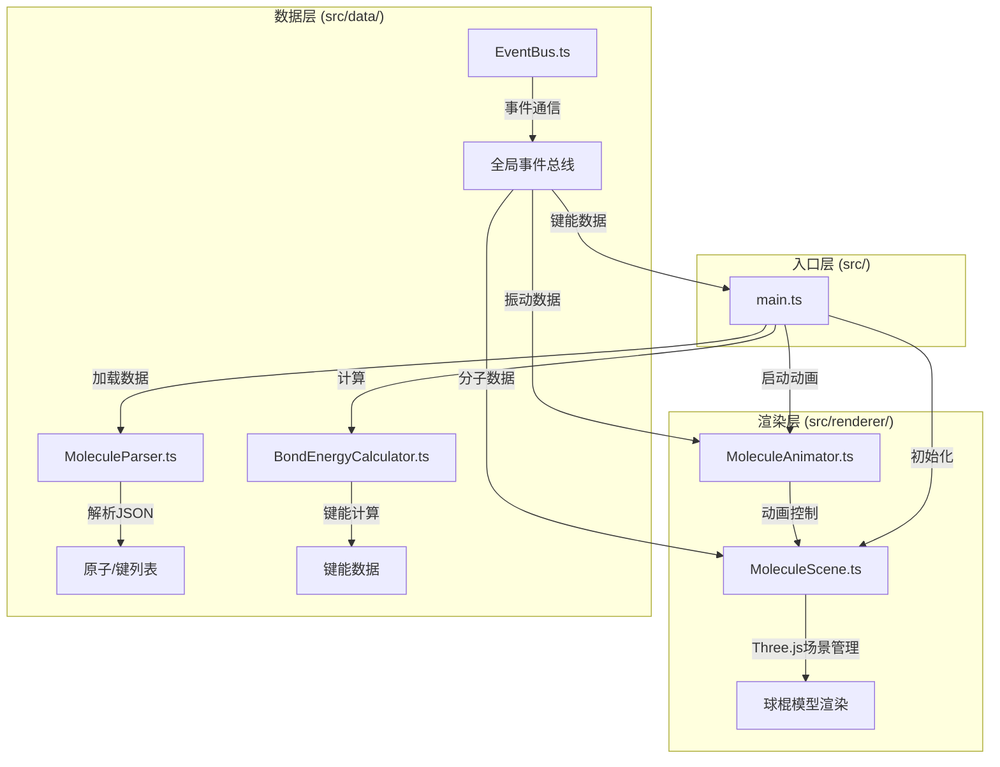

## 1. 架构设计



## 2. 技术描述

- **前端框架**：原生TypeScript + Three.js（无React/Vue，按用户要求）
- **构建工具**：Vite 5.x，支持ES模块和TypeScript
- **三维渲染**：Three.js 0.160.x，OrbitControls交互
- **事件系统**：EventEmitter3，模块间异步通信
- **UI层**：原生HTML/CSS，深色主题，响应式设计
- **数据格式**：内置JSON分子结构数据（H2O、CO2、CH4）

## 3. 目录结构

```
auto68/
├── package.json
├── vite.config.js
├── tsconfig.json
├── index.html
├── public/
│   └── molecules/
│       ├── h2o.json
│       ├── co2.json
│       └── ch4.json
└── src/
    ├── main.ts
    ├── renderer/
    │   ├── MoleculeScene.ts
    │   └── MoleculeAnimator.ts
    ├── data/
    │   ├── MoleculeParser.ts
    │   ├── BondEnergyCalculator.ts
    │   └── EventBus.ts
    └── styles/
        └── main.css
```

## 4. 核心数据结构

### 4.1 分子结构JSON格式
```typescript
interface MoleculeData {
  name: string;
  atoms: Array<{
    id: string;
    element: string;      // 'H', 'C', 'N', 'O' 等
    position: [number, number, number];  // x, y, z 坐标（埃）
  }>;
  bonds: Array<{
    id: string;
    atom1: string;       // 原子id
    atom2: string;       // 原子id
    bondOrder: number;   // 1=单键, 2=双键, 3=三键
  }>;
}
```

### 4.2 键能数据结构
```typescript
interface BondEnergyData {
  bondId: string;
  bondType: 'single' | 'double' | 'triple';
  bondLength: number;      // 埃
  bondEnergy: number;      // kJ/mol
  frequency: number;       // cm⁻¹
  atoms: [string, string];
}
```

### 4.3 振动数据结构
```typescript
interface VibrationData {
  bondId: string;
  amplitude: number;       // 埃
  frequency: number;       // 弧度/秒
  phase: number;
}
```

## 5. 核心类设计

### 5.1 EventBus (单例)
```typescript
// 事件类型
' molecule:loaded' → MoleculeData
' molecule:change' → string (分子名称)
' bond:selected' → string (bondId)
' atom:hover' → {atomId: string, position: Vector3} | null
' vibration:amplitude' → number
' vibration:toggle' → boolean
' bond:energy:calculated' → BondEnergyData[]
' transition:start' | 'transition:end'
```

### 5.2 MoleculeScene 核心方法
- `init(container: HTMLElement)`: 初始化场景、相机、灯光
- `loadMolecule(data: MoleculeData)`: 渲染新分子
- `transitionToMolecule(data: MoleculeData, duration: number)`: 贝塞尔过渡
- `getIntersectedAtom(event: MouseEvent)`: 射线检测原子
- `getIntersectedBond(event: MouseEvent)`: 射线检测键
- `highlightAtom(atomId: string | null)`: 原子高亮/发光
- `updateAtomPositions(positions: Map<string, Vector3>)`: 动画更新位置

### 5.3 MoleculeAnimator 核心方法
- `start()`: 启动动画循环
- `stop()`: 停止动画循环
- `setAmplitude(amp: number)`: 设置振动幅度
- `setVibrationData(data: VibrationData[])`: 设置振动参数
- `update(deltaTime: number)`: 每帧更新原子位置

### 5.4 BondEnergyCalculator 核心公式
- **键长计算**：三维空间两点距离公式
- **键能经验公式**：E = k × (r₀ / r)² × bondOrder，其中k为元素特性常数
- **振动频率**：ν = (1/(2πc)) × √(k/μ)，μ为约化质量

## 6. 预置分子数据

### H2O (水)
- 键角：104.5°
- 键长：0.957埃
- 原子：O(0,0,0), H(0.957,0,0), H(-0.239,0.927,0)

### CO2 (二氧化碳)
- 线型分子，键角180°
- 键长：1.163埃（C=O双键）
- 原子：O(-1.163,0,0), C(0,0,0), O(1.163,0,0)

### CH4 (甲烷)
- 正四面体结构
- 键长：1.087埃
- 键角：109.47°

## 7. CPK原子配色

| 元素 | 颜色 | 半径 |
|------|------|------|
| H (氢) | #FFFFFF | 0.2 |
| C (碳) | #909090 | 0.3 |
| N (氮) | #3050F8 | 0.3 |
| O (氧) | #FF0D0D | 0.3 |

## 8. 性能优化策略

1. **对象池复用**：切换分子时复用Mesh和Geometry对象，避免频繁GC
2. **射线检测优化**：限制检测频率，使用空间分区
3. **动画帧率控制**：使用requestAnimationFrame，时间增量计算
4. **CSS硬件加速**：UI面板使用transform动画，触发GPU合成
5. **事件节流**：鼠标移动事件节流，减少计算频率
