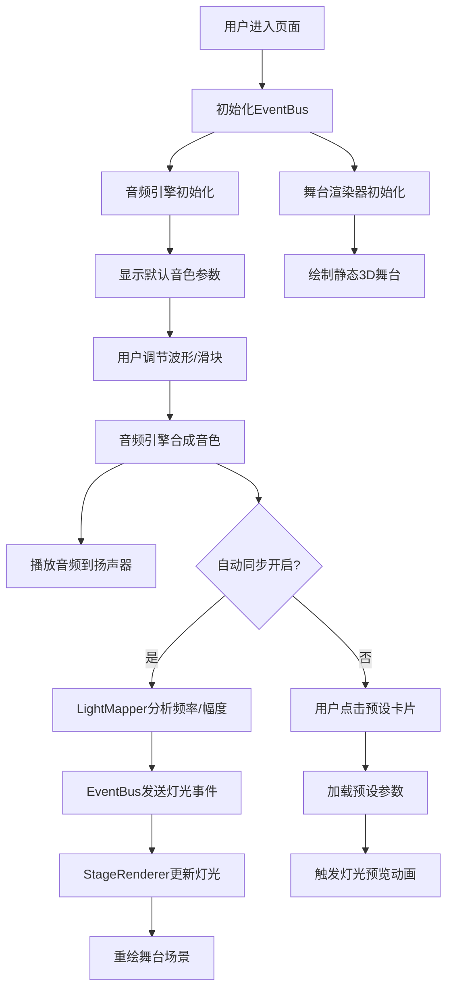

## 1. 产品概述

线上互动音色调节与灯光同步演示应用，为独立音乐人提供浏览器端的虚拟乐器音色调节和舞台灯光同步可视化体验。观众可实时调整音色参数，观看3D舞台灯光随音乐动态变化。

- 核心目标：打造沉浸式音乐互动体验，让用户直观感受音色参数与视觉效果的关联
- 目标用户：独立音乐人、音乐爱好者、虚拟演出观众
- 市场价值：降低虚拟演出技术门槛，提供可直接在浏览器运行的互动演示方案

## 2. 核心功能

### 2.1 用户角色
| 角色 | 注册方式 | 核心权限 |
|------|----------|----------|
| 普通用户 | 无需注册，直接访问 | 调节音色参数、选择预设、观看灯光同步效果 |

### 2.2 功能模块
1. **音色合成面板**：波形选择、频率调节、包络控制、滤波器调节
2. **灯光同步系统**：音频频率分析、频段映射、动态灯光过渡
3. **3D舞台渲染**：透视舞台绘制、聚光灯效果、粒子系统
4. **预设音色管理**：预设卡片展示、一键加载、灯光预览动画

### 2.3 页面详情
| 页面名称 | 模块名称 | 功能描述 |
|----------|----------|----------|
| 主页面 | 音色合成面板 | 三种波形选择按钮、四个参数滑块、自动同步开关 |
| 主页面 | 舞台渲染区域 | Canvas绘制透视舞台、三盏聚光灯、地面网格、粒子特效 |
| 主页面 | 预设音色列表 | 三种预设卡片，点击加载参数并触发灯光预览 |

## 3. 核心流程

用户进入页面后，音色合成面板展示默认参数，舞台区域渲染静态3D场景。用户可通过波形按钮和滑块调整音色参数，音频引擎实时合成声音输出。点击"自动同步"按钮后，系统实时分析音频频率和幅度，通过EventBus发送灯光控制指令，舞台渲染模块接收指令更新聚光灯颜色和亮度。用户也可点击预设卡片快速加载音色配置，同时触发灯光闪烁预览动画。

## 4. 用户界面设计

### 4.1 设计风格
- 主色：#00d4ff（青色霓虹）
- 辅色：#ff00ff（品红）、#ffaa00（橙色警告）
- 背景色：#0f0f23（深蓝夜幕）、#1a1a2e（面板半透明）
- 字体：'Courier New', monospace（等宽无衬线）
- 字号：正文14px，标题18px加粗
- 按钮风格：圆形渐变按钮，点击有脉冲光晕动画
- 布局风格：左侧控制面板 + 右侧舞台区域的分栏布局
- 视觉风格：赛博朋克未来感，霓虹色系高亮，深色背景营造沉浸感

### 4.2 页面设计概述
| 页面名称 | 模块名称 | UI元素 |
|----------|----------|--------|
| 主页面 | 音色合成面板 | 半透明暗色卡片（圆角12px，边框2px亮青色），圆形波形按钮（蓝/红/绿渐变），四个渐变滑块，数值浮标 |
| 主页面 | 舞台渲染区域 | Canvas全屏绘制，60度透视视角，地面透视网格（#2a2a4a），三盏聚光灯（红/绿/蓝），漂浮粒子 |
| 主页面 | 预设音色列表 | 三张卡片，展示波形图标和参数预览，点击触发加载动画 |

### 4.3 响应式
- 桌面端：左侧330px控制面板，右侧舞台区域自适应
- 窗口宽度<800px：控制面板折叠为顶部抽屉，右下角图标展开/收起，舞台全屏
- 窗口高度<600px：自动关闭粒子特效以节省性能
- 交互反馈：悬停边框变亮青色（0.2s淡入），点击缩放95%回弹（0.1s）

### 4.4 3D场景指导
- 环境：深色赛博朋克空间，虚拟舞台环境
- 灯光设置：三盏点光源聚光灯，分别映射低/中/高频段，颜色动态变化
- 相机设置：固定60度透视视角，俯视舞台中心
- 构图：舞台居中，地面网格提供深度感，聚光灯从不同角度照射
- 交互动画：灯光颜色线性插值过渡（0.1秒），粒子垂直正弦运动
- 后期效果：光晕、渐变叠加营造霓虹氛围
- 性能预算：Canvas帧率≥30FPS，粒子上限300个，音频缓冲256采样点
