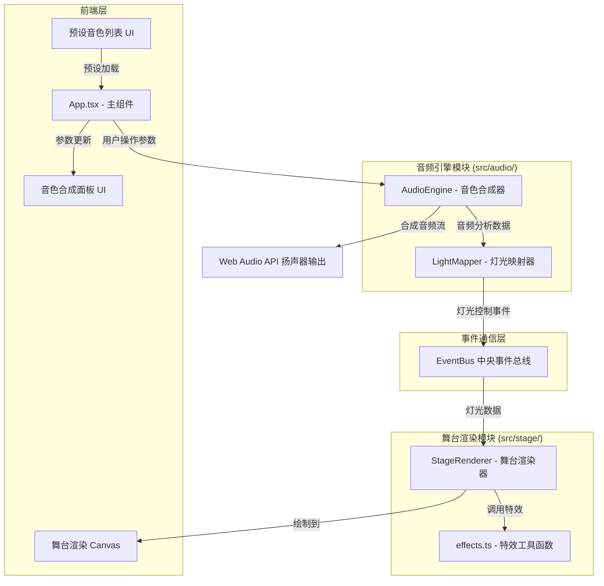

## 1. 架构设计



## 2. 技术描述
- 前端：React@18 + TypeScript + Vite
- 状态管理：React useState/useRef（组件局部状态）+ EventBus（跨模块通信）
- 音频处理：Web Audio API（OscillatorNode、GainNode、BiquadFilterNode、AnalyserNode）
- 图形渲染：Canvas 2D API（手动实现3D透视投影）
- 依赖：uuid（用于粒子唯一标识）

## 3. 核心文件结构
| 文件路径 | 职责描述 |
|----------|----------|
| `src/App.tsx` | 主组件，初始化EventBus，整合UI模块和渲染模块 |
| `src/audio/AudioEngine.ts` | 音频引擎，波形合成、包络控制、滤波器、音频分析 |
| `src/audio/LightMapper.ts` | 灯光映射，频率分析到灯光颜色/亮度的转换逻辑 |
| `src/stage/StageRenderer.ts` | 舞台渲染，Canvas绘制透视场景、聚光灯、粒子系统 |
| `src/stage/effects.ts` | 特效工具函数，粒子发射、光晕、烟雾等 |

## 4. 数据模型定义

### 4.1 音色参数
```typescript
interface SynthParams {
  waveform: 'sine' | 'square' | 'sawtooth';
  frequency: number;           // 220-880 Hz
  attackTime: number;          // 0.01-2 秒
  releaseTime: number;         // 0.1-5 秒
  filterCutoff: number;        // 200-20000 Hz
}
```

### 4.2 灯光数据
```typescript
interface LightData {
  id: 'red' | 'green' | 'blue';
  color: string;
  brightness: number;          // 0.2-1.0
  position: { x: number; y: number; z: number };
}

interface LightControlEvent {
  lights: LightData[];
  timestamp: number;
}
```

### 4.3 粒子数据
```typescript
interface Particle {
  id: string;
  x: number;
  y: number;
  baseY: number;
  size: number;                // 2-4 像素
  life: number;                // 剩余生命周期
  maxLife: number;             // 3-5 秒
  sinAmplitude: number;        // 1-3 像素
  sinFrequency: number;        // 2-5 Hz
  phase: number;
}
```

### 4.4 预设音色
```typescript
interface Preset {
  id: string;
  name: string;
  waveform: 'sine' | 'square' | 'sawtooth';
  params: SynthParams;
}
```

## 5. 事件定义（EventBus）
| 事件名 | 数据类型 | 触发方 | 接收方 |
|--------|----------|--------|--------|
| `light:update` | `LightControlEvent` | LightMapper | StageRenderer |
| `light:preview` | `{ type: 'flash', times: number }` | App | StageRenderer |
| `audio:analysis` | `{ low: number; mid: number; high: number }` | AudioEngine | LightMapper |
| `params:update` | `SynthParams` | UI | AudioEngine |

## 6. 性能约束
- 音频缓冲区：256采样点，延迟≤50ms
- Canvas渲染：≥30FPS
- 粒子数量：上限300个，超过时暂停新粒子生成
- 灯光过渡：线性插值，0.1秒平滑过渡
