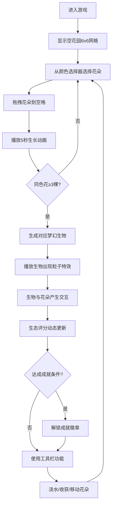

## 1. 产品概述
精灵花园是一款浏览器端的微缩花园培育与生态交互游戏，玩家通过种植发光精灵花吸引梦幻生物入住，打造属于自己的梦幻生态系统。
- 主要用途：休闲娱乐、创意布置、生态探索
- 目标用户：喜欢休闲养成类游戏的全年龄段玩家

## 2. 核心功能

### 2.1 功能模块
1. **花园主界面**：6x6网格花园、花朵种植与生长动画、拖拽交互
2. **生物系统**：5种梦幻生物、6帧循环动画、粒子特效
3. **生态交互**：生物与花朵的互动效果、信息气泡、生物拖拽
4. **生态面板**：评分系统、进度条、生物清单、成就徽章
5. **工具栏**：种植模式、移动模式、浇水功能、收获功能

### 2.2 功能详情
| 页面名称 | 模块名称 | 功能描述 |
|-----------|-------------|---------------------|
| 花园主界面 | 网格系统 | 6x6半透明白色虚线网格，深绿色到蓝紫色圆形渐变背景 |
| 花园主界面 | 精灵花 | 5种颜色(红/蓝/紫/粉/金)、5秒生长动画、Canvas绘制5片花瓣、脉动光晕花心 |
| 花园主界面 | 种植交互 | 从颜色选择器拖拽花朵到空格，立即开始生长动画 |
| 生物系统 | 生物生成 | 同色花达3棵时随机生成对应生物，带1秒粒子爆炸特效 |
| 生物系统 | 生物动画 | 小火灵(跳动火焰)、水波精(流动水滴)、暗影蝶(拖尾粒子)、花仙子(旋转撒花瓣)、光之虫(z字星光) |
| 生态交互 | 花-生物互动 | 火灵使红花变大、水精使蓝花摇摆、暗影蝶使紫花变暗、花仙子撒花瓣、光之虫使金花闪烁 |
| 生态交互 | 生物交互 | 悬停显示半圆形信息气泡、点击拖动生物、移动路径留足迹粒子 |
| 生态面板 | 评分系统 | 花朵数量+颜色种类计分，暖黄色大字号显示，0.5秒弹性动画过渡 |
| 生态面板 | 进度条 | 红到绿横向渐变进度条，与评分同步动画 |
| 生态面板 | 生物清单 | 圆形缩略图图标，周围发光描边 |
| 生态面板 | 成就系统 | 金属质感圆形徽章，解锁时带闪光划过特效 |
| 工具栏 | 模式切换 | 种植/移动模式，当前模式高亮带脉动白色边框 |
| 工具栏 | 浇水功能 | 所有花朵亮度提升20%持续3秒 |
| 工具栏 | 收获功能 | 盛开花朵掉落花瓣粒子并重新变为种子 |

## 3. 核心流程
玩家打开游戏 → 选择花朵颜色 → 拖拽到花园空格种植 → 花朵生长动画播放 → 集齐同色3朵花触发生物生成 → 生物与花朵产生交互 → 生态评分动态更新 → 达成条件解锁成就 → 使用工具栏浇水/收获

## 4. 用户界面设计

### 4.1 设计风格
- 主色调：深绿色→蓝紫色渐变背景（月光草坪氛围）
- 辅助色：红、蓝、紫、粉、金五种精灵花色
- 按钮风格：圆角矩形图标，深色半透明条带工具栏
- 面板风格：半透明磨砂玻璃效果（毛玻璃滤镜 blur(10px)）
- 字体：使用优雅的装饰性字体配合简洁正文
- 动效：柔和光晕、粒子效果、弹性过渡动画

### 4.2 页面设计概述
| 页面名称 | 模块名称 | UI元素 |
|-----------|-------------|-------------|
| 游戏主界面 | 花园区域 | 居中6x6网格、圆形渐变背景、半透明白色虚线、Canvas渲染层 |
| 游戏主界面 | 颜色选择区 | 左下角5色圆形花朵图标，可拖拽 |
| 游戏主界面 | 生态面板 | 右侧固定面板、毛玻璃背景、评分+进度条+生物清单+成就区 |
| 游戏主界面 | 工具栏 | 底部深色半透明条带、4个功能按钮、脉动高亮边框 |
| 游戏主界面 | 信息气泡 | 鼠标悬停生物时弹出、半圆形、对应生物颜色背景、白色小字 |

### 4.3 响应式设计
- 桌面端优先设计，居中布局花园区域
- 画布最小尺寸：800x600
- 生态面板固定宽度280px，响应式高度
- 工具栏固定底部宽度100%

### 4.4 性能要求
- FPS稳定在45帧以上
- Canvas动画使用requestAnimationFrame
- 粒子总数不超过300个
- 无明显卡顿或闪烁
