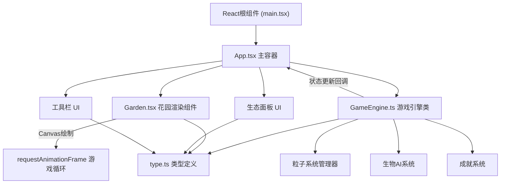

## 1. 架构设计



## 2. 技术说明
- 前端框架：React@18 + TypeScript@5 + Vite@5
- 渲染技术：HTML5 Canvas 2D + requestAnimationFrame
- 样式方案：原生 CSS3（含毛玻璃滤镜、CSS动画）
- 状态管理：React useState/useRef + GameEngine类内部状态
- 构建工具：Vite（@vitejs/plugin-react）

## 3. 文件结构

```
d:\Pro\tasks\auto70\
├── package.json              # 项目依赖与脚本
├── index.html                # 入口HTML
├── vite.config.ts            # Vite配置
├── tsconfig.json             # TypeScript配置
└── src\
    ├── main.tsx              # React入口
    ├── App.tsx               # 主容器组件
    ├── Garden.tsx            # 花园Canvas组件
    ├── GameEngine.ts         # 游戏引擎核心类
    ├── type.ts               # 类型定义
    └── style.css             # 全局样式
```

## 4. 核心数据模型

### 4.1 类型定义 (type.ts)
```
FlowerColor: RED | BLUE | PURPLE | PINK | GOLD
CreatureType: FIRE_SPIRIT | WATER_SPIRIT | SHADOW_BUTTERFLY | FAIRY | LIGHT_BUG
FlowerState: { id, x, y, color, growthProgress (0-1), isBloomed, bloomPhase, wilted, swayOffset, darkMode, flashTimer, brightnessMultiplier }
CreatureState: { id, type, x, y, targetX, targetY, animFrame, attachedFlowerId, trailParticles, interactState }
Particle: { id, x, y, vx, vy, life, maxLife, color, size, type }
Achievement: { id, name, description, unlocked, unlockTime }
GameMode: PLANT | MOVE
```

### 4.2 引擎核心接口
```
GameEngine:
  - constructor(onStateChange: callback)
  - plantFlower(x, y, color): boolean
  - moveFlower(fromX, fromY, toX, toY): boolean
  - waterGarden(): void
  - harvestFlowers(): void
  - moveCreature(creatureId, x, y): void
  - update(deltaTime: number): void  // 每帧更新
  - getState(): EngineState
  - addParticle(...): void
```

## 5. 渲染系统

### 5.1 Canvas绘制层级（从下到上）
1. 背景渐变（深绿→蓝紫色径向渐变）
2. 6x6网格线（半透明白色虚线）
3. 花朵底层（未完全盛开的花苞）
4. 花瓣飘落粒子
5. 花朵中层（盛开的5片花瓣+光晕）
6. 花朵顶层（脉动花心光晕）
7. 生物足迹粒子
8. 生物本体+动画
9. 生物拖尾/翅膀粒子
10. 信息气泡层

### 5.2 关键渲染算法
- 花朵生长：插值计算花瓣展开角度和大小
- 脉动光晕：sin(2π*1Hz*t) 计算半径 10px→20px
- 粒子系统：对象池复用，超过300个时回收最旧粒子
- 生物路径：缓动函数插值，生物移动留粒子轨迹

## 6. 性能优化策略
1. Canvas脏区域重绘：仅重绘变化区域
2. 粒子对象池：避免频繁GC
3. 离屏Canvas预渲染静态花朵图案
4. requestAnimationFrame节流更新
5. 限制同时存在的粒子总数≤300
6. 使用translate/scale批量变换减少状态切换
