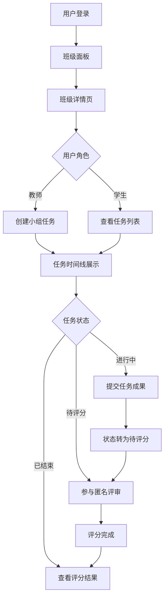

## 1. 产品概述

虚拟班级互评系统是一个面向教育场景的在线协作工具，解决传统课堂小组合作中组员贡献难以量化、互评流程繁琐且结果不透明的问题。学生可以在浏览器中创建虚拟班级、发布小组任务、并在线进行互评打分。

- 目标用户：教师和学生
- 核心价值：简化小组任务互评流程，提供透明、公正的评分机制
- 市场定位：教育科技领域的轻量级协作工具

## 2. 核心功能

### 2.1 用户角色

| 角色 | 核心权限 |
|------|----------|
| 教师 | 创建班级、创建任务、查看评分结果 |
| 学生 | 加入班级、提交任务、参与互评、查看结果 |

### 2.2 功能模块

1. **班级面板**：班级列表展示、班级创建与加入
2. **班级详情**：成员列表展示、任务时间线
3. **任务管理**：任务创建、任务提交、状态流转
4. **评分系统**：匿名评审分配、评分表单、结果统计

### 2.3 页面详情

| 页面名称 | 模块名称 | 功能描述 |
|-----------|-------------|---------------------|
| 登录页 | 登录表单 | 用户身份验证，进入系统 |
| 班级面板 | 班级卡片列表 | 以卡片形式展示所有已加入班级，包含班级名、创建日期、成员总数和渐变色标识 |
| 班级详情页 | 成员列表 | 横向滚动展示班级成员，圆形头像占位图，悬停显示姓名和活跃时间 |
| 班级详情页 | 任务时间线 | 纵向排列任务卡片，左侧渐变色标识状态，显示任务信息和进度 |
| 任务创建表单 | 表单组件 | 任务名称、截止日期、任务描述（Markdown）、分组方式选择 |
| 任务提交页 | 成员在线状态 | 左侧展示组内成员实时在线状态（绿点在线、灰点离线） |
| 任务提交页 | 文件上传 | 拖拽上传区域，支持图片、PDF、文档格式，显示缩略图可删除 |
| 评分页面 | 左右分栏布局 | 左侧展示被评审组提交文件，右侧评分表单 |
| 评分页面 | 评分表单 | 三个维度滑动条评分（完整度、创意性、协作表现），200字评语 |
| 结果页面 | 柱状图 | Canvas绘制分层柱状图，展示各组评分结果 |
| 结果页面 | 评分表格 | 详细评分表，行交错背景色，评语可展开收起 |

## 3. 核心流程

### 3.1 主流程描述

用户登录后进入班级面板，选择班级进入详情页。教师可以创建小组任务，学生可以查看任务并提交成果。任务截止后进入评分阶段，系统自动分配匿名评审组，学生参与互评。评分完成后，所有用户可查看最终评分结果。

### 3.2 流程图

## 4. 用户界面设计

### 4.1 设计风格

- **主色调**：深蓝(#1a1a2e)背景
- **强调色**：浅蓝(#e0e7ff)和浅粉(#fce4ec)渐变
- **按钮风格**：14px圆角按钮，背景柔和磨砂效果（backdrop-filter: blur(8px)）
- **字体**：等宽字体用于倒计时数字显示，常规字体用于正文
- **布局风格**：极简卡片式设计，大量留白
- **动画效果**：页面切换淡入淡出（0.3秒），列表项呼吸动画（1秒），评分提交绿色对勾动画（0.6秒）

### 4.2 页面设计概述

| 页面名称 | 模块名称 | UI元素 |
|-----------|-------------|-------------|
| 班级面板 | 班级卡片 | 渐变色标识背景（首字母哈希选色）、悬停上移3px加深阴影、卡片布局 |
| 班级详情页 | 成员列表 | 横向滚动、圆形头像、背景色由用户ID哈希生成、悬停显示完整信息 |
| 班级详情页 | 任务时间线 | 纵向排列、左侧渐变色边框标识状态（灰/蓝/橙）、等宽字体倒计时 |
| 任务提交页 | 在线状态列表 | 绿色/灰色圆点指示在线状态 |
| 任务提交页 | 拖拽上传区 | 虚线边框、悬停高亮、缩略图展示、删除按钮 |
| 评分页面 | 左右分栏 | 左侧文件预览、右侧评分表单 |
| 评分页面 | 评分滑动条 | 1-5分滑动条、实时数值显示 |
| 结果页面 | 柱状图 | Canvas绘制、三色分层叠加、柱顶显示总分 |
| 结果页面 | 评分表格 | 交错背景色、表头固定、评语展开收起 |

### 4.3 响应式设计

- 设计策略：桌面端优先，移动端自适应
- 断点：平板(768px)、手机(480px)
- 移动端优化：卡片堆叠、横向滚动区域保持、触摸友好的按钮尺寸

### 4.4 性能要求

- 首屏渲染时间：不超过1.5秒
- 评分动画帧率：稳定60FPS
- 交互响应：按钮点击反馈延迟<100ms
