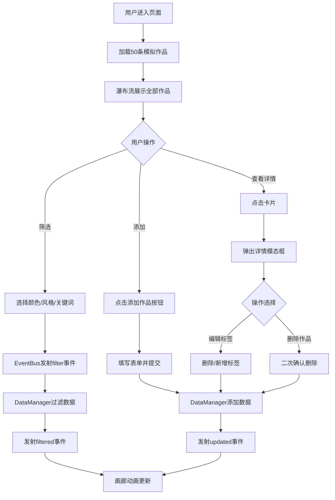

## 1. 产品概述

在线插画师作品集管理与展示应用，为独立插画师提供作品上传、标签编辑、智能筛选和瀑布流动态展示功能，帮助插画师高效整理和美观地展示个人作品集。
- 解决插画师在浏览器中快速整理、标签化和展示作品的需求
- 面向独立插画师，提供零部署成本的本地化管理与展示方案

## 2. 核心功能

### 2.1 用户角色
| 角色 | 注册方式 | 核心权限 |
|------|----------|----------|
| 插画师 | 无需注册（本地应用） | 作品增删改查、标签编辑、筛选浏览 |

### 2.2 功能模块
1. **作品集页面**：左侧筛选面板 + 右侧瀑布流画廊 + 作品详情弹窗

### 2.3 页面详情
| 页面名称 | 模块名称 | 功能描述 |
|----------|----------|----------|
| 作品集页面 | 筛选面板 | 颜色色块选择（12色板，多选）、风格标签多选（水彩/油画/板绘/素描/拼贴）、主题关键词搜索、添加作品按钮 |
| 作品集页面 | 瀑布流画廊 | CSS columns瀑布流布局，卡片展示缩略图+标题+标签缩略条，响应式列数，悬停动效，点击弹出详情 |
| 作品集页面 | 添加作品表单 | 标题、图片URL、颜色标签（12色板点选）、风格标签（多选）、主题关键词（回车确认） |
| 作品集页面 | 作品详情弹窗 | 大图、标题、全部标签（颜色色块+文字/风格胶囊/关键词胶囊）、创建日期、编辑标签、删除作品 |
| 作品集页面 | 编辑标签 | 标签以可删除圆角小标签展示，新增按钮弹出输入框 |
| 作品集页面 | 删除确认 | 二次确认对话框 |

## 3. 核心流程

**作品浏览与筛选流程**：用户进入页面 → 查看瀑布流作品 → 使用筛选面板选择颜色/风格/关键词 → EventBus发射filter事件 → DataManager过滤数据 → 发射filtered事件 → 画廊更新展示

**作品添加流程**：点击添加作品 → 弹出表单 → 填写信息 → 提交 → DataManager添加数据 → 发射updated事件 → 画廊刷新

**作品详情与操作流程**：点击卡片 → 弹出详情模态框 → 查看完整信息 → 编辑标签或删除 → 关闭弹窗

## 4. 用户界面设计

### 4.1 设计风格
- 主色调：深灰（#2C2C2C）+ 暖橙色（#E07A5F）强调
- 背景色：米白色（#F5F0EB）
- 按钮样式：暖橙色背景、白色文字、圆角8px、悬停变深（#D06A4F）
- 字体：展示用衬线字体（Playfair Display），正文用无衬线字体（DM Sans）
- 布局风格：左右两栏，左侧280px固定筛选面板，右侧弹性瀑布流
- 过渡动画：统一ease-in-out曲线，0.3秒时长；筛选淡入动画0.1秒延迟递增

### 4.2 页面设计概览
| 页面名称 | 模块名称 | UI元素 |
|----------|----------|--------|
| 作品集页面 | 筛选面板 | 纯白背景#FFFFFF，圆角16px，浅阴影，12色板20x20px圆角10px色块，选中2px深灰边框，风格多选标签，关键词搜索框，暖橙色添加按钮 |
| 作品集页面 | 瀑布流画廊 | CSS columns布局，卡片圆角12px白底阴影(0 2px 8px rgba(0,0,0,0.08))，悬停上浮6px阴影加深(0 8px 20px rgba(0,0,0,0.15))，间距16px |
| 作品集页面 | 作品详情弹窗 | 半透明遮罩(rgba(0,0,0,0.6))，居中模态框scale 0.8→1动画0.4秒，颜色标签色块+文字，风格/关键词灰色胶囊样式 |
| 作品集页面 | 添加作品表单 | 暖橙色提交按钮，12色板点选式，风格多选，关键词回车确认 |

### 4.3 响应式设计
- 桌面优先设计（≥1200px：4列瀑布流）
- 平板适配（≥768px：3列瀑布流）
- 小屏手机（<768px：2列瀑布流）
- 极小屏（<600px：筛选面板折叠为顶部可收起区域，瀑布流单列）
- 所有过渡和动画适配触屏设备

### 4.4 3D场景指引
不适用
