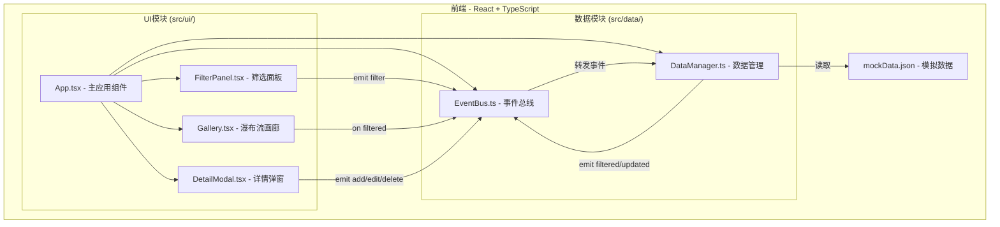
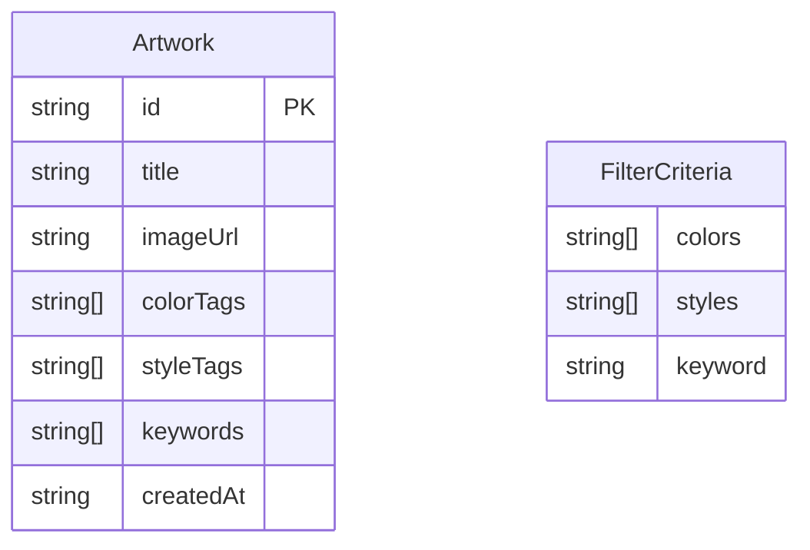

## 1. 架构设计



## 2. 技术说明
- 前端：React@18 + TypeScript + Vite + Tailwind CSS
- 初始化工具：vite-init（react-ts模板）
- 后端：无（纯前端应用）
- 数据库：无（使用静态JSON模拟数据，DataManager在内存中管理）

## 3. 路由定义
| 路由 | 用途 |
|------|------|
| / | 作品集管理与展示主页面 |

## 4. API定义
无后端API。数据通过EventBus在模块间通信：

**事件类型定义：**
```typescript
interface EventBusEvents {
  'filter': FilterCriteria;
  'filtered': Artwork[];
  'add': Omit<Artwork, 'id' | 'createdAt'>;
  'edit': { id: string; updates: Partial<Artwork> };
  'delete': string;
  'updated': Artwork[];
}
```

## 5. 服务端架构图
不适用

## 6. 数据模型

### 6.1 数据模型定义



### 6.2 数据定义

**作品接口 (Artwork)：**
- `id`: 唯一标识，UUID格式
- `title`: 作品标题
- `imageUrl`: 图片URL
- `colorTags`: 颜色标签数组（从12色板中选择）
- `styleTags`: 风格标签数组（水彩/油画/板绘/素描/拼贴）
- `keywords`: 主题关键词数组
- `createdAt`: 创建日期，ISO字符串

**筛选条件接口 (FilterCriteria)：**
- `colors`: 选中颜色数组
- `styles`: 选中风格数组
- `keyword`: 搜索关键词

**预定义12色板：**
#E07A5F, #F2CC8F, #81B29A, #3D405B, #F4F1DE, #E63946, #457B9D, #A8DADC, #1D3557, #F1FAEE, #264653, #E9C46A

**预定义风格标签：**
水彩, 油画, 板绘, 素描, 拼贴
