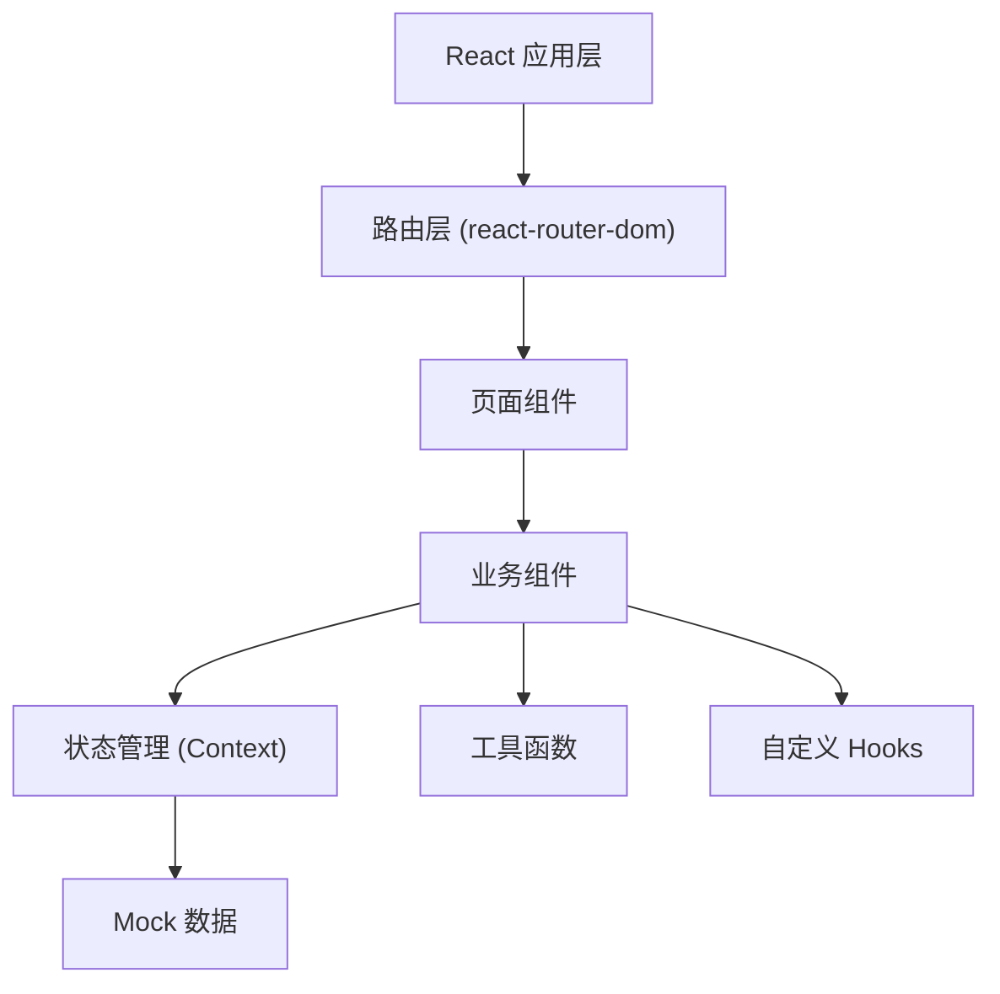

## 1. 架构设计



## 2. 技术描述

- **前端框架**：React@18 + TypeScript
- **构建工具**：Vite
- **路由管理**：react-router-dom
- **唯一ID生成**：uuid
- **状态管理**：React Context API（轻量级全局状态）
- **样式方案**：原生CSS + CSS变量 + CSS Modules
- **图表绘制**：Canvas API
- **数据来源**：Mock数据（前端模拟，无后端）

## 3. 路由定义

| 路由 | 页面 | 用途 |
|-------|------|---------|
| / | 登录页 | 用户登录入口 |
| /classes | 班级面板 | 展示所有已加入班级 |
| /class/:id | 班级详情 | 班级成员列表和任务时间线 |
| /task/:id/submit | 任务提交 | 小组任务成果提交页面 |
| /task/:id/review | 评分页面 | 匿名评审评分页面 |
| /task/:id/results | 结果页面 | 最终评分结果展示 |

## 4. 数据模型

### 4.1 数据模型定义

```mermaid
erDiagram
    USER ||--o{ CLASS_MEMBER : "加入"
    CLASS ||--o{ CLASS_MEMBER : "包含"
    CLASS ||--o{ TASK : "拥有"
    TASK ||--o{ GROUP : "包含"
    GROUP ||--o{ GROUP_MEMBER : "包含"
    GROUP ||--o| SUBMISSION : "提交"
    TASK ||--o{ REVIEW : "产生"
    GROUP ||--o{ REVIEW : "评审"
    GROUP ||--o{ REVIEW : "被评审"
    
    USER {
        string id PK
        string name
        string role
        string avatarColor
    }
    
    CLASS {
        string id PK
        string name
        date createdAt
        string creatorId
    }
    
    CLASS_MEMBER {
        string id PK
        string classId FK
        string userId FK
        date joinedAt
        date lastActive
    }
    
    TASK {
        string id PK
        string classId FK
        string name
        string description
        date deadline
        string status
        string groupingMethod
    }
    
    GROUP {
        string id PK
        string taskId FK
        string name
        string leaderId
    }
    
    GROUP_MEMBER {
        string id PK
        string groupId FK
        string userId FK
    }
    
    SUBMISSION {
        string id PK
        string groupId FK
        date submittedAt
        array files
    }
    
    REVIEW {
        string id PK
        string taskId FK
        string reviewerGroupId FK
        string revieweeGroupId FK
        number completeness
        number creativity
        number collaboration
        string comment
        boolean completed
    }
```

### 4.2 核心类型定义

```typescript
interface User {
  id: string;
  name: string;
  role: 'teacher' | 'student';
}

interface ClassItem {
  id: string;
  name: string;
  createdAt: string;
  creatorId: string;
  memberCount: number;
}

interface Task {
  id: string;
  classId: string;
  name: string;
  description: string;
  deadline: string;
  status: 'pending' | 'in-progress' | 'reviewing' | 'completed';
  groupingMethod: 'random' | 'manual';
  groups: Group[];
}

interface Group {
  id: string;
  taskId: string;
  name: string;
  memberIds: string[];
  leaderId: string;
  submission?: Submission;
  reviews: Review[];
}

interface Submission {
  id: string;
  groupId: string;
  submittedAt: string;
  files: FileItem[];
}

interface FileItem {
  id: string;
  name: string;
  type: 'image' | 'pdf' | 'document';
  url?: string;
  size?: number;
}

interface Review {
  id: string;
  taskId: string;
  reviewerGroupId: string;
  revieweeGroupId: string;
  completeness: number;
  creativity: number;
  collaboration: number;
  comment: string;
  completed: boolean;
}
```

## 5. 文件结构

```
src/
├── main.tsx              # 应用入口
├── App.tsx               # 主应用组件，路由和全局状态
├── types/                # TypeScript类型定义
│   └── index.ts
├── context/              # React Context
│   └── AppContext.tsx
├── data/                 # Mock数据
│   └── mockData.ts
├── utils/                # 工具函数
│   ├── colorHash.ts      # 颜色哈希生成
│   ├── dateUtils.ts      # 日期倒计时
│   └── markdown.ts       # Markdown解析
├── class/                # 班级模块
│   └── ClassPanel.tsx
├── task/                 # 任务模块
│   ├── TaskTimeline.tsx
│   ├── TaskSubmit.tsx
│   └── TaskCreateForm.tsx
├── rating/               # 评分模块
│   ├── RatingPanel.tsx
│   ├── RatingForm.tsx
│   └── ResultChart.tsx
├── components/           # 通用组件
│   ├── ClassCard.tsx
│   ├── MemberAvatar.tsx
│   ├── TaskCard.tsx
│   ├── FileUpload.tsx
│   └── Modal.tsx
└── styles/               # 全局样式
    ├── globals.css
    └── variables.css
```

## 6. 性能优化策略

- **首屏优化**：代码分割、路由懒加载、关键CSS内联
- **动画性能**：使用transform和opacity属性，避免重排重绘
- **Canvas优化**：requestAnimationFrame控制渲染帧率
- **列表优化**：虚拟滚动（长列表时）、React.memo优化重渲染
- **图片优化**：懒加载、适当尺寸缩略图

## 7. 构建配置

- **TypeScript**：严格模式，target ES2020
- **Vite**：React插件、HMR支持、生产构建优化
- **开发脚本**：npm run dev
- **构建脚本**：npm run build
