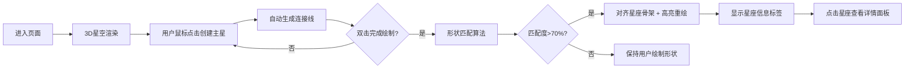

## 1. 产品概述

虚拟星座生成与天文知识交互可视化应用，用户通过鼠标在3D星空中绘制任意形状的连线，系统自动识别并匹配经典星座模板，展示对应的神话故事和天文数据。

- 核心价值：以交互式3D可视化方式让用户探索天文知识，结合艺术创作与科普教育
- 目标用户：天文爱好者、学生、对星座神话感兴趣的普通用户

## 2. 核心功能

### 2.1 功能模块

1. **星空背景渲染**：3000颗闪烁星星的3D星空背景
2. **星座绘制交互**：鼠标点击创建主星、自动连线、双击完成绘制
3. **星座智能匹配**：形状识别算法匹配8+经典星座模板（匹配度>70%）
4. **星座信息展示**：浮动标签显示名称、观测信息、神话故事
5. **天文数据详情面板**：恒星名称、视星等、距离、光谱类型
6. **星座列表导航**：侧边菜单列出所有可匹配星座，支持脉冲高亮

### 2.2 页面详情

| 页面名称 | 模块名称 | 功能描述 |
|---------|---------|---------|
| 主页面 | 星空背景 | 径向渐变背景 + 3000颗闪烁星星 + 鼠标视角控制 |
| 主页面 | 绘制交互区 | 左键点击创建主星、拖动预览、双击完成绘制 |
| 主页面 | 星座标签 | 匹配后浮动显示中英文名称、观测月份、纬度范围、神话故事 |
| 主页面 | 详情面板 | 点击星座从右侧滑入，展示恒星天文数据，毛玻璃效果 |
| 主页面 | 星座列表 | 左下角按钮展开半透明菜单，点击高亮对应星座 |

## 3. 核心流程

## 4. 用户界面设计

### 4.1 设计风格

- **主色调**：极深蓝 #0a0a2e → 紫色 #1a0a3e 径向渐变
- **点缀色**：金黄色 #ffd700（主星）、银白色 #e0e0ff（连接线）
- **星座专属色**：猎户座淡蓝色、仙后座淡紫色、大熊座淡青色等
- **UI风格**：白色半透明毛玻璃效果（backdrop-filter: blur）
- **字体**：细体无衬线字体
- **圆角**：8px 圆角边框
- **动画**：平滑过渡 300ms ease-in-out，星星闪烁正弦波，标签上下浮动

### 4.2 页面设计概览

| 页面名称 | 模块名称 | UI元素 |
|---------|---------|--------|
| 主页面 | 星空背景 | 径向渐变、3000颗随机星星、大小0.05-0.3、浅蓝到白色、闪烁0.5-2Hz |
| 主页面 | 主星 | 金黄色球体半径0.2、自发光材质、轻微光晕 |
| 主页面 | 连接线 | 银白色细管、线宽0.03、发光效果、半透明 |
| 主页面 | 星座标签 | 白色半透明背景、圆角、淡入动画、上下浮动5px/3s周期 |
| 主页面 | 详情面板 | 右侧滑入、毛玻璃blur、半透明深蓝背景 |
| 主页面 | 星座列表 | 左下角按钮、展开悬浮菜单、深蓝半透明、毛玻璃 |

### 4.3 响应式

- 桌面端优先，全屏自适应
- Canvas 按窗口尺寸缩放，保持星空比例不变形
- UI元素使用固定定位，移动端自动调整字号和间距

### 4.4 3D场景指导

- **环境**：深邃太空，径向渐变背景，无外部光源，物体自发光
- **光照**：主星使用自发光材质(MeshBasicMaterial + emissive)，无需场景光
- **相机**：PerspectiveCamera，OrbitControls 支持旋转缩放平移
- **构图**：用户绘制区域在场景中心，星星分布在半径50的球体内
- **交互**：Raycaster 实现点击检测，CSS2DRenderer 渲染文字标签
- **后期**：星星闪烁通过动画循环更新size属性实现
- **性能预算**：3000颗星星使用BufferGeometry批量渲染，帧率>30FPS
