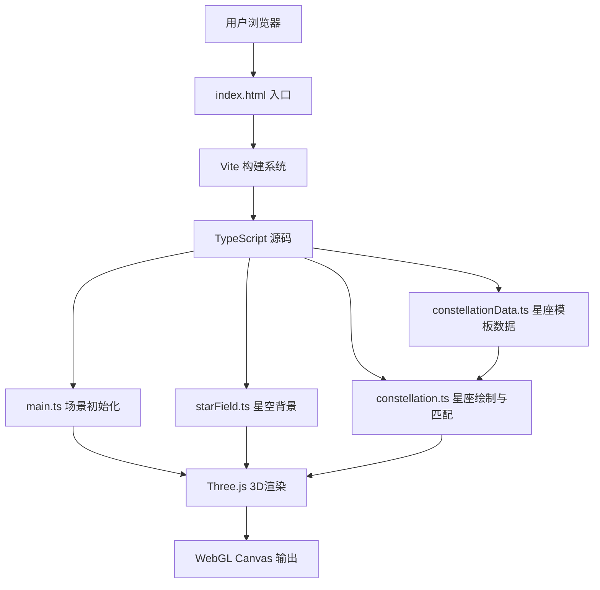

## 1. 架构设计



## 2. 技术描述

- **前端框架**：原生 TypeScript（无React/Vue，按用户需求）
- **3D引擎**：Three.js ^0.160.0 + @types/three
- **构建工具**：Vite ^5.0.0 + vite-plugin-glsl
- **语言**：TypeScript ^5.3.0（严格模式，target ES2020）
- **文字渲染**：Three.js CSS2DRenderer
- **交互控制**：Three.js OrbitControls
- **后端**：无（纯前端应用，所有数据内置）

## 3. 项目文件结构

| 文件路径 | 用途 |
|---------|------|
| package.json | 依赖配置与启动脚本 |
| vite.config.js | Vite构建配置（GLSL、TS支持） |
| tsconfig.json | TypeScript严格模式配置 |
| index.html | 入口页面，全屏自适应 |
| src/main.ts | 初始化Three.js场景、相机、渲染器、OrbitControls、动画循环 |
| src/starField.ts | 星空背景生成：3000颗随机星星 + 闪烁效果 |
| src/constellation.ts | 核心交互：鼠标绘制、主星创建、连线、形状匹配、标签渲染 |
| src/constellationData.ts | 8个经典星座模板数据（位置、连接、名称、神话、天文数据） |
| src/types.ts | TypeScript类型定义 |

## 4. 核心数据模型

### 4.1 星座模板数据

```typescript
interface StarTemplate {
  name: string;
  nameEn: string;
  position: [number, number, number];
  magnitude?: number;
  distance?: number;
  spectralType?: string;
}

interface ConstellationTemplate {
  id: string;
  name: string;
  nameEn: string;
  color: string;
  bestMonth: string;
  latitudeRange: string;
  mythology: string;
  stars: StarTemplate[];
  connections: [number, number][];
}
```

### 4.2 匹配算法

- 算法：形状上下文匹配 + Procrustes 分析
- 输入：用户绘制的点集 N 个坐标
- 输出：与每个模板的匹配度（0-100%）
- 阈值：>70% 判定匹配成功
- 耗时：< 50ms（纯计算，无异步）

匹配步骤：
1. 归一化用户点集（居中、缩放至单位大小）
2. 对每个模板同样归一化
3. 使用匈牙利算法找到最优点对应
4. 计算 Procrustes 距离作为匹配度
5. 返回匹配度最高的模板

## 5. 性能优化策略

| 优化点 | 方案 |
|-------|------|
| 星星渲染 | 使用 BufferGeometry + PointsMaterial 批量渲染3000颗 |
| 闪烁动画 | 预计算正弦相位数组，每帧更新size属性 |
| 匹配计算 | 同步计算但限制算法复杂度O(n²)，n≤8 |
| 标签渲染 | CSS2DRenderer 将DOM元素 overlay 在3D之上 |
| 内存管理 | 匹配失败时及时 dispose 几何与材质 |
| 帧率控制 | requestAnimationFrame 自然同步显示器刷新率 |
