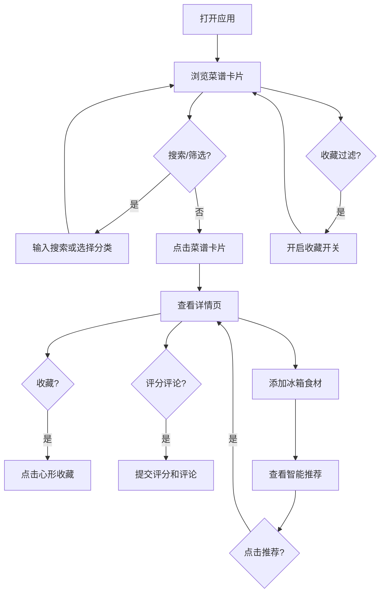

## 1. 产品概述

在线食谱收藏与智能餐食搭配应用，帮助用户浏览菜谱、收藏喜爱的菜品，并根据冰箱中的食材智能推荐可做的菜品。目标用户为家庭烹饪爱好者，解决"有食材不知道做什么"的痛点。

## 2. 核心功能

### 2.1 用户角色

| 角色 | 注册方式 | 核心权限 |
|------|----------|----------|
| 普通用户 | 无需注册 | 浏览菜谱、收藏菜品、管理冰箱食材、获取智能推荐 |

### 2.2 功能模块

1. **配方展示页面**: 菜谱卡片网格展示、搜索过滤、分类筛选、收藏管理
2. **配方详情页面**: 完整食材与步骤展示、评分评论、智能搭配推荐
3. **冰箱食材面板**: 食材录入、智能匹配推荐、匹配度可视化

### 2.3 页面详情

| 页面名称 | 模块名称 | 功能描述 |
|----------|----------|----------|
| 配方展示页 | 搜索栏 | 实时搜索过滤，焦点时放大1.05倍带淡橙色光晕 |
| 配方展示页 | 分类标签 | 中餐/西餐/日餐/早餐/甜品筛选，选中标签变色加粗带下划线动画 |
| 配方展示页 | 菜谱卡片网格 | 三列响应式布局，卡片含菜名/渐变缩略图/烹饪时长/收藏按钮，悬停上移5px加深阴影 |
| 配方展示页 | 收藏过滤开关 | 滑钮样式，开启时金色背景，仅显示收藏菜谱 |
| 配方详情页 | 大图展示 | 高度300px渐变占位图，加载时渐显 |
| 配方详情页 | 食材列表 | 圆角标签显示，用量不足标红抖动 |
| 配方详情页 | 步骤说明 | 编号竖排卡片，虚线连接 |
| 配方详情页 | 评分系统 | 1-5星点击评分，右向左填充金色 |
| 配方详情页 | 评论区 | textarea自动增高，评论以气泡显示 |
| 配方详情页 | 智能搭配推荐 | 基于当前菜谱推荐搭配菜品 |
| 冰箱食材面板 | 食材输入 | 输入框+添加按钮，添加名称和数量 |
| 冰箱食材面板 | 食材标签列表 | 显示已添加食材，删除时缩小消失动画 |
| 冰箱食材面板 | 推荐菜谱列表 | 菜名+匹配百分比进度条（红→绿渐变），点击跳转详情 |

## 3. 核心流程

用户打开应用 → 浏览菜谱卡片 → 搜索/分类筛选 → 点击进入详情 → 查看食材与步骤 → 收藏/评分/评论 → 打开食材面板 → 添加冰箱食材 → 查看智能推荐 → 点击推荐跳转详情

## 4. 用户界面设计

### 4.1 设计风格

- 主背景色：暖白 #FFF8F0
- 卡片背景：白色，浅灰边框，4px圆角
- 强调色：淡橙 #FFB347（搜索框边框、焦点光晕）
- 菜系渐变色：中餐红橙、西餐蓝紫、日餐青绿
- 字体：系统默认无衬线字体
- 按钮样式：柔和过渡动画（0.3s ease-in-out）
- 布局风格：卡片式网格，顶部固定搜索栏

### 4.2 页面设计概览

| 页面名称 | 模块名称 | UI元素 |
|----------|----------|--------|
| 配方展示页 | 搜索栏 | 淡橙色边框输入框，焦点放大1.05倍+光晕+阴影 |
| 配方展示页 | 分类标签 | 横排标签组，选中态变色+加粗+下划线动画 |
| 配方展示页 | 卡片网格 | 3列响应式，渐变占位图，时钟图标+分钟，心形收藏按钮(白→红+缩放动画) |
| 配方展示页 | 收藏开关 | 滑钮，开启金色背景 |
| 配方详情页 | 大图区 | 300px高渐变占位，渐显加载 |
| 配方详情页 | 食材标签 | 浅灰圆角标签，不足标红+抖动 |
| 配方详情页 | 步骤卡片 | 编号竖排，虚线连接 |
| 配方详情页 | 星级评分 | 5颗星，右→左金色填充 |
| 配方详情页 | 评论区 | 自动增高textarea，气泡评论 |
| 冰箱食材面板 | 输入区 | 输入框+添加按钮 |
| 冰箱食材面板 | 食材标签 | 带删除按钮的标签，删除缩小动画 |
| 冰箱食材面板 | 推荐列表 | 匹配百分比进度条(红→绿) |

### 4.3 响应式适配

- 桌面端（≥1024px）：三列卡片网格，食材面板右侧固定300px
- 平板端（640px~1024px）：两列卡片网格
- 手机端（<640px）：单列卡片，食材面板变为底部可拖拽面板（默认150px高，拖拽手柄带条纹）

### 4.4 动画设计

- 页面加载：卡片渐入动画（透明→不透明，间隔0.1s逐个显示）
- 收藏心形：0.5s缩放动画（先放大1.2倍再恢复），白色→红色
- 标签选中：下划线滑入动画
- 食材标签删除：缩小消失
- 所有交互：0.3s ease-in-out过渡
