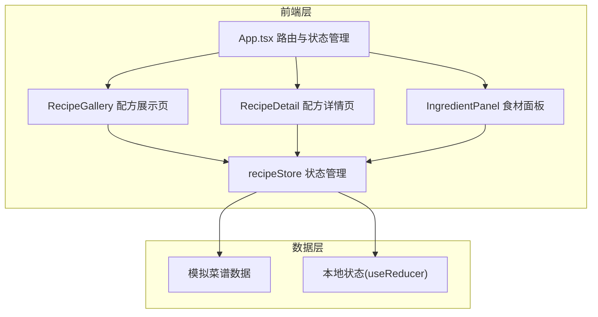

## 1. 架构设计



## 2. 技术说明

- 前端框架：React 18 + TypeScript
- 构建工具：Vite + @vitejs/plugin-react
- 状态管理：useReducer（管理菜谱列表、收藏状态、食材数据）
- 路由：React Router DOM v6
- 样式方案：Tailwind CSS 3
- 图标库：lucide-react
- 唯一ID：uuid
- 初始化工具：vite-init（react-ts模板）
- 后端：无（纯前端，使用模拟数据）

## 3. 路由定义

| 路由 | 用途 |
|------|------|
| / | 配方展示页面，卡片网格展示所有菜谱 |
| /recipe/:id | 配方详情页面，显示食材、步骤、评分、评论 |

## 4. 数据模型

### 4.1 核心类型定义

```typescript
interface Recipe {
  id: string;
  name: string;
  category: '中餐' | '西餐' | '日餐' | '早餐' | '甜品';
  cookTime: number;
  ingredients: Ingredient[];
  steps: string[];
  rating: number;
  ratings: number[];
  comments: Comment[];
  isFavorite: boolean;
}

interface Ingredient {
  name: string;
  amount: string;
  unit: string;
}

interface Comment {
  id: string;
  text: string;
  timestamp: number;
}

interface FridgeIngredient {
  id: string;
  name: string;
  quantity: number;
}

interface RecipeState {
  recipes: Recipe[];
  favorites: Set<string>;
  fridgeIngredients: FridgeIngredient[];
  searchQuery: string;
  activeCategory: string | null;
  showFavoritesOnly: boolean;
}
```

### 4.2 模拟数据

提供12-15道预设菜谱，覆盖所有分类（中餐、西餐、日餐、早餐、甜品），每道菜谱包含3-8种食材和4-6个烹饪步骤。

## 5. 状态管理设计

使用 useReducer 管理全局状态：

| Action类型 | 描述 |
|-----------|------|
| TOGGLE_FAVORITE | 切换菜谱收藏状态 |
| SET_SEARCH | 设置搜索关键词 |
| SET_CATEGORY | 设置分类过滤 |
| TOGGLE_FAVORITES_FILTER | 切换仅显示收藏 |
| ADD_FRIDGE_INGREDIENT | 添加冰箱食材 |
| REMOVE_FRIDGE_INGREDIENT | 删除冰箱食材 |
| SET_RATING | 设置菜谱评分 |
| ADD_COMMENT | 添加评论 |

## 6. 智能推荐算法

基于冰箱食材与菜谱食材的匹配度计算：
- 遍历所有菜谱的食材列表
- 计算用户冰箱食材对菜谱食材的覆盖率
- 匹配百分比 = 已匹配食材数 / 菜谱所需食材总数 × 100%
- 按匹配百分比降序排列，展示推荐结果
