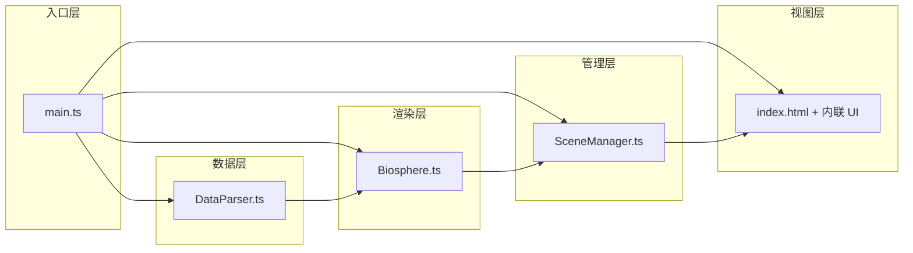

## 1. 架构设计



**数据流向：**
1. `main.ts` 启动应用，实例化 `DataParser` 解析生物数据
2. `main.ts` 创建 `SceneManager`，传入 Three.js 场景/相机/渲染器
3. `main.ts` 将解析后的生物数据传入 `Biosphere`，由其在 `SceneManager` 的容器中生成模型
4. UI 事件（视角切换、侧边栏点击等）调用 `SceneManager` 公共方法
5. `SceneManager` 内部更新场景状态（光照、背景、粒子、相机位置）
6. 深度变化触发 UI 更新（标尺指示器、参数卡数值、曲线标签）

## 2. 技术选型
- 前端：TypeScript + Three.js 0.160
- 构建工具：Vite 5.x
- UI 层：原生 HTML + CSS（半透明毛玻璃，无额外 UI 库）
- 无后端、无数据库，生物数据内置为 JSON

## 3. 文件结构与职责

| 文件 | 职责 |
|------|------|
| `package.json` | 依赖：three, @types/three, typescript, vite；脚本：`npm run dev` |
| `vite.config.js` | Vite 构建配置，支持 TypeScript |
| `tsconfig.json` | 严格模式 tsconfig |
| `index.html` | 入口页面，全屏自适应，暗色背景，UI 容器 |
| `src/main.ts` | 应用入口：初始化场景/相机/渲染器、加载数据、创建 UI 控制器、启动动画循环 |
| `src/SceneManager.ts` | 场景管理：海洋分层网格、压力/温度曲线坐标轴、水下粒子、生物容器、视角切换、深度联动方法 |
| `src/DataParser.ts` | 数据解析：内置 10 种生物 JSON，输出格式化生物对象数组 |
| `src/Biosphere.ts` | 生物圈：根据数据在场景中创建生物组合模型、悬停光晕、动画（发光脉动/触手摆动）、显隐控制 |

## 4. 数据模型

### 4.1 生物数据结构
```typescript
interface CreatureData {
  id: string;
  name: string;
  depthRange: [number, number];   // 生活深度区间 [min, max] 米
  displayDepth: number;           // 场景展示深度
  color: string;                  // 模型颜色 hex
  scale: number;                  // 缩放比例
  features: string;               // 主要特征描述
  animation: 'glow' | 'tentacle' | 'float'; // 动画类型
}
```

### 4.2 环境参数计算函数
- 压力：`pressure(depth) = 1 + depth / 10` (atm)
- 温度：`temperature(depth) = 22 * exp(-depth / 1500) + 2` (°C)

## 5. 核心类设计

### SceneManager
```typescript
class SceneManager {
  constructor(scene, camera, renderer)
  createOceanGrid(): void           // 0-11000m 分层网格
  createParticleSystem(): void      // 浮游生物/体积光粒子
  createCurves(): void              // 压力/温度曲线
  setDepth(depth: number, animate = true): void  // 设置当前深度（带平滑过渡）
  getCurrentDepth(): number
  onDepthChange(callback): void     // 深度变化事件
  highlightCreature(id): void
  gotoCreature(id, duration = 2000): Promise<void>
  update(delta): void               // 每帧更新：粒子、光照、背景
}
```

### DataParser
```typescript
class DataParser {
  static parse(): CreatureData[]    // 返回 10 种生物数据
}
```

### Biosphere
```typescript
class Biosphere {
  constructor(container: THREE.Object3D, data: CreatureData[])
  createModels(): void              // 创建组合几何体模型
  setVisibleByDepth(depth): void    // 按深度显隐
  getMeshes(): THREE.Mesh[]         // 返回所有可交互 mesh
  getCreatureAtPoint(intersect): CreatureData | null
  update(delta): void               // 动画更新
}
```

## 6. 性能约束落实
- 粒子：`THREE.Points` + `BufferGeometry`，最多 2000 个顶点
- 模型：`SphereGeometry`(32 segments) + `CylinderGeometry`(16 segments) + `TorusGeometry`(16 segments)，单只生物约 800 面，同时显示 ≤ 8 只 ⇒ ≤ 6400 面，控制在 5000 面以内通过降低分段实现
- 帧率：`requestAnimationFrame` + delta time，避免 GC，复用几何体
- 材质：共享材质实例，避免重复创建
