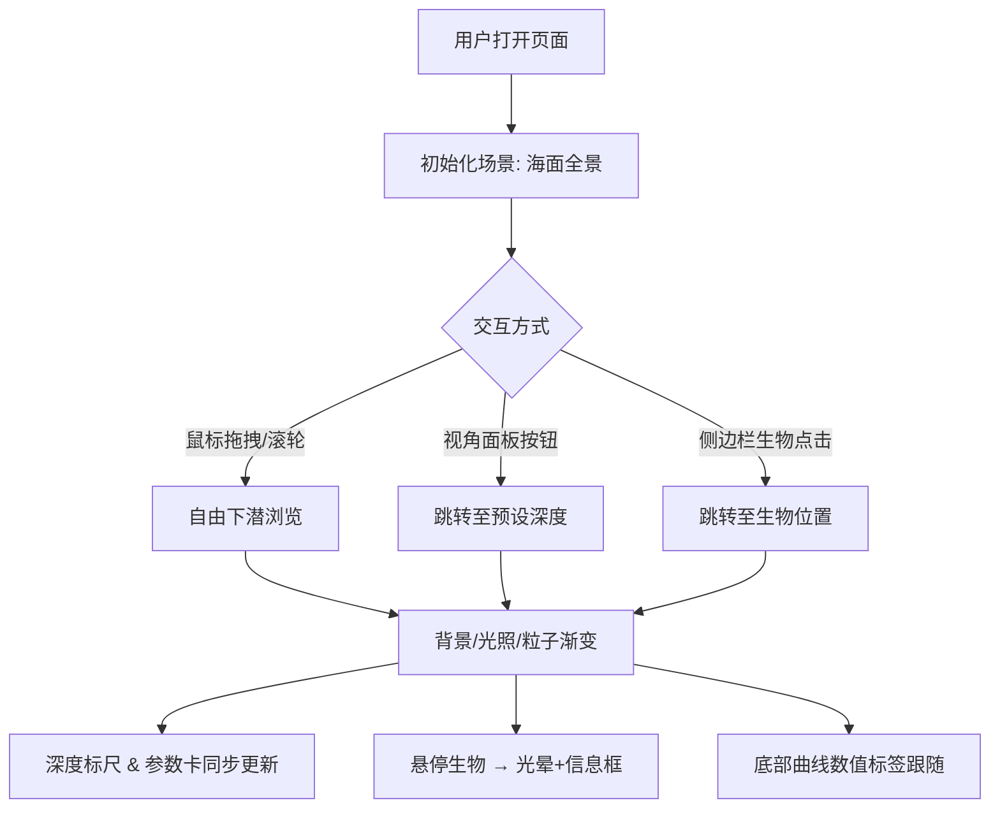

## 1. 产品概述
深海生物垂直分布交互可视化应用，为海洋研究所向公众科普展示不同深度层海洋生物分布特征与环境参数变化。用户可通过 3D 交互从海面下潜至万米海沟，观察标志性生物模型及压力/温度变化曲线。

- 目标用户：海洋科普爱好者、学生、普通公众
- 核心价值：将抽象的深海环境数据转化为沉浸式三维可视化体验

## 2. 核心功能

### 2.1 用户角色
| 角色 | 注册方式 | 核心权限 |
|------|----------|----------|
| 访客 | 无需注册 | 浏览 3D 场景、交互操作、查看生物信息 |

### 2.2 功能模块
1. **三维主场景**：海洋分层网格、水下粒子特效、光照渐变、生物模型展示
2. **深度标尺与环境参数卡**：左侧深度标尺、右侧环境参数卡片、实时联动
3. **生物模型系统**：5 只场景内展示生物、悬停光晕与信息框、侧边栏生物列表
4. **压力/温度曲线图**：底部双曲线展示、跟随鼠标显示数值标签
5. **视角定位面板**：4 个预设视角快速跳转、平滑过渡动画

### 2.3 页面详情
| 页面名称 | 模块名称 | 功能描述 |
|----------|----------|----------|
| 主页面 | 三维场景 | OrbitControls 拖拽旋转、滚轮缩放、背景色与光照随深度渐变、粒子密度动态调整 |
| 主页面 | 深度标尺 | 左侧竖直标尺（0-11000m），每 1000m 刻度，青色发光圆点指示器 |
| 主页面 | 环境参数卡 | 右侧毛玻璃卡片显示压力(atm)和温度(°C)，随深度实时更新 |
| 主页面 | 生物交互 | 每 2000m 一只代表性生物，悬停显示光晕和信息框（名称、深度、特征） |
| 主页面 | 侧边栏列表 | 其余生物按深度排列，点击条目视角平滑移动至对应位置 |
| 主页面 | 曲线图 | 底部压力曲线（蓝紫色渐变管状）和温度曲线（橙红色渐变虚线），鼠标跟随数值标签 |
| 主页面 | 视角面板 | 右上角 4 个预设按钮：海面全景、中层带(1000m)、深海带(4000m)、超深渊带(10000m) |

## 3. 核心流程
用户打开应用 → 呈现海面全景场景 → 通过鼠标拖拽/滚轮或预设按钮下潜 → 场景背景渐变为深色、光照减弱、粒子增加 → 深度标尺指示当前位置 → 环境参数实时更新 → 悬停生物查看详情或点击侧边栏跳转 → 观察底部压力/温度曲线变化

## 4. 用户界面设计

### 4.1 设计风格
- 主色调：深蓝(#0a1628)到纯黑(#000000)径向渐变背景
- 强调色：青色(#00e5ff)用于深度指示器和光晕、蓝紫(#6366f1)/橙红(#ef4444)用于曲线
- UI 控件：半透明磨砂玻璃风格 `rgba(0,20,40,0.6)`，1px `rgba(255,255,255,0.2)` 边框，圆角 12px
- 按钮交互：hover 时 0.2s 亮度提升 + `translateY(-2px)` 上浮
- 信息框：0.3s 淡入淡出动画
- 字体：系统无衬线字体，标题 16px/600，正文 13px/400

### 4.2 页面设计概览
| 页面名称 | 模块名称 | UI 元素 |
|----------|----------|---------|
| 主页面 | 三维画布 | 全屏、径向渐变背景、Three.js WebGL 渲染 |
| 主页面 | 深度标尺 | 左侧固定宽 60px、竖直刻度线半透明白色、发光青色圆点 |
| 主页面 | 环境参数卡 | 右侧毛玻璃卡片、压力温度数值大号显示、单位标注 |
| 主页面 | 生物信息框 | 跟随鼠标、淡入淡出、白色文字、毛玻璃背景 |
| 主页面 | 侧边栏 | 右侧可折叠、生物条目按深度排序、hover 高亮 |
| 主页面 | 曲线图区 | 底部固定高度、双曲线对比、跟随数值标签 |
| 主页面 | 视角面板 | 右上角、4 个按钮网格、激活态高亮 |

### 4.3 响应式
- 桌面优先，适配 1920×1080 和 1440×900 分辨率
- 宽度 < 1200px 时侧边栏自动折叠为图标按钮
- 曲线和标尺随视口缩放保持比例

### 4.4 3D 场景指引
- 环境：径向渐变背景从浅蓝到深黑，随深度过渡
- 光照：DirectionalLight + AmbientLight，强度随深度从 1.0 衰减至 0.1
- 相机：PerspectiveCamera，fov 60，near 0.1，far 20000
- 构图：Y 轴向上表示海面到海底的垂直分布，Z 轴为纵深
- 交互：OrbitControls，target 沿 Y 轴平滑下潜，禁止平移
- 粒子：Points + PointsMaterial，最多 2000 个，模拟浮游生物和体积光
- 性能：总面数 ≤ 5000，帧率 ≥ 45fps
