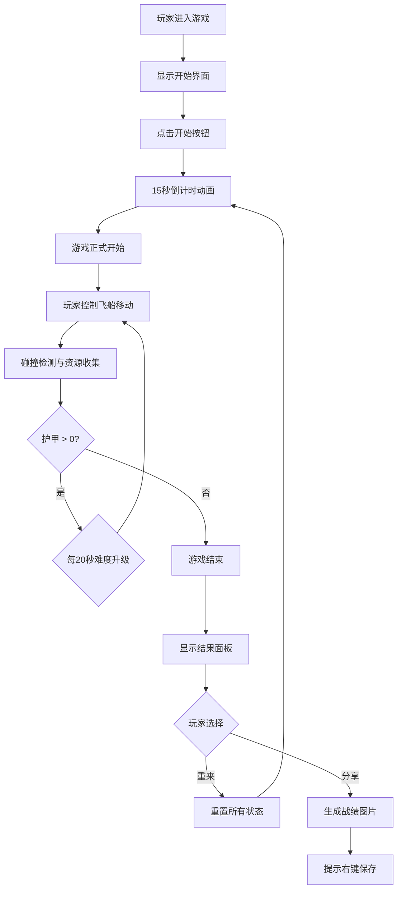

## 1. 产品概述

太空飞船陨石带穿越游戏是一款2D动作生存类小游戏，玩家控制飞船在陨石带中穿越、躲避障碍并收集资源。游戏旨在考验玩家的反应能力和路径规划能力，在有限燃料下生存尽可能长的时间。

- 核心玩法：通过键盘方向键控制飞船移动，躲避陨石，收集能量晶体补充燃料，收集护甲块提升防御
- 目标用户：休闲游戏玩家，喜欢太空题材和挑战性游戏的用户
- 市场价值：提供碎片化时间的娱乐体验，具备易上手、难精通的游戏特性

## 2. 核心功能

### 2.1 功能模块

1. **游戏主场景**：星空背景、飞船控制、陨石生成、资源收集、碰撞检测
2. **难度系统**：动态难度升级机制，随时间提升陨石生成速度、尺寸和资源出现频率
3. **UI状态面板**：实时得分显示、难度等级标签、燃料条、护甲条
4. **游戏状态机**：开始界面、倒计时、游戏进行中、游戏结束
5. **粒子特效系统**：推进器火焰、拾取爆炸、碰撞闪光
6. **结果面板**：得分统计、最高记录存储、战绩分享

### 2.2 页面详情

| 页面名称 | 模块名称 | 功能描述 |
|-----------|-------------|---------------------|
| 游戏主界面 | 状态面板 | 实时显示得分、难度等级、燃料和护甲值 |
| 游戏主界面 | 游戏画布 | Canvas渲染的2D游戏场景，包含所有游戏元素 |
| 游戏主界面 | 倒计时 | 游戏开始前15秒倒计时动画 |
| 结果面板 | 统计展示 | 显示本次得分、最高分、存活时间、收集数量、撞击次数 |
| 结果面板 | 操作按钮 | 重来按钮重置游戏，分享按钮生成战绩图片 |

## 3. 核心流程

玩家进入游戏后看到开始界面，点击开始按钮触发15秒倒计时，倒计时结束后游戏正式开始。玩家使用方向键控制飞船移动，躲避陨石并收集能量晶体和护甲块。游戏每20秒自动提升难度等级，玩家需要在有限燃料和护甲下生存尽可能长的时间。当护甲值降为0时游戏结束，显示结果面板，玩家可以选择重新开始或分享战绩。

## 4. 用户界面设计

### 4.1 设计风格

- **主题风格**：未来科技感，深空探索主题
- **主色调**：深空蓝紫渐变背景 (#0a0a1a → #1a1a3a)
- **强调色**：
  - 燃料条：橙色到红色渐变 (#ff8800 → #ff2200)
  - 护甲条：蓝色到紫色渐变 (#0088ff → #8800ff)
  - 能量晶体：红色 (#ff3366)
  - 护甲块：蓝色 (#3399ff)
- **按钮风格**：半透明毛玻璃效果，圆角边框，鼠标悬停时边框发光
- **字体**：现代无衬线字体，数字使用等宽字体增强科技感
- **图标**：简洁的矢量风格，与游戏主题一致

### 4.2 页面设计概述

| 页面名称 | 模块名称 | UI Elements |
|-----------|-------------|-------------|
| 游戏主界面 | 状态面板 | 半透明毛玻璃背景、圆角边框、渐变进度条、发光文字 |
| 游戏主界面 | 游戏画布 | 深空蓝紫渐变、星星闪烁层、粒子特效 |
| 倒计时 | 倒计时动画 | 数字放大缩小、轻微抖动、渐隐渐显 |
| 结果面板 | 统计卡片 | 毛玻璃效果、阴影、发光边框、悬浮动画 |
| 结果面板 | 按钮 | 圆角、发光边框、悬停光晕、点击反馈 |

### 4.3 响应式

- 设计方式：桌面优先，自适应不同屏幕尺寸
- Canvas画布：按比例缩放，保持游戏画面比例
- UI控件：使用相对定位和百分比布局，适配不同分辨率
- 触控优化：支持键盘控制为主，无需额外触控操作

### 4.4 视觉特效

- **飞船**：蓝色箭矢造型，尾部推进器火焰粒子效果，碰撞时摇动动画
- **陨石**：灰色到棕色渐变，表面凹凸纹理感，大小和速度随机变化
- **资源拾取**：粒子爆炸特效，资源消失时向四周发散粒子
- **碰撞反馈**：屏幕边缘闪红（0.3秒淡出），飞船摇动模拟冲击
- **星星背景**：多层星星，不同速度闪烁和移动，营造深度感
