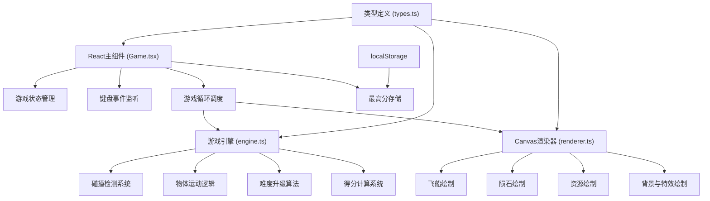

## 1. 架构设计



## 2. 技术描述

- **前端框架**：React@18 + TypeScript
- **构建工具**：Vite@5
- **渲染技术**：HTML5 Canvas 2D API
- **状态管理**：React useState/useRef 管理游戏状态
- **动画系统**：requestAnimationFrame 实现游戏主循环
- **外部依赖**：uuid（唯一标识符生成）
- **存储方案**：localStorage（最高分持久化）

### 2.1 项目初始化方式

使用 Vite React TypeScript 模板初始化项目：

```bash
npm init vite-init@latest -y . "--" --template react-ts --force
```

### 2.2 依赖调整

根据用户需求，需要安装以下依赖：
- react, react-dom（模板自带）
- typescript（模板自带）
- vite（模板自带）
- @vitejs/plugin-react（模板自带）
- uuid（需额外安装）
- @types/uuid（TypeScript类型定义）

## 3. 核心文件组织

| 文件路径 | 职责描述 | 关键函数/类 |
|-----------|----------|------------|
| src/types.ts | 核心类型定义 | Ship, Asteroid, Crystal, GameState枚举 |
| src/engine.ts | 游戏引擎核心 | GameEngine类，update方法，碰撞检测 |
| src/renderer.ts | Canvas渲染器 | Renderer类，render方法，各元素绘制函数 |
| src/Game.tsx | React主组件 | 游戏状态机，键盘监听，UI渲染 |

## 4. 核心数据模型

### 4.1 类型定义 (types.ts)

```typescript
// 游戏状态枚举
export enum GameState {
  IDLE = 'idle',
  COUNTDOWN = 'countdown',
  PLAYING = 'playing',
  GAME_OVER = 'game_over'
}

// 难度等级
export enum DifficultyLevel {
  NORMAL = '普通',
  HARD = '困难',
  NIGHTMARE = '噩梦'
}

// 飞船状态
export interface Ship {
  x: number;
  y: number;
  vx: number;
  vy: number;
  rotation: number;
  fuel: number;
  maxFuel: number;
  armor: number;
  maxArmor: number;
  shieldActive: boolean;
}

// 陨石
export interface Asteroid {
  id: string;
  x: number;
  y: number;
  vx: number;
  vy: number;
  radius: number;
  rotation: number;
  rotationSpeed: number;
  vertices: number[];
}

// 能量晶体
export interface Crystal {
  id: string;
  x: number;
  y: number;
  type: 'energy' | 'armor';
  value: number;
  pulsePhase: number;
}

// 粒子
export interface Particle {
  id: string;
  x: number;
  y: number;
  vx: number;
  vy: number;
  life: number;
  maxLife: number;
  color: string;
  size: number;
}

// 星星
export interface Star {
  x: number;
  y: number;
  size: number;
  brightness: number;
  twinkleSpeed: number;
  twinklePhase: number;
  layer: number;
}

// 游戏统计
export interface GameStats {
  score: number;
  highScore: number;
  survivalTime: number;
  crystalsCollected: number;
  armorCollected: number;
  collisionCount: number;
}

// 游戏引擎状态
export interface EngineState {
  ship: Ship;
  asteroids: Asteroid[];
  crystals: Crystal[];
  particles: Particle[];
  stars: Star[];
  difficulty: number;
  difficultyLevel: DifficultyLevel;
  stats: GameStats;
  collisionFlash: number;
  shipShake: { x: number; y: number; intensity: number };
}
```

### 4.2 引擎状态更新流程

1. **输入处理**：Game.tsx 监听键盘事件，更新按键状态
2. **游戏循环**：requestAnimationFrame 触发 update 和 render
3. **物理更新**：engine.ts 更新所有物体位置、速度、碰撞检测
4. **碰撞响应**：处理飞船与陨石、资源的碰撞
5. **难度升级**：每20秒提升难度参数
6. **渲染**：renderer.ts 根据最新状态绘制所有元素

## 5. 性能优化策略

- **对象池**：复用陨石、晶体、粒子对象，避免频繁GC
- **空间分区**：使用网格分区优化碰撞检测性能
- **粒子限制**：最大粒子数不超过500个，超出时回收最早的粒子
- **帧率控制**：目标帧率60FPS，通过deltaTime保证游戏速度一致
- **离屏渲染**：星空背景使用离屏canvas预渲染

## 6. 关键算法

### 6.1 碰撞检测

使用圆形碰撞检测算法，结合距离平方比较避免开方运算：

```typescript
function checkCircleCollision(
  x1: number, y1: number, r1: number,
  x2: number, y2: number, r2: number
): boolean {
  const dx = x2 - x1;
  const dy = y2 - y1;
  const minDist = r1 + r2;
  return dx * dx + dy * dy < minDist * minDist;
}
```

### 6.2 难度升级算法

每20秒：
- 陨石生成速度提升10%
- 陨石平均尺寸增大5%
- 能量晶体出现频率提升15%

```typescript
function updateDifficulty(elapsedSeconds: number): DifficultyParams {
  const level = Math.floor(elapsedSeconds / 20);
  return {
    asteroidSpawnRate: baseSpawnRate * Math.pow(1.1, level),
    asteroidSizeMultiplier: Math.pow(1.05, level),
    crystalSpawnRate: baseCrystalRate * Math.pow(1.15, level)
  };
}
```

### 6.3 得分计算

得分 = 存活时间 × 10 + 收集晶体数 × 50 + 难度系数 × 100

```typescript
function calculateScore(
  survivalTime: number,
  crystalsCollected: number,
  difficultyLevel: number
): number {
  return Math.floor(
    survivalTime * 10 +
    crystalsCollected * 50 +
    difficultyLevel * 100
  );
}
```
