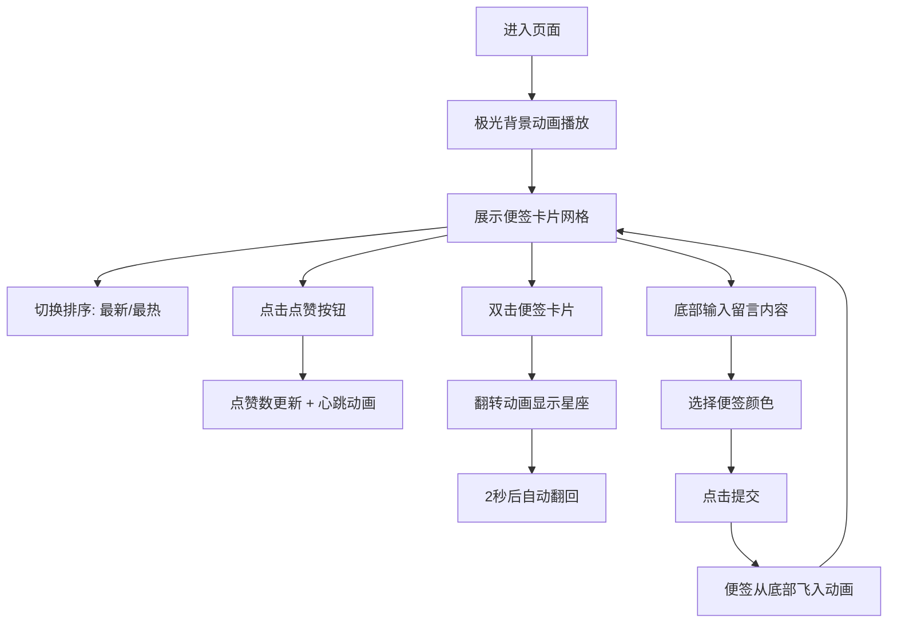

## 1. 产品概述

极光留言墙是一个基于Canvas动画的互动留言应用，访客可以在绚丽的极光背景上留下彩色便签留言，并通过点赞互动探索热门留言。

- 核心功能：动态极光背景画布、彩色便签留言、点赞互动、热度排序
- 目标用户：希望在沉浸式视觉体验中留下/浏览留言的访客
- 产品价值：将普通留言墙升级为具有艺术感和互动性的视觉体验

## 2. 核心功能

### 2.1 功能模块

1. **极光背景画布**：全屏动态极光波浪动画，三色渐变流动效果
2. **便签留言系统**：彩色便签卡片、浮动动画、入场动画
3. **留言输入模块**：文字输入、颜色选择器、提交按钮
4. **互动模块**：点赞功能、双击翻牌显示星座图案
5. **排序功能**：最新排序、最热排序，平滑切换

### 2.2 页面详情

| 页面名称 | 模块名称 | 功能描述 |
|---------|---------|---------|
| 主页 | 极光背景画布 | 全屏Canvas渲染三色渐变波浪极光动画，便签卡片浮于上层 |
| 主页 | 顶部排序栏 | "最新"和"最热"两个排序按钮，切换时淡入淡出过渡 |
| 主页 | 便签卡片网格 | 响应式网格布局，便签带浮动动画和磨砂玻璃效果 |
| 主页 | 底部输入区 | 文字输入框（100字限制）、圆形色盘、提交按钮 |
| 主页 | 便签背面 | 双击翻转动画，显示随机星座图案，2秒后自动翻回 |

## 3. 核心流程

用户进入页面 → 看到全屏极光背景和浮动便签 → 
浏览便签（可切换最新/最热排序）→ 
点击点赞按钮互动 → 
在底部输入留言内容 → 
选择便签颜色 → 
点击提交 → 
新便签从底部飞入随机位置 → 
双击便签查看背面星座图案

## 4. 用户界面设计

### 4.1 设计风格

- **主色调**：深暗色背景 #0a0a1a，极光三色（青绿#00ffcc、蓝紫#9933ff、粉红#ff66cc）
- **便签色盘**：12种柔和色（雾蓝、薄荷绿、樱花粉、鹅黄、薰衣草紫等）
- **卡片风格**：半透明磨砂玻璃效果（背景rgba(255,255,255,0.1)，模糊10px，边框1px半透明白色）
- **字体**：系统无衬线字体，文字白色，辅助信息浅灰色
- **动效风格**：平滑缓动，自然浮动，精致微交互

### 4.2 页面设计概览

| 页面名称 | 模块名称 | UI元素 |
|---------|---------|-------|
| 主页 | 极光背景 | 三色波浪渐变、流动动画、全屏Canvas |
| 主页 | 排序按钮 | 圆角胶囊按钮、选中高亮、淡入淡出切换 |
| 主页 | 便签卡片 | 磨砂玻璃效果、浮动动画、拖尾阴影、心形点赞 |
| 主页 | 颜色选择器 | 圆形色盘、选中脉冲光环、12色预设 |
| 主页 | 输入框 | 圆角输入、磨砂背景、字数统计 |
| 主页 | 星座背面 | 点阵连线、半透明背景、缓慢动画 |

### 4.3 响应式布局

- 大屏（≥1200px）：4列网格
- 中屏（≥768px）：3列网格
- 小屏（<768px）：2列网格
- 列间距：20px
- 底部输入区固定，便签区域可滚动

### 4.4 动画细节

- **极光动画**：requestAnimationFrame驱动，三色波浪层叠流动
- **便签浮动**：上下3px随机偏移，周期2-4秒随机
- **入场动画**：0.3秒从底部飞入，缩放从0.2到1倍，缓出
- **点赞动画**：心形缩小再回弹，0.2秒完成
- **翻牌动画**：沿Y轴旋转180度，0.4秒
- **排序切换**：淡入淡出过渡，0.3秒
- **颜色选中**：白色脉冲光环
