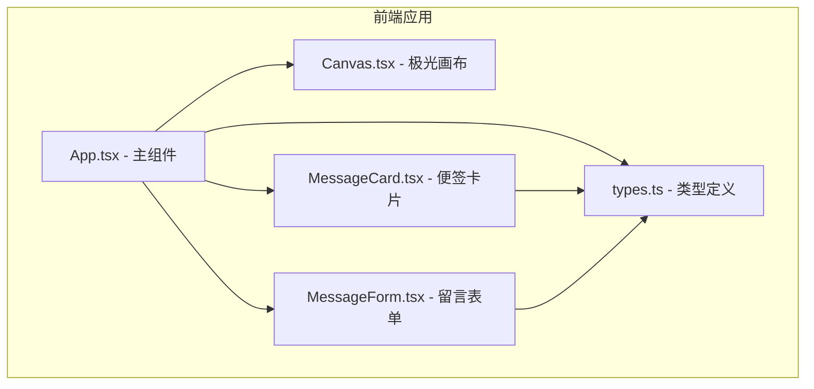

## 1. 架构设计



## 2. 技术描述

- **前端框架**：React 18 + TypeScript
- **构建工具**：Vite 5 + @vitejs/plugin-react
- **唯一标识**：uuid 库
- **样式方案**：原生CSS + CSS Modules（内联样式处理动态值）
- **动画方案**：
  - Canvas 2D API 渲染极光背景
  - CSS 动画处理便签浮动、入场、点赞、翻牌
  - requestAnimationFrame 控制动画帧率

## 3. 文件结构

```
auto82/
├── package.json
├── vite.config.js
├── tsconfig.json
├── index.html
└── src/
    ├── App.tsx          # 主组件：状态管理、布局容器
    ├── types.ts         # TypeScript 类型定义
    └── components/
        ├── Canvas.tsx       # 极光背景画布组件
        ├── MessageForm.tsx  # 留言输入表单组件
        └── MessageCard.tsx  # 单条便签卡片组件
```

## 4. 数据模型

### 4.1 Message 接口

```typescript
interface Message {
  id: string;          // 唯一标识（uuid）
  content: string;     // 留言内容（最多100字）
  color: string;       // 便签底色（hex颜色值）
  timestamp: number;   // 发布时间戳
  likes: number;       // 点赞数
  position: {          // 随机位置（用于入场动画）
    x: number;
    y: number;
  };
  floatOffset: number; // 浮动动画偏移量（随机）
  floatDuration: number; // 浮动周期（随机2-4秒）
}
```

### 4.2 排序类型

```typescript
type SortType = 'latest' | 'hottest';
```

## 5. 核心实现方案

### 5.1 极光背景实现

- 使用 Canvas 2D API
- 三层正弦波叠加（分别对应青绿、蓝紫、粉红）
- 每层波浪有不同的频率、振幅、相位偏移
- 使用 requestAnimationFrame 逐帧更新
- 渐变色使用 createLinearGradient + 透明度叠加

### 5.2 便签动画实现

- 浮动动画：CSS @keyframes + animation-delay 随机化
- 入场动画：CSS transform + transition
- 点赞动画：CSS transform scale + 状态切换
- 翻牌动画：CSS transform rotateY + perspective
- 星座图案：Canvas 或 SVG 随机生成点和连线

### 5.3 性能优化

- 便签数量限制在50条以内
- Canvas 动画使用 requestAnimationFrame
- 便签浮动使用 CSS 动画（GPU加速）
- 相对时间每10秒刷新一次（setInterval）

### 5.4 响应式布局

- 使用 CSS Grid 布局
- 媒体查询断点：1200px、768px
- 列间距固定 20px
- 卡片宽度自适应列宽

## 6. 预设颜色方案

12种柔和便签色：
| 颜色名 | 色值 |
|-------|------|
| 雾蓝 | #a8d8ea |
| 薄荷绿 | #aae6c6 |
| 樱花粉 | #ffb7c5 |
| 鹅黄 | #fff3b0 |
| 薰衣草紫 | #d4b3ff |
| 蜜桃橙 | #ffccb3 |
| 天青 | #b3e0e6 |
| 玫粉 | #ff99cc |
| 嫩绿 | #c5e8a8 |
| 冰蓝 | #b3d9ff |
| 珊瑚粉 | #ffb3b3 |
| 柠檬黄 | #fff099 |
