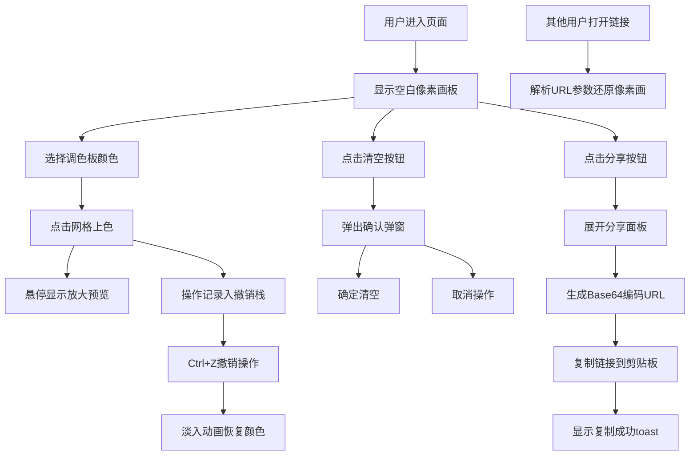

## 1. 产品概述

实时像素涂鸦是一款基于浏览器的在线像素画创作工具，用户可以在16x16的像素网格上进行创作，并通过分享链接将作品分享给他人观看。产品主要解决在线协作绘画缺乏实时性和趣味性的问题，目标用户为喜欢像素艺术、创意涂鸦的普通用户。

产品核心价值在于提供一个简洁有趣的像素画创作体验，支持快速撤销和一键分享，让用户能够轻松创作并传播自己的像素艺术作品。

## 2. 核心功能

### 2.1 功能模块
1. **主创作页面**：像素网格画板、调色板、撤销计数器、清空按钮、分享按钮
2. **分享功能**：生成包含画板数据的Base64编码URL、一键复制、toast提示

### 2.2 页面详情

| 页面名称 | 模块名称 | 功能描述 |
|---------|---------|---------|
| 主创作页面 | 像素网格画板 | 16x16像素网格，支持点击上色，鼠标悬停显示放大预览（60x60px悬浮窗口显示当前颜色和坐标） |
| 主创作页面 | 调色板 | 12种预设颜色（红、橙、黄、绿、青、蓝、紫、粉、棕、灰、黑、白），选中高亮显示（4px黄色#FFD700内发光） |
| 主创作页面 | 撤销计数器 | 五个小圆点显示可用撤销次数（绿色可用/灰色不可用），Ctrl+Z撤销最近5步，撤销时0.2秒淡入动画 |
| 主创作页面 | 清空画板按钮 | 红色圆形按钮带垃圾桶图标，点击弹出确认弹窗（半透明遮罩+白色圆角矩形），包含取消/确定按钮 |
| 主创作页面 | 分享按钮 | 蓝紫色渐变圆角矩形，悬停向右滑动0.2秒展开下拉面板，生成Base64编码URL，复制后显示toast提示 |
| 分享链接页面 | 画板还原 | 通过URL参数解析Base64编码的像素数据，还原像素画 |

## 3. 核心流程

用户进入页面后，默认显示空白16x16像素画板。用户从右侧调色板选择颜色（选中状态高亮），然后点击网格进行上色，鼠标悬停时显示放大预览。用户可以使用Ctrl+Z撤销操作（最多5步），撤销时被修改的格子以淡入动画恢复。点击清空按钮弹出确认弹窗，确认后清空画板。点击分享按钮展开面板，生成包含画板数据的Base64编码URL并复制到剪贴板，显示复制成功toast。其他用户打开分享链接即可看到相同的像素画。

## 4. 用户界面设计

### 4.1 设计风格
- **主色调**：深色模式背景 #1a1a2e
- **强调色**：彩虹渐变分隔线、黄色#FFD700选中高亮、蓝紫色渐变分享按钮、红色清空按钮
- **中性色**：浅灰色#ccc网格线、白色文字、灰色不可用状态
- **按钮风格**：圆角矩形/圆形，0.2s ease-out过渡动画，悬停放大1.05倍并加深阴影
- **字体**：系统无衬线字体，标题28px字重600，白色
- **布局风格**：画板居中，左右自适应边距，调色板右侧

### 4.2 页面设计概览

| 页面名称 | 模块名称 | UI元素 |
|---------|---------|--------|
| 主创作页面 | 标题区 | "实时像素涂鸦"白色标题，2px彩虹渐变分隔线 |
| 主创作页面 | 画板区 | 600x600px Canvas，16x16网格，浅灰色#ccc格线，白色背景 |
| 主创作页面 | 调色板 | 右侧12色块（40x40px），2px圆角边框，选中时4px黄色#FFD700内发光 |
| 主创作页面 | 撤销指示器 | 左上角五个小圆点，绿色可用/灰色不可用 |
| 主创作页面 | 清空按钮 | 画板下方红色圆形（直径48px），白色垃圾桶图标 |
| 主创作页面 | 分享按钮 | 左下角蓝紫色渐变圆角矩形，悬停滑出下拉面板 |
| 主创作页面 | 悬停预览 | 鼠标旁60x60px悬浮窗口，显示当前格子颜色和坐标 |
| 主创作页面 | 确认弹窗 | 半透明黑色遮罩，白色圆角矩形弹窗，取消（浅灰）和确定（红色）按钮 |

### 4.3 响应式设计
- **桌面端**：画板600x600px，像素格37.5x37.5px，调色板垂直排列在右侧
- **移动端（<768px）**：画板320x320px，像素格20x20px，调色板变为横向可滚动色条，按钮文字隐藏仅保留图标，整体布局居中

### 4.4 性能要求
- Canvas渲染帧率稳定60fps
- 撤销操作响应时间≤50ms
- 生成分享链接时间≤100ms
