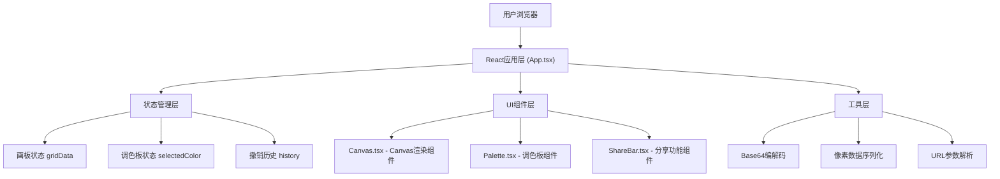

## 1. 架构设计

本项目为纯前端React应用，无后端服务。架构层次如下：



## 2. 技术描述

- **前端框架**：React 18 + TypeScript
- **构建工具**：Vite
- **渲染技术**：Canvas 2D API
- **状态管理**：React useState/useEffect（无需额外状态管理库，状态简单）
- **样式方案**：CSS Modules / 内联样式（按用户需求精确控制像素级样式）
- **图标**：lucide-react（垃圾桶图标）

## 3. 路由定义

| 路由 | 用途 |
|-----|------|
| / | 主创作页面，支持通过URL查询参数加载分享的像素画 |

## 4. 数据模型

### 4.1 核心数据结构

```typescript
// 像素数据类型 - 16x16二维数组，每个元素存储颜色值
type GridData = string[][];

// 历史记录项 - 记录每次操作修改的格子位置和前后颜色
interface HistoryItem {
  x: number;
  y: number;
  previousColor: string;
  newColor: string;
}

// 调色板颜色定义
const PALETTE_COLORS = [
  '#FF0000', // 红
  '#FF8C00', // 橙
  '#FFD700', // 黄
  '#00FF00', // 绿
  '#00FFFF', // 青
  '#0000FF', // 蓝
  '#800080', // 紫
  '#FFC0CB', // 粉
  '#8B4513', // 棕
  '#808080', // 灰
  '#000000', // 黑
  '#FFFFFF', // 白
];
```

### 4.2 分享链接数据格式

```typescript
// 画板数据序列化为紧凑字符串后进行Base64编码
// 序列化方案：将16x16颜色数组映射为调色板索引（0-11），每格4bit，共16*16*4=1024bit=128字节
interface SharePayload {
  version: number;      // 版本号，用于未来兼容性
  grid: number[];       // 16x16调色板索引数组（0-11）
}

// URL格式：/?art=<base64_encoded_data>
```

## 5. 核心模块设计

### 5.1 App.tsx - 主应用组件
- 职责：管理全局状态（gridData, selectedColor, history栈）、处理用户交互、协调子组件
- 数据流：用户点击Canvas → onGridClick回调 → 更新gridData → push历史记录 → 重新渲染Canvas
- 撤销逻辑：Ctrl+Z监听 → pop历史记录 → 恢复对应格子previousColor → 触发淡入动画
- 分享逻辑：序列化gridData → Base64编码 → 更新URL query参数 → 复制到剪贴板

### 5.2 Canvas.tsx - Canvas渲染组件
- Props: `gridData`, `selectedColor`, `onGridClick`, `hoverCell`
- 职责：绘制16x16网格线、绘制像素填充、处理鼠标事件（点击/悬停/移动）
- 性能优化：使用requestAnimationFrame确保60fps，仅在gridData变化时重绘
- 悬停预览：监听mousemove计算格子坐标，通过props回调传递hover状态给父组件渲染悬浮预览

### 5.3 Palette.tsx - 调色板组件
- Props: `selectedColor`, `onColorSelect`
- 职责：渲染12个色块，处理选中状态高亮（4px黄色内发光box-shadow）

### 5.4 ShareBar.tsx - 分享功能组件
- Props: `gridData`
- 职责：分享按钮、下拉面板展开动画、生成链接、复制到剪贴板、toast提示
- 内部状态：面板展开/收起、toast显示状态

## 6. 文件结构

```
auto86/
├── package.json
├── vite.config.js
├── tsconfig.json
├── index.html
└── src/
    ├── App.tsx         # 主应用组件
    ├── Canvas.tsx      # Canvas渲染组件
    ├── Palette.tsx     # 调色板组件
    ├── ShareBar.tsx    # 分享功能组件
    └── main.tsx        # 入口文件
```
