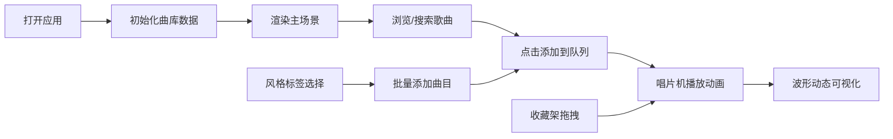

## 1. 产品概述

个性化音乐电台与虚拟唱片机收藏应用，用户可从曲库中挑选歌曲创建专属电台，每首歌曲以虚拟唱片形式收藏，播放时呈现精美的3D唱片机动画与动态波形特效。

- 核心价值：为音乐爱好者提供沉浸式的虚拟唱片收藏与播放体验，融合复古黑胶唱片美学与现代交互设计
- 目标用户：喜欢音乐收藏、追求个性化播放体验的用户
- 市场定位：Web端轻量级音乐电台应用，主打视觉体验与交互乐趣

## 2. 核心功能

### 2.1 用户角色

| 角色 | 注册方式 | 核心权限 |
|------|---------|---------|
| 普通用户 | 无需注册，本地存储 | 搜索歌曲、创建电台、收藏唱片、播放音乐 |

### 2.2 功能模块

1. **首页主场景**：黑胶唱片店风格背景、木质唱片架、唱片机播放区、动态波形可视化
2. **电台管理**：电台命名、风格标签选择、批量添加曲目、队列管理
3. **搜索系统**：按曲名/歌手搜索、搜索结果列表、点击添加到队列
4. **收藏架**：6列Grid布局展示收藏唱片、拖拽播放、高光动画效果
5. **播放引擎**：CSS唱片机动画、Web Audio API模拟音频、Canvas波形绘制

### 2.3 页面详情

| 页面名称 | 模块名称 | 功能描述 |
|---------|---------|----------|
| 主页面 | 顶部唱片架 | 横向展示三张唱片封面，每格随机几何图形封面 |
| 主页面 | 唱片机播放区 | CSS绘制唱片机，转盘旋转动画，唱臂移入移出动画 |
| 主页面 | 动态波形区 | Canvas绘制随节奏变化的扫频波形线 |
| 主页面 | 右侧搜索栏 | 毛玻璃效果搜索框，搜索结果列表展示 |
| 主页面 | 电台创建区 | 电台名称输入框、风格标签、批量添加功能 |
| 主页面 | 左侧收藏架 | 6列Grid布局，拖拽唱片到播放区直接播放 |

## 3. 核心流程

用户打开应用 → 自动初始化曲库与默认电台 → 浏览收藏架或搜索歌曲 → 点击歌曲添加到播放队列 → 唱片机开始播放动画 → 波形随播放进度动态变化 → 可拖拽收藏架唱片直接播放 → 可选择风格标签批量添加曲目

## 4. 用户界面设计

### 4.1 设计风格

- **主色调**：深棕色(#2D1B0E)到暗红色(#4A0E0E)的径向渐变背景
- **辅助色**：木质棕色(#8B5A2B)、镀铬银色(#C0C0C0)、唱片黑(#1A1A1A)
- **强调色**：唱针红(#E63946)、标签白(#FFFFFF)、悬停橙(#FF8C42)
- **风格标签色**：民谣棕(#8B6914)、电子紫(#9B59B6)、爵士蓝(#3498DB)、古典金(#F1C40F)、摇滚红(#E74C3C)、流行粉(#E91E63)
- **按钮/卡片**：圆角12px，毛玻璃模糊10px，半透明背景
- **字体**：复古打字机风格(Courier Prime/monospace)，白色文字带微弱阴影
- **布局**：三栏布局(左侧收藏架、中间播放区、右侧搜索管理)
- **图标**：使用lucide-react图标库，统一线性风格

### 4.2 页面设计概览

| 页面名称 | 模块名称 | UI元素 |
|---------|---------|--------|
| 主页面 | 背景 | 深棕到暗红径向渐变，模拟老式唱片店灯光 |
| 主页面 | 顶部唱片架 | 木质纹理，每格展示3张唱片，随机几何封面 |
| 主页面 | 唱片机 | 圆形转盘200px，黑到深灰渐变，镀铬边框，红底白字标签 |
| 主页面 | 唱片封套 | 匀速旋转(2秒/圈)，边缘晕影光效，点击暂停 |
| 主页面 | 唱臂动画 | 暂停时0.8秒ease-out移入，播放时移出 |
| 主页面 | 波形Canvas | 白色折线扫过，振幅随节奏变化 |
| 主页面 | 搜索栏 | 毛玻璃背景，圆角12px，白灰边框1px |
| 主页面 | 搜索结果 | 最多8条，高60px，左侧缩略图50x50px，悬停浅橙色 |
| 主页面 | 风格标签 | 圆角矩形，半透明对应色，悬停放大1.1倍 |
| 主页面 | 收藏架卡片 | 宽120px高140px，亚克力板覆盖，45度高光带 |
| 主页面 | 拖拽效果 | 半透明跟随体(blur2px, opacity0.6)，放下闪烁金边 |
| 主页面 | 提示气泡 | 圆角12px，白色半透明，顶部滑入停留1.5秒 |

### 4.3 响应式设计

- **桌面优先**：1280px以上三栏完整布局
- **平板适配**：1024px左右搜索栏移至底部，收藏架缩为4列
- **移动适配**：768px以下单列布局，唱片机缩小，收藏架3列
- **触控优化**：增大可点击区域至44x44px，支持触摸拖拽

### 4.4 动画性能

- 所有CSS动画使用transform和opacity，避免重排
- 帧率保持在50FPS以上
- Canvas动画使用requestAnimationFrame
- 拖拽使用GPU加速，will-change提示浏览器优化

