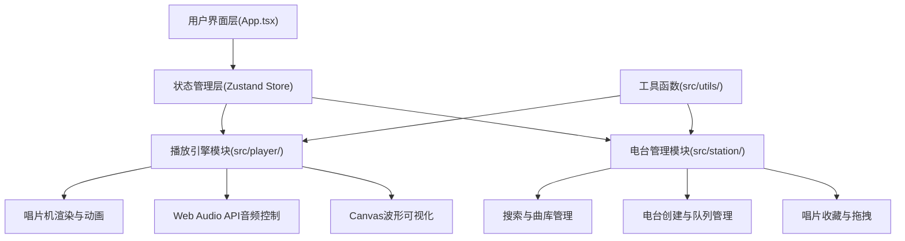

## 1. 架构设计

本项目为纯前端单页应用，采用React + TypeScript + Vite技术栈，使用Zustand进行全局状态管理，分为播放引擎和电台管理两大模块。



## 2. 技术栈描述

- **前端框架**：React@18 + TypeScript@5
- **构建工具**：Vite@5 + @vitejs/plugin-react@4
- **状态管理**：Zustand@4
- **唯一标识**：uuid@9
- **图标库**：lucide-react@latest
- **开发模式**：纯前端，Mock数据，无后端依赖

## 3. 项目结构

```
d:\Pro\tasks\auto87/
├── package.json
├── vite.config.js
├── tsconfig.json
├── index.html
├── .trae/documents/
│   ├── PRD.md
│   └── TechArch.md
└── src/
    ├── App.tsx
    ├── store/
    │   └── useStore.ts
    ├── player/
    │   ├── Player.tsx
    │   └── Waveform.tsx
    ├── station/
    │   ├── StationManager.tsx
    │   ├── RecordCard.tsx
    │   └── RecordShelf.tsx
    └── utils/
        └── colorPalette.ts
```

## 4. 数据模型定义

### 4.1 核心类型定义

```typescript
interface Track {
  id: string;
  title: string;
  artist: string;
  genre: string;
  duration: number;
  coverColors: string[];
  coverPattern: 'circles' | 'triangles' | 'squares' | 'waves';
}

interface RadioStation {
  id: string;
  name: string;
  queue: Track[];
  createdAt: number;
}

interface PlayState {
  currentTrack: Track | null;
  isPlaying: boolean;
  progress: number;
  volume: number;
}

interface StoreState {
  trackLibrary: Track[];
  collections: Track[];
  stations: RadioStation[];
  currentStation: RadioStation | null;
  playState: PlayState;
  searchText: string;
  searchResults: Track[];
}
```

### 4.2 状态Actions

- `setSearchText(text: string)`: 更新搜索文本
- `searchTracks()`: 根据搜索文本过滤曲库
- `addToQueue(track: Track)`: 添加曲目到当前队列
- `removeFromQueue(trackId: string)`: 从队列移除曲目
- `addToCollection(track: Track)`: 添加到收藏架
- `removeFromCollection(trackId: string)`: 从收藏移除
- `createStation(name: string)`: 创建新电台
- `setCurrentTrack(track: Track)`: 设置当前播放曲目
- `togglePlay()`: 切换播放/暂停
- `setProgress(progress: number)`: 更新播放进度
- `addTracksByGenre(genre: string, count: number)`: 按风格批量添加

## 5. 性能优化策略

### 5.1 动画性能

- 所有CSS动画使用`transform`和`opacity`属性
- 为动画元素添加`will-change: transform, opacity`
- 使用`requestAnimationFrame`驱动Canvas波形动画
- 避免在动画回调中修改布局相关属性

### 5.2 渲染优化

- React组件使用`React.memo`避免不必要重渲染
- 列表使用稳定的`key`属性
- 拖拽操作使用`transform`而非`top/left`定位
- Canvas绘制使用离屏Canvas预渲染唱片封面

### 5.3 内存管理

- Web Audio API资源及时释放
- 事件监听器在组件卸载时移除
- requestAnimationFrame回调正确取消
- 大对象使用Object.freeze避免意外修改

## 6. 模块接口定义

### 6.1 播放引擎模块

```typescript
// Player.tsx Props
interface PlayerProps {
  currentTrack: Track | null;
  isPlaying: boolean;
  progress: number;
  onTogglePlay: () => void;
}

// Waveform.tsx Props
interface WaveformProps {
  progress: number;
  isPlaying: boolean;
  audioData?: Uint8Array;
}
```

### 6.2 电台管理模块

```typescript
// StationManager.tsx Props
interface StationManagerProps {
  searchText: string;
  searchResults: Track[];
  currentQueue: Track[];
  onSearchChange: (text: string) => void;
  onAddToQueue: (track: Track) => void;
  onAddByGenre: (genre: string) => void;
  onCreateStation: (name: string) => void;
}

// RecordCard.tsx Props
interface RecordCardProps {
  track: Track;
  size?: 'small' | 'medium' | 'large';
  draggable?: boolean;
  onDragStart?: (track: Track) => void;
  onDragEnd?: () => void;
  onClick?: (track: Track) => void;
}

// RecordShelf.tsx Props
interface RecordShelfProps {
  tracks: Track[];
  onTrackDrop: (track: Track) => void;
  onTrackClick: (track: Track) => void;
}
```

### 6.3 工具函数

```typescript
// colorPalette.ts
function generateCoverColors(title: string): string[];
function hslToHex(h: number, s: number, l: number): string;
function hashStringToHue(str: string): number;
```

## 7. Mock数据规范

- 预置50+首不同风格的模拟曲目
- 曲名和歌手使用虚构但合理的名称
- 风格覆盖：民谣、电子、爵士、古典、摇滚、流行
- 每首曲目包含唯一ID、时长(180-360秒)、封面配色方案
- 初始收藏架预置12张唱片

