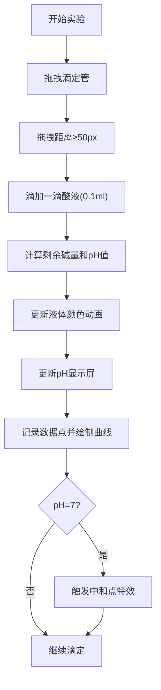

## 1. 产品概述

虚拟化学实验室酸碱中和滴定交互模拟应用，通过直观的拖拽操作让用户体验化学实验过程，实时观察pH变化和指示剂颜色转变，实现沉浸式的化学学习体验。

- 主要用途：化学教育、实验模拟、酸碱中和反应可视化教学
- 目标用户：学生、化学教师、化学爱好者
- 产品价值：降低实验门槛，安全直观地展示化学反应原理，提升学习效率

## 2. 核心功能

### 2.1 用户角色
本应用无需用户登录，所有用户均可直接使用全部功能。

| 角色 | 注册方式 | 核心权限 |
|------|----------|----------|
| 访客用户 | 无需注册 | 完整使用所有实验功能 |

### 2.2 功能模块
1. **实验台主界面**：滴管拖拽操作、烧杯液体动画、pH计实时显示
2. **数据面板**：pH曲线绘制、滴定体积记录、中和点标记
3. **状态管理**：试剂体积管理、pH值计算、指示剂颜色混合、历史记录

### 2.3 页面详情
| 页面名称 | 模块名称 | 功能描述 |
|----------|----------|------------|
| 主界面 | 实验台 | 拖拽酸式滴定管滴加酸液，观察烧杯内液体颜色变化和液面波动 |
| 主界面 | pH显示屏 | 电子数字屏实时显示pH值，颜色随酸碱性渐变（蓝→绿→红） |
| 主界面 | 数据面板 | Canvas绘制pH-体积曲线，支持鼠标悬停查看数据点 |
| 主界面 | 中和点特效 | 达到pH=7时显示闪烁金色五角星和庆祝粒子效果 |

## 3. 核心流程

用户拖拽酸式滴定管到烧杯上方，松开鼠标后自动滴下一滴酸液，系统实时计算剩余碱量和pH值，更新烧杯内液体颜色和pH显示屏，同时在数据面板记录数据点并绘制曲线。当pH值达到7时触发中和点庆祝特效。

## 4. 用户界面设计

### 4.1 设计风格
- **设计风格**：极简科幻风格，清爽的实验室环境
- **主色调**：蓝色系（主色 #1976d2），配合pH渐变色彩（蓝→绿→红）
- **圆角**：统一6px圆角
- **按钮样式**：扁平化设计，悬停时有轻微阴影和颜色变化
- **字体**：等宽数字字体用于pH显示，主字体使用现代无衬线字体
- **图标风格**：简洁线性图标

### 4.2 页面设计概述
| 页面名称 | 模块名称 | UI元素 |
|----------|----------|--------|
| 主界面 | 背景 | 浅灰到淡蓝线性渐变（#f0f0f0→#e3f2fd），网格纹理背景 |
| 主界面 | 实验台区域 | 居中80%宽，80vh高，浅灰色虚线网格 |
| 主界面 | 烧杯 | 圆底玻璃器皿，宽180px高240px，半透明蓝色边框，底部弧形 |
| 主界面 | 滴定管 | 长条形蓝色，宽20px高200px，带刻度，可拖拽 |
| 主界面 | 数据面板 | 右侧白色卡片，宽420px，圆角8px，阴影效果 |
| 主界面 | pH显示屏 | 等宽字体32px，数字颜色随pH渐变 |
| 主界面 | 中和点标记 | 金色五角星，闪烁周期0.3秒，尺寸20px |

### 4.3 响应式
- 采用桌面端优先设计
- 实验台区域居中布局，自适应窗口大小
- 数据面板固定在右侧，保持420px宽度
- 移动端可适当调整面板位置为底部悬浮

### 4.4 动画效果
- **滴液动画**：圆形液滴从滴管滑落，1秒完成，进入烧杯后消失
- **液面波动**：正弦波动画，振幅3px，频率0.5Hz
- **颜色过渡**：requestAnimationFrame驱动，60fps流畅过渡
- **粒子效果**：中和点时金色粒子随机飞出，持续2秒渐隐
- **曲线绘制**：pH曲线延迟不超过100ms，颜色随pH值渐变
