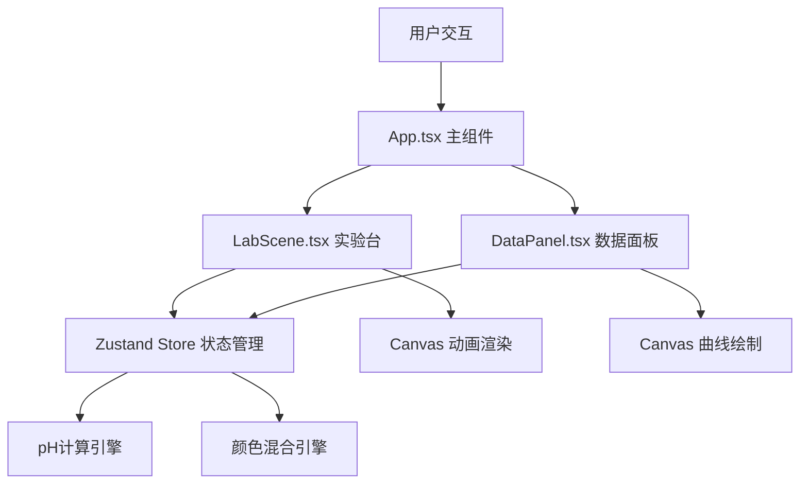

## 1. 架构设计



## 2. 技术描述

- **前端框架**：React 18 + TypeScript
- **构建工具**：Vite
- **状态管理**：Zustand
- **UI渲染**：React + CSS3 + Canvas 2D
- **动画引擎**：requestAnimationFrame
- **唯一标识**：uuid

### 依赖说明
| 包名 | 版本 | 用途 |
|------|------|------|
| react | ^18 | 前端框架 |
| react-dom | ^18 | DOM渲染 |
| typescript | ^5 | 类型系统 |
| vite | ^5 | 构建工具 |
| @vitejs/plugin-react | ^4 | Vite React插件 |
| zustand | ^4 | 状态管理 |
| uuid | ^9 | 唯一ID生成 |

## 3. 项目文件结构

```
auto88/
├── package.json          # 项目依赖和脚本
├── vite.config.js        # Vite构建配置
├── tsconfig.json         # TypeScript配置
├── index.html            # 入口HTML
└── src/
    ├── App.tsx           # 主应用组件
    ├── store.ts          # Zustand状态管理
    ├── LabScene.tsx      # 实验台组件
    └── DataPanel.tsx     # 数据面板组件
```

## 4. 核心数据结构

### 4.1 Store 状态定义

```typescript
interface LabState {
  // 试剂体积 (ml)
  acidVolume: number;          // 已滴加酸液体积
  baseVolume: number;          // 初始碱液体积
  totalVolume: number;         // 烧杯内总液体体积
  
  // pH值相关
  currentPH: number;           // 当前pH值
  phHistory: Array<{volume: number, ph: number, id: string}>;
  
  // 指示剂状态
  phenolphthaleinColor: string;  // 酚酞颜色
  methylOrangeColor: string;      // 甲基橙颜色
  mixedColor: string;             // 混合颜色
  
  // 中和状态
  isNeutralized: boolean;      // 是否已达到中和点
  neutralizationPoint: {volume: number, ph: number} | null;
  
  // 动画状态
  isDropping: boolean;         // 是否正在滴液
  dropPosition: {x: number, y: number} | null;
  
  // 操作方法
  addAcidDrop: () => void;     // 滴加一滴酸
  updatePH: () => void;        // 更新pH值
  reset: () => void;           // 重置实验
}
```

### 4.2 pH计算逻辑

- 初始碱液浓度：0.1mol/L，体积50ml，pH=13
- 酸液浓度：0.1mol/L，每滴0.1ml
- 剩余OH⁻浓度 = (初始OH⁻物质的量 - 已滴加H⁺物质的量) / 总体积
- pH = 14 + log₁₀([OH⁻]) （碱性时）
- pH = -log₁₀([H⁺]) （酸性时）
- 中和点：pH=7，酸体积=碱体积

### 4.3 指示剂颜色混合

- **酚酞**：pH≥8.2时粉红色 #ffb6c1，pH<8.2时无色 rgba(255,255,255,0)
- **甲基橙**：pH≥4.4时黄色 #ffd700，pH<4.4时红色 #ff4444
- 混合权重：根据pH值在阈值区间内线性过渡
- 最终颜色 = 酚酞颜色 × 权重₁ + 甲基橙颜色 × 权重₂

## 5. 组件职责划分

### App.tsx (主组件)
- 整体布局管理
- 实验状态调度
- 子组件组合

### LabScene.tsx (实验台组件)
- 滴管拖拽交互
- 烧杯CSS绘制
- 液体波浪动画
- 液滴下落动画
- pH数字显示屏
- 中和点粒子特效
- Canvas动画渲染（requestAnimationFrame）

### DataPanel.tsx (数据面板组件)
- Canvas 2D曲线绘制
- pH值实时显示
- 滴定体积记录
- 数据点悬停提示
- 中和点五角星标记

### store.ts (状态管理)
- 试剂体积管理
- pH值计算逻辑
- 指示剂颜色混合
- 历史记录维护
- 中和状态判断

## 6. 性能优化策略

1. **帧率控制**：所有动画使用requestAnimationFrame，保持55fps+
2. **状态更新**：pH值每500ms更新一次，避免频繁计算
3. **Canvas优化**：局部重绘，避免全画布刷新
4. **事件防抖**：拖拽事件节流，保证响应时间<50ms
5. **曲线绘制延迟**：限制在100ms以内，使用requestIdleCallback处理非关键更新
6. **内存管理**：历史记录限制最大数量，及时清理动画帧
