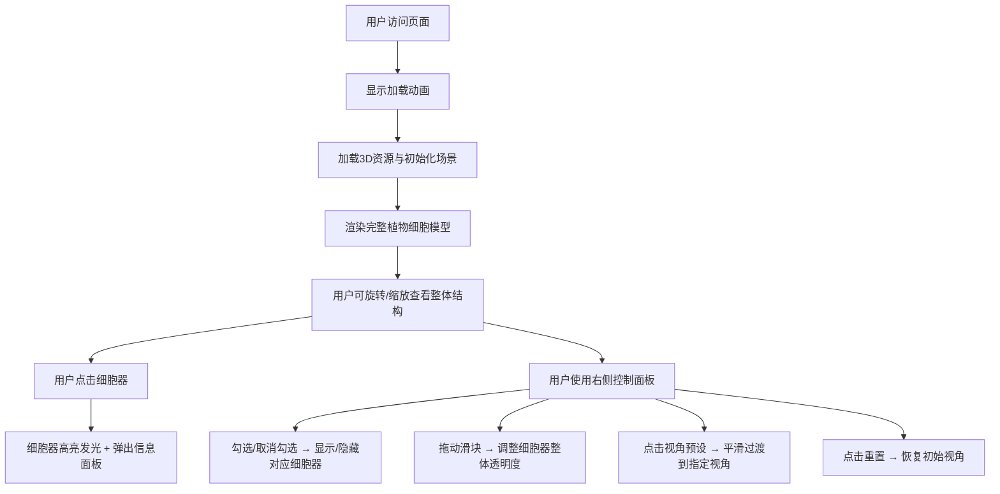

## 1. 产品概述

植物细胞3D探索教学应用，帮助学生在浏览器中直观观察和交互探索植物细胞的微观结构，解决生物教学中细胞结构抽象难理解、学生无法直观观察各细胞器空间位置和形态的问题。

- 目标用户：中学生物学生、教师及生物爱好者
- 核心价值：将抽象的细胞结构转化为可交互的3D可视化模型，提升学习效率和兴趣

## 2. 核心功能

### 2.1 用户角色

| 角色 | 注册方式 | 核心权限 |
|------|----------|----------|
| 普通用户 | 无需注册，直接访问 | 浏览3D模型、交互探索、使用控制面板 |

### 2.2 功能模块

1. **3D细胞场景**：完整的植物细胞3D模型，包含细胞壁、细胞膜、液泡及7种细胞器
2. **信息面板**：点击细胞器显示详细信息（名称、尺寸、功能）
3. **控制面板**：细胞器显隐控制、透明度调节、视角预设切换
4. **加载动画**：页面加载时的过渡效果

### 2.3 页面详情

| 页面名称 | 模块名称 | 功能描述 |
|----------|----------|----------|
| 主页面 | 3D场景模块 | 可360度旋转缩放的植物细胞模型，液泡占据中心位置，细胞壁和细胞膜构成外层结构，7种细胞器分布在细胞质中 |
| 主页面 | 信息面板模块 | 左下角半透明面板，点击细胞器后显示其中文名、英文名、真实尺寸范围和功能描述，边框颜色与细胞器主色匹配 |
| 主页面 | 控制面板模块 | 右侧悬浮面板，包含细胞器复选框列表、透明度滑块、3个视角预设按钮和重置视角按钮 |
| 主页面 | 加载动画模块 | 页面加载时显示圆形旋转进度条，持续2秒后平滑过渡到主场景 |

## 3. 核心流程

## 4. 用户界面设计

### 4.1 设计风格

- **主色调**：深蓝到黑色的暗色渐变背景，营造科学探索氛围
- **强调色**：金色（高亮光圈、边缘勾勒）、亮蓝色（#4fc3f7，选中状态、按钮悬停）
- **按钮样式**：圆角矩形，悬停时从灰色变为亮蓝色，带有平滑过渡动画
- **字体**：现代无衬线字体，信息面板14px，行高1.6
- **布局风格**：中央3D渲染区（80%宽度），左右各10%边距，右侧悬浮控制面板，左下角信息面板
- **视觉效果**：半透明磨砂玻璃质感面板，金色边缘勾勒，CSS滤镜发光效果

### 4.2 页面设计概述

| 页面名称 | 模块名称 | UI元素 |
|----------|----------|--------|
| 主页面 | 3D场景模块 | 半透明淡紫色液泡（带蓝色浮动颗粒）、浅绿色细胞壁（金色边缘）、淡黄色细胞膜、7种各具形态的细胞器 |
| 主页面 | 信息面板模块 | 深灰色半透明磨砂背景，2px彩色边框（匹配细胞器颜色），白色文字，圆角设计 |
| 主页面 | 控制面板模块 | 宽度280px，深灰半透明背景，圆角12px，距右边缘20px，半透明分隔线，浅灰色文字（#ddd），选中项亮蓝色 |
| 主页面 | 加载动画模块 | 浅灰色圆形旋转进度条，居中显示 |

### 4.3 响应式设计

- **桌面端（≥768px）**：右侧垂直控制面板，左下角信息面板
- **移动端（<768px）**：控制面板变为底部横向抽屉，默认高度60px，点击展开至屏幕高度30%
- **触摸优化**：支持手势缩放和旋转，按钮尺寸适配触摸操作

### 4.4 3D场景设计

- **环境与氛围**：深蓝到黑色渐变背景，营造微观世界的沉浸感
- **光照设置**：两盏角度可调的点光源，确保细胞器各面都有适当照明，体现3D立体感
- **相机设置**：透视相机，支持OrbitControls控制旋转缩放，初始视角可完整观察整个细胞
- **交互与动画**：
  - 液泡内蓝色颗粒随机浮动
  - 选中细胞器金色光圈脉动（0.5Hz）
  - 视角切换平滑过渡（1秒动画）
  - 控制面板悬停时细胞器对应闪烁
- **后期处理**：使用OutlinePass实现选中高亮（发光强度1.5，阈值0.1），配合CSS滤镜增强发光效果
- **性能预算**：保持30FPS以上，在中等配置笔记本电脑上流畅运行

## 5. 交互反馈要求

- 所有点击、悬停、滑块拖动操作响应延迟≤100ms
- 悬停复选框时对应细胞器闪烁提示
- 滑块拖动时实时更新透明度
- 视角切换时显示平滑过渡动画
- 按钮悬停时颜色渐变反馈
