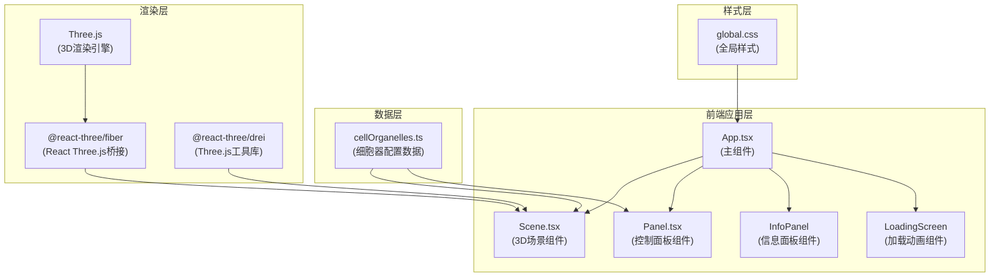

## 1. 架构设计



## 2. 技术选型说明

| 技术 | 版本 | 用途说明 |
|------|------|----------|
| React | 18.x | UI构建框架，组件化开发 |
| React DOM | 18.x | React DOM渲染 |
| TypeScript | 5.x | 类型安全的JavaScript |
| Vite | 5.x | 快速构建工具和开发服务器 |
| @vitejs/plugin-react | 4.x | Vite的React支持插件 |
| Three.js | 0.160.x | 3D图形渲染引擎 |
| @react-three/fiber | 8.x | React与Three.js的桥接库 |
| @react-three/drei | 9.x | R3F常用组件工具库（OrbitControls等） |
| uuid | 9.x | 生成唯一标识符 |

## 3. 项目结构

```
auto89/
├── .trae/
│   └── documents/
│       ├── PRD.md
│       └── technical-architecture.md
├── src/
│   ├── components/
│   │   ├── Scene.tsx          # 3D场景核心组件
│   │   └── Panel.tsx          # 右侧控制面板组件
│   ├── data/
│   │   └── cellOrganelles.ts  # 细胞器数据配置
│   ├── styles/
│   │   └── global.css         # 全局样式
│   └── App.tsx                # 主应用组件
├── index.html                 # 入口HTML
├── package.json               # 项目依赖配置
├── vite.config.js             # Vite构建配置
└── tsconfig.json              # TypeScript配置
```

## 4. 核心组件设计

### 4.1 App.tsx - 主组件
- **状态管理**：
  - `loading`：加载状态
  - `selectedOrganelle`：当前选中的细胞器
  - `opacity`：细胞器整体透明度
  - `visibleOrganelles`：细胞器可见性Map
  - `hoveredOrganelle`：悬停高亮的细胞器
  - `cameraTarget`：相机目标位置（用于视角切换）

- **核心功能**：
  - 初始化场景和渲染循环
  - 管理全局状态
  - 协调Scene和Panel组件的通信
  - 处理加载动画逻辑（2秒后显示主内容）

### 4.2 Scene.tsx - 3D场景组件
- **Props**：
  - `onOrganelleClick`：细胞器点击回调
  - `opacity`：透明度参数
  - `visibleOrganelles`：可见性Map
  - `hoveredOrganelle`：悬停高亮
  - `selectedOrganelle`：选中细胞器
  - `cameraTarget`：相机目标

- **核心3D元素**：
  - **细胞壁**：半透明浅绿色立方体，金色边缘线条
  - **细胞膜**：紧贴细胞壁内侧的淡黄色半透明层
  - **液泡**：半透明淡紫色球体，内部蓝色浮动颗粒
  - **7种细胞器**：每种有独特的几何形状、颜色、动画
  - **光照**：两盏点光源，位置可配置

- **交互处理**：
  - Raycaster点击检测
  - OutlinePass高亮选中细胞器
  - 选中时金色光圈脉动动画（0.5Hz）
  - 悬停时闪烁效果

### 4.3 Panel.tsx - 控制面板组件
- **Props**：
  - `organelles`：细胞器列表
  - `visibleOrganelles`：可见性状态
  - `opacity`：透明度值
  - `onVisibilityChange`：可见性变更回调
  - `onOpacityChange`：透明度变更回调
  - `onViewPreset`：视角预设回调
  - `onResetView`：重置视角回调
  - `onHover`：悬停回调

- **UI元素**：
  - 细胞器复选框列表（带颜色色块）
  - 透明度滑块（0.1-1.0）
  - 3个视角预设按钮
  - 重置视角按钮
  - 半透明分隔线

### 4.4 cellOrganelles.ts - 数据配置
```typescript
interface OrganelleData {
  id: string;
  name: string;           // 中文名
  englishName: string;    // 英文名
  color: string;          // 主色调
  size: string;           // 真实尺寸范围
  scale: number;          // 模型缩放比例
  position: [number, number, number]; // 初始位置
  function: string;       // 功能描述
  type: OrganelleType;    // 细胞器类型
}

type OrganelleType = 
  | 'nucleus'      // 细胞核
  | 'chloroplast'  // 叶绿体
  | 'mitochondrion'// 线粒体
  | 'golgi'        // 高尔基体
  | 'er'           // 内质网
  | 'ribosome'     // 核糖体
  | 'centrosome';  // 中心体
```

## 5. 核心技术实现方案

### 5.1 3D渲染架构
- 使用`@react-three/fiber`的声明式API管理Three.js场景
- `@react-three/drei`提供`OrbitControls`实现360度旋转缩放
- 使用`OutlinePass`实现选中高亮效果（发光强度1.5，阈值0.1）
- CSS `filter: drop-shadow()` 配合Three.js后期处理增强发光效果

### 5.2 细胞器几何建模
- **细胞核**：`SphereGeometry` + 顶点着色器实现波纹纹理
- **叶绿体**：`SphereGeometry`（缩放为椭球）+ 内部金色圆柱体模拟类囊体
- **线粒体**：椭球体 + 内部折叠平面模拟嵴结构
- **高尔基体**：4-6个扁平圆柱体堆叠
- **内质网**：`TubeGeometry`构建波浪状网状结构
- **核糖体**：微小`SphereGeometry`，随机附着在内质网表面
- **中心体**：两个垂直的`CylinderGeometry`

### 5.3 动画系统
- 使用`useFrame` hook实现帧动画
- 液泡内颗粒：正弦波随机运动
- 选中脉动：`Math.sin(time * Math.PI)`控制光圈强度（0.5Hz）
- 视角切换：使用lerp插值实现平滑过渡（1秒动画）
- 悬停闪烁：快速切换透明度

### 5.4 性能优化
- 几何体复用：相同类型细胞器共享Geometry
- 材质复用：相同颜色/透明度的细胞器共享Material
- 帧率控制：使用`drei`的`<PerformanceMonitor>`动态调整质量
- 背面剔除：对封闭几何体启用`backside: false`

### 5.5 响应式布局
- CSS媒体查询检测屏幕宽度
- 移动端：使用CSS transform实现底部抽屉动画
- 使用`useMediaQuery` hook在React中响应断点变化

## 6. 类型定义

```typescript
// 细胞器类型
export type OrganelleType = 'nucleus' | 'chloroplast' | 'mitochondrion' | 'golgi' | 'er' | 'ribosome' | 'centrosome';

// 细胞器数据
export interface OrganelleData {
  id: string;
  type: OrganelleType;
  name: string;
  englishName: string;
  color: string;
  sizeRange: string;
  scale: number;
  position: [number, number, number];
  description: string;
  count?: number;
}

// 相机视角预设
export interface ViewPreset {
  name: string;
  position: [number, number, number];
  target: [number, number, number];
}

// 场景Props
export interface SceneProps {
  onOrganelleClick: (organelle: OrganelleData | null) => void;
  opacity: number;
  visibleOrganelles: Record<OrganelleType, boolean>;
  hoveredOrganelle: OrganelleType | null;
  selectedOrganelle: OrganelleType | null;
  viewPreset: ViewPreset | null;
}

// 控制面板Props
export interface PanelProps {
  organelles: OrganelleData[];
  visibleOrganelles: Record<OrganelleType, boolean>;
  opacity: number;
  onVisibilityChange: (type: OrganelleType, visible: boolean) => void;
  onOpacityChange: (opacity: number) => void;
  onViewPreset: (preset: ViewPreset) => void;
  onResetView: () => void;
  onHover: (type: OrganelleType | null) => void;
}
```

## 7. 样式规范

### CSS变量定义
```css
:root {
  --bg-gradient-start: #0a0a1a;
  --bg-gradient-end: #000000;
  --panel-bg: rgba(30, 30, 40, 0.85);
  --panel-border: rgba(255, 255, 255, 0.1);
  --text-primary: #ffffff;
  --text-secondary: #dddddd;
  --accent-blue: #4fc3f7;
  --accent-gold: #ffd700;
  --border-radius: 12px;
  --panel-width: 280px;
}
```

### 关键帧动画
```css
@keyframes spin { /* 加载动画 */ }
@keyframes pulse { /* 光圈脉动 */ }
@keyframes fadeIn { /* 淡入效果 */ }
@keyframes slideUp { /* 抽屉展开 */ }
```
