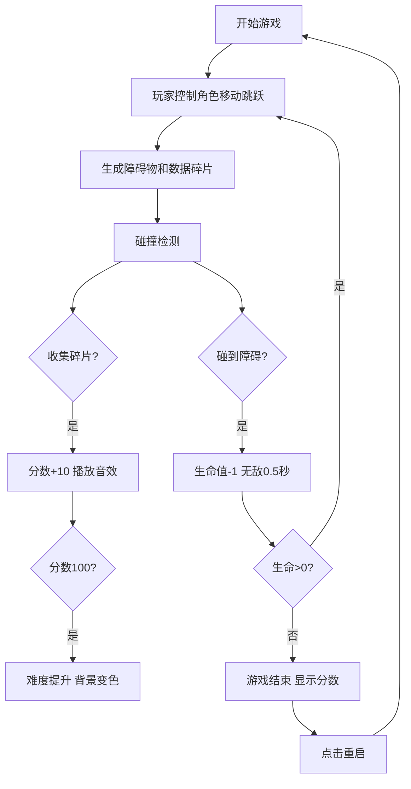

## 1. 产品概述

CYBER DASH 是一款像素风格的赛博朋克都市跑酷游戏，玩家操控黑客角色在霓虹闪耀的楼顶之间奔跑跳跃，躲避障碍物并收集数据碎片。

- **主要用途**：提供休闲娱乐体验，通过快节奏的跑酷玩法让玩家体验赛博朋克都市的视觉冲击
- **目标用户**：休闲游戏爱好者、像素风格游戏粉丝、赛博朋克文化爱好者
- **目标价值**：打造一款视觉风格独特、玩法简单易上手、难度递增有挑战性的HTML5跑酷游戏

## 2. 核心功能

### 2.1 用户角色
无需用户注册，所有玩家直接进入游戏体验。

| 角色 | 注册方式 | 核心权限 |
|------|----------|----------|
| 玩家 | 无需注册 | 完整游戏体验、分数记录保存 |

### 2.2 功能模块

1. **游戏核心模块**：玩家物理系统、障碍物生成系统、碰撞检测系统、分数计算系统
2. **渲染模块**：背景视差卷轴、角色帧动画、粒子特效系统、霓虹灯光效果
3. **UI交互模块**：实时分数显示、生命值显示、暂停菜单、游戏结束界面
4. **音频模块**：Web Audio合成的背景音乐和音效
5. **数据持久化**：localStorage存储最高分记录

### 2.3 页面详情

| 页面名称 | 模块名称 | 功能描述 |
|----------|----------|----------|
| 游戏主界面 | 游戏核心 | 玩家控制、障碍物生成、碰撞检测、分数计算 |
| 暂停界面 | UI交互 | 显示暂停菜单、继续/重启按钮 |
| 游戏结束界面 | UI交互 | 显示最终分数、最高分、重启按钮 |

## 3. 核心流程

玩家打开页面后自动进入游戏，通过方向键控制角色左右移动，空格键跳跃。躲避从右侧移动的障碍物，收集数据碎片获得分数。生命值归零后游戏结束，显示分数并可选择重新开始。

## 4. 用户界面设计

### 4.1 设计风格

- **主色调**：深黑/深蓝背景，霓虹品红(#FF00FF)、霓虹青色(#00FFFF)、霓虹黄色(#FFFF00)、霓虹绿色(#00FF00)
- **像素风格**：16x16像素角色，Press Start 2P像素字体
- **视觉效果**：三层视差卷轴背景、粒子尾迹、霓虹光晕、屏幕报警条
- **按钮样式**：圆角矩形，悬停时亮度提升20%并轻微缩放(1.05倍)
- **字体**：Press Start 2P 等宽像素字体

### 4.2 页面设计概览

| 页面名称 | 模块名称 | UI元素 |
|----------|----------|--------|
| 游戏主界面 | 游戏场景 | 三层视差背景、跑酷角色、障碍物、数据碎片、粒子系统 |
| 游戏主界面 | 状态栏 | 品红到青色渐变标题"CYBER DASH"、帧率显示 |
| 游戏主界面 | HUD | 白色像素分数(左上)、红色心形生命值(左上)、黄色暂停按钮(右上) |
| 游戏主界面 | 装饰 | 左右两侧半透明立柱(呼吸效果)、上下报警条(高难度时) |
| 暂停界面 | 弹窗 | 半透明遮罩、暂停文字、继续/重启按钮 |
| 结束界面 | 弹窗 | Game Over标题、动画分数、金色最高分、绿色重启按钮 |

### 4.3 响应式设计

- **适配策略**：响应式适配常见移动端和桌面端宽高比
- **缩放方式**：保持游戏画面比例，各元素相对位置不变
- **触控支持**：移动端可考虑虚拟按键（桌面端优先键盘控制）
- **全屏显示**：自适应1080x1920或其他比例

### 4.4 性能要求

- **帧率**：稳定60fps，单帧渲染时间≤16ms
- **粒子控制**：同时存在粒子≤200个
- **音频**：Web Audio API合成，无外部音频文件
