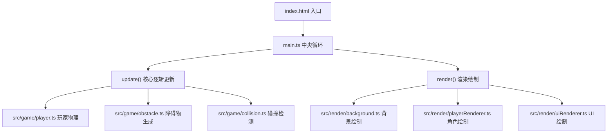

## 1. 架构设计

本项目采用模块化架构，游戏核心逻辑与渲染层完全分离，通过中央游戏循环协调。



## 2. 技术描述

- **前端框架**：纯 TypeScript + HTML5 Canvas（无需React/Vue）
- **构建工具**：Vite 5.x + TypeScript 5.x
- **编程语言**：TypeScript 5.x（严格模式，target ES2020）
- **音频**：Web Audio API 合成音效和音乐
- **数据存储**：localStorage 存储最高分
- **字体**：Press Start 2P 像素字体（@font-face加载）

## 3. 项目文件结构

| 文件路径 | 用途说明 |
|----------|----------|
| `package.json` | 依赖配置：typescript, vite；启动脚本：npm run dev |
| `vite.config.js` | Vite构建配置，支持TypeScript |
| `tsconfig.json` | TypeScript严格模式，target ES2020 |
| `index.html` | 入口页面，全屏暗色背景，设置viewport |
| `src/main.ts` | 游戏主循环，初始化场景、绑定键盘事件、协调update和render |
| `src/game/player.ts` | 玩家类：x,y坐标、速度、生命值；update处理重力跳跃左右移动 |
| `src/game/obstacle.ts` | 障碍物类：随机类型（通风口/天线/广告牌）、水平移动 |
| `src/game/collision.ts` | 碰撞检测函数，基于AABB包围盒 |
| `src/render/background.ts` | 背景绘制：三层视差卷轴，颜色渐变 |
| `src/render/playerRenderer.ts` | 玩家绘制：16x16像素帧动画、粒子尾迹 |
| `src/render/uiRenderer.ts` | UI绘制：分数、生命值、暂停菜单、结束界面 |

## 4. 核心数据结构定义

### 4.1 玩家状态

```typescript
interface PlayerState {
  x: number;           // X坐标
  y: number;           // Y坐标
  vx: number;          // 水平速度
  vy: number;          // 垂直速度
  width: number;       // 宽度 (32px)
  height: number;      // 高度 (32px)
  lives: number;       // 生命值 (初始3)
  isJumping: boolean;  // 是否在跳跃
  isInvincible: boolean; // 是否无敌
  invincibleTimer: number; // 无敌计时器
  frameIndex: number;  // 当前动画帧
  state: 'idle' | 'running' | 'jumping'; // 角色状态
}
```

### 4.2 障碍物类型

```typescript
type ObstacleType = 'vent' | 'antenna' | 'billboard';

interface Obstacle {
  x: number;
  y: number;
  width: number;
  height: number;
  type: ObstacleType;
  color: string;
  speed: number;
  textFrame: number; // 广告牌文字动画帧
}
```

### 4.3 数据碎片

```typescript
interface DataFragment {
  x: number;
  y: number;
  size: number;
  rotation: number;
  rotationSpeed: number;
  collected: boolean;
}
```

### 4.4 粒子系统

```typescript
interface Particle {
  x: number;
  y: number;
  vx: number;
  vy: number;
  size: number;
  maxSize: number;
  color: string;
  alpha: number;
  decay: number;
  type: 'trail' | 'halo';
}
```

### 4.5 游戏状态

```typescript
interface GameState {
  score: number;
  highScore: number;
  isPaused: boolean;
  isGameOver: boolean;
  gameSpeed: number;       // 当前游戏速度
  spawnInterval: number;   // 障碍物生成间隔
  alertLevel: number;      // 警戒等级 (0-1)
  obstacleCount: number;   // 已生成障碍物计数
}
```

## 5. 核心常量配置

```typescript
// 物理常量
const GRAVITY = -0.6;           // 重力加速度
const JUMP_FORCE = 12;          // 跳跃初速度
const MOVE_SPEED = 5;           // 左右移动速度
const INITIAL_GAME_SPEED = 4;   // 初始游戏速度
const MAX_GAME_SPEED = 12;      // 最大游戏速度

// 游戏配置
const INITIAL_LIVES = 3;        // 初始生命值
const MAX_LIVES = 5;            // 最大生命值
const SCORE_PER_FRAGMENT = 10;  // 每个碎片分数
const LIFE_BONUS_SCORE = 500;   // 奖励生命所需分数
const DIFFICULTY_INTERVAL = 100; // 难度提升分数间隔

// 尺寸配置
const CANVAS_WIDTH = 1080;
const CANVAS_HEIGHT = 1920;
const GROUND_Y = 1700;          // 地面Y坐标
const CEILING_Y = 100;          // 天花板Y坐标
const PLAYER_SIZE = 32;         // 玩家尺寸
```

## 6. 性能优化策略

1. **粒子池化**：重用粒子对象，避免频繁GC
2. **离屏Canvas**：静态背景元素预渲染到离屏Canvas
3. **帧率控制**：使用requestAnimationFrame，单帧时间≤16ms
4. **粒子限制**：最多200个同时存在的粒子，超出时移除最老的
5. **状态读取优化**：渲染模块只读游戏状态，不修改
