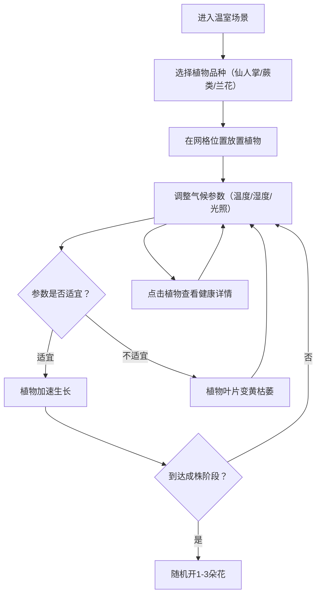

## 1. 产品概述

虚拟植物温室与气候调控系统——用户在浏览器中创建个人温室，通过滑块和按钮调整温度、湿度、光照等气候参数，实时观察不同植物品种（仙人掌、蕨类、兰花）的生长状态和外观变化，温室背景随气候参数动态切换天气场景。

- 目标用户：植物爱好者、教育场景中的学生、休闲互动体验用户
- 核心价值：以可视化、交互式的方式理解气候参数对植物生长的影响，兼具趣味性和教育性

## 2. 核心功能

### 2.1 用户角色
| 角色 | 注册方式 | 核心权限 |
|------|----------|----------|
| 访客 | 无需注册 | 创建温室、调整气候、放置植物、查看植物状态 |

### 2.2 功能模块
1. **温室场景页**：全屏Canvas温室场景，渐变背景、网格地面、植物渲染、粒子特效
2. **气候控制面板**：半透明磨砂玻璃面板，温度/湿度/光照滑块，天气状态图标
3. **植物管理系统**：植物选择、拖拽放置、生长阶段、健康状态、开花机制

### 2.3 页面详情
| 页面名称 | 模块名称 | 功能描述 |
|----------|----------|----------|
| 温室场景 | Canvas背景层 | 浅草绿到天空蓝渐变背景，灰白网格地面（间距120px） |
| 温室场景 | 植物渲染层 | 4阶段生长外观（种子→小苗→中苗→成株），不同品种差异化绘制 |
| 温室场景 | 粒子特效层 | 浇水水珠粒子（30个，2-5px，随机方向缓慢下落），天气粒子（雨滴下落） |
| 气候面板 | 温度滑块 | -5°C到45°C，刻度数值标签，面板背景色随温度蓝→红渐变 |
| 气候面板 | 湿度滑块 | 0%到100%，蓝色波浪图标 |
| 气候面板 | 光照滑块 | 0到10000 lux，太阳图标 |
| 气候面板 | 天气状态 | 晴天（黄色太阳+辐射光晕动画）、阴天（灰色云朵+摇摆）、雨天（蓝色云朵+雨滴粒子） |
| 气候面板 | 植物按钮 | 3个圆形按钮（直径60px），品种渐变色填充，选中时白色光环脉冲动画 |
| 植物交互 | 拖拽放置 | 选择品种后在网格位置拖拽放置植物 |
| 植物交互 | 健康状态 | 点击植物弹出详情气泡（生长阶段、气候参数、健康评分） |
| 植物逻辑 | 生长计算 | 基于气候参数加权影响生长速度，超出适宜范围叶片变黄枯萎 |
| 植物逻辑 | 开花机制 | 所有参数适宜时加速生长，成株后随机开1-3朵花（粉/红/白/紫，5瓣CSS旋转绽放动画） |

## 3. 核心流程

用户进入温室 → 选择植物品种 → 在网格位置放置植物 → 调整温度/湿度/光照参数 → 观察植物生长和状态变化 → 点击植物查看健康详情

## 4. 用户界面设计

### 4.1 设计风格
- 主色调：植物绿（#4CAF50）、暖黄（#FFC107）、天空蓝（#87CEEB）
- 按钮风格：圆形植物选择按钮（直径60px），滑块带图标和数值
- 字体：深绿色圆角无衬线体，温暖清新温室美学
- 布局：全屏Canvas + 右侧半透明控制面板
- 交互动画：过渡动画0.3s ease-in-out，悬停放大/变色，点击95%缩放回弹

### 4.2 页面设计概览
| 页面名称 | 模块名称 | UI元素 |
|----------|----------|--------|
| 温室场景 | 背景层 | 浅草绿→天空蓝渐变，灰白网格线（120px间距） |
| 温室场景 | 植物层 | Canvas绘制各阶段植物，品种差异化外观 |
| 温室场景 | 粒子层 | 浇水水珠粒子、雨滴粒子系统 |
| 控制面板 | 面板容器 | 宽300px，圆角12px，rgba(255,255,255,0.25)磨砂玻璃，backdrop-blur |
| 控制面板 | 温度滑块 | 蓝色→红色渐变轨道，数值标签 |
| 控制面板 | 湿度滑块 | 蓝色轨道，波浪图标 |
| 控制面板 | 光照滑块 | 黄色轨道，太阳图标 |
| 控制面板 | 天气图标 | 动态SVG/Canvas图标，光晕/摇摆/雨滴动画 |
| 控制面板 | 植物按钮 | 圆形60px渐变填充，选中白色光环脉冲 |
| 植物弹窗 | 详情气泡 | 半透明深色背景，白色文字，生长阶段/气候参数/健康评分 |

### 4.3 响应式设计
- 桌面优先，全屏体验
- Canvas自适应窗口尺寸
- 控制面板固定右侧300px宽度

### 4.4 3D场景指引
- 不涉及3D，使用Canvas 2D绘制所有场景元素
- 渐变背景模拟室内外透视效果
- 粒子系统模拟水珠和天气效果
