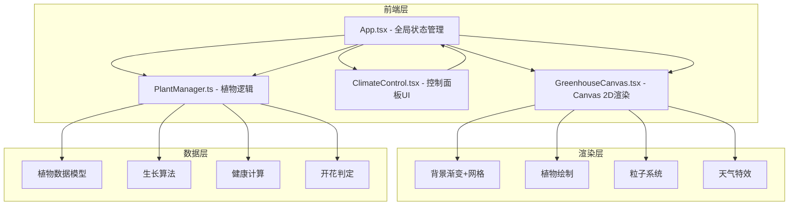

## 1. 架构设计



## 2. 技术说明
- 前端：React@18 + TypeScript + Canvas 2D
- 构建工具：Vite + @vitejs/plugin-react
- 状态管理：React useState/useCallback（全局状态在App.tsx）
- 初始化工具：vite-init
- 后端：无
- 数据库：无（纯前端，状态保存在内存中）

## 3. 路由定义
| 路由 | 用途 |
|------|------|
| / | 温室场景主页（单页应用，无路由切换） |

## 4. API定义
无后端API，所有逻辑在前端完成。

## 5. 文件结构

```
project/
├── package.json          # 依赖：react, react-dom, typescript, vite, @vitejs/plugin-react, uuid
├── index.html            # 入口页面，全屏，meta viewport
├── vite.config.js        # 构建配置，devServer端口3000
├── tsconfig.json         # 严格模式，target ES2020，moduleResolution bundler
└── src/
    ├── App.tsx           # 主组件：组合Canvas+UI面板，管理全局状态
    ├── GreenhouseCanvas.tsx  # Canvas渲染：背景、植物、粒子、天气
    ├── PlantManager.ts   # 植物逻辑：生长阶段、健康值、开花判定
    ├── ClimateControl.tsx # 控制面板：滑块、天气图标、植物按钮
    ├── style.css         # 全局样式：#1a2a1a背景、字体、滚动条
    └── main.tsx          # 入口渲染
```

## 6. 数据模型

### 6.1 核心数据接口

```typescript
interface PlantData {
  id: string;
  type: PlantType;
  gridX: number;
  gridY: number;
  growthStage: GrowthStage;
  health: number;
  age: number;
  flowers: FlowerData[];
  isWatered: boolean;
  waterTimer: number;
}

enum PlantType { Cactus, Fern, Orchid }
enum GrowthStage { Seed, Seedling, Young, Mature }

interface FlowerData {
  color: FlowerColor;
  petalCount: number;
  bloomProgress: number;
}

enum FlowerColor { Pink, Red, White, Purple }

interface ClimateParams {
  temperature: number;
  humidity: number;
  lightIntensity: number;
}

interface PlantOptimalRange {
  temperature: [number, number];
  humidity: [number, number];
  lightIntensity: [number, number];
  weights: { temperature: number; humidity: number; lightIntensity: number };
}
```

### 6.2 植物适宜范围定义

| 品种 | 温度范围 | 湿度范围 | 光照范围 | 温度权重 | 湿度权重 | 光照权重 |
|------|----------|----------|----------|----------|----------|----------|
| 仙人掌 | 20-40°C | 10-30% | 5000-10000 lux | 0.3 | 0.3 | 0.4 |
| 蕨类 | 15-28°C | 50-80% | 1000-4000 lux | 0.3 | 0.4 | 0.3 |
| 兰花 | 18-30°C | 60-90% | 2000-6000 lux | 0.3 | 0.4 | 0.3 |

### 6.3 性能指标
- 气候参数调整后植物状态更新延迟 ≤ 100ms
- 渲染帧率稳定 ≥ 30fps
- Canvas使用requestAnimationFrame驱动渲染循环
