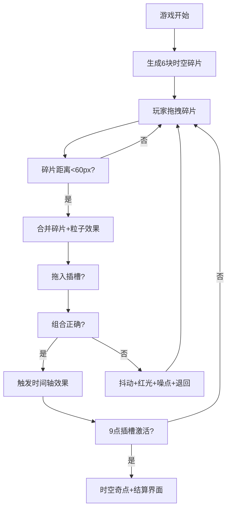

## 1. 产品概述

时空修补匠是一款基于浏览器的2D解谜游戏，玩家扮演时空修补匠，通过拖拽和组合不同颜色的时空碎片来修复破碎的时间轴，从而改变游戏世界的环境（日夜、天气、季节）。本游戏解决了传统解谜游戏中谜题与场景动态反馈缺乏深度耦合的问题，实现了谜题操作与世界状态的实时联动。

- 核心玩法：拖拽合并彩虹色时空碎片，将正确组合放入时钟插槽触发时间轴修复
- 目标用户：喜欢解谜和视觉艺术的浏览器游戏玩家
- 产品价值：提供沉浸式的蒸汽朋克风格解谜体验，通过动态视觉反馈增强解谜成就感

## 2. 核心功能

### 2.1 游戏场景
- 2D横卷轴古老钟表塔内部场景
- 巨大主时钟表盘（直径占屏幕45%）
- 中央镂空齿轮组动画（Canvas绘制）
- 12时辰刻度（子丑寅卯等）

### 2.2 碎片系统
- 6块彩虹色时空碎片（红、橙、黄、绿、蓝、紫）
- 不规则六边形，带发光边缘（1Hz闪烁）
- 自由拖拽，跟随鼠标移动
- 碎片合并机制（距离<60px自动吸附）
- 合并粒子效果（20个粒子，0.5秒持续）

### 2.3 插槽系统
- 4个空置插槽（12点、3点、6点、9点方向）
- 12点插槽：红+橙 → 时间流速加快，2倍速，背景金黄色
- 3点插槽：黄+绿 → 下雨天气，雨滴粒子，雨声白噪音
- 6点插槽：蓝+紫 → 夜晚模式，暗度0.3倍，指针发光
- 9点插槽：所有碎片 → 时空奇点动画，游戏结算
- 错误反馈：插槽抖动+红色光晕+黑白噪点

### 2.4 状态面板
- 圆形时间进度条（金色→红色渐变）
- 天气/季节图标（晴天/雨天/雪天，40x40px）
- 已收集碎片总数

## 3. 核心流程

## 4. 用户界面设计

### 4.1 设计风格
- **主色调**：深棕色(#3D2914)、古铜色(#8B6914)、金色(#FFD700)
- **点缀色**：彩虹渐变色系（红、橙、黄、绿、蓝、紫）
- **整体风格**：蒸汽朋克风格，金属纹理，铆钉装饰
- **按钮风格**：金属质感，CSS渐变+阴影模拟，悬停暖色光晕
- **字体**：仿宋（时辰刻度），主要字体选择具有古典机械感的字体

### 4.2 页面设计概述

| 页面名称 | 模块名称 | UI元素 |
|---------|---------|--------|
| 游戏主界面 | 钟表塔背景层 | 深棕到暗金径向渐变，木质齿轮纹理 |
| 游戏主界面 | 时钟表盘层 | 大型齿轮(80px/12齿)、小型齿轮(40px/8齿)，青铜到古铜渐变，不同转速 |
| 游戏主界面 | 碎片交互层 | 六边形碎片，发光边缘，拖拽拖尾粒子，合并爆炸粒子 |
| 游戏主界面 | 插槽验证层 | 4个六边形凹槽，亮金色边框，半透明白底色 |
| 游戏主界面 | 状态面板层 | 右侧面板，圆形进度条，天气图标，碎片计数 |
| 游戏主界面 | 特效叠加层 | 雨滴粒子、夜晚暗化、时空奇点动画、噪点效果 |

### 4.3 动画与交互
- **拖拽效果**：磁吸拖尾粒子，释放弹性回弹(ease-out, 0.15s)
- **齿轮动画**：不同速度顺时针旋转，转速与时间流速成正比
- **插槽激活**：各插槽对应的环境渐变动画（3-8秒）
- **错误反馈**：抖动(10px, 0.3s)、红光闪烁(3Hz, 1s)、黑白噪点(10%, 0.5s)

### 4.4 响应式设计
- **设计优先级**：桌面端优先（1920x1080）
- **适配分辨率**：1920x1080、1366x768，元素比例保持不变
- **触屏支持**：手指拖拽事件，触控区域优化
- **性能要求**：稳定60FPS，单帧粒子≤200个

### 4.5 音频设计
- **背景音效**：低沉钟摆声、齿轮啮合金属摩擦声（Web Audio API生成）
- **交互音效**：碎片合并音效、错误抖动音效、时空奇点音效
- **环境音效**：雨声白噪音（3点插槽激活时）
