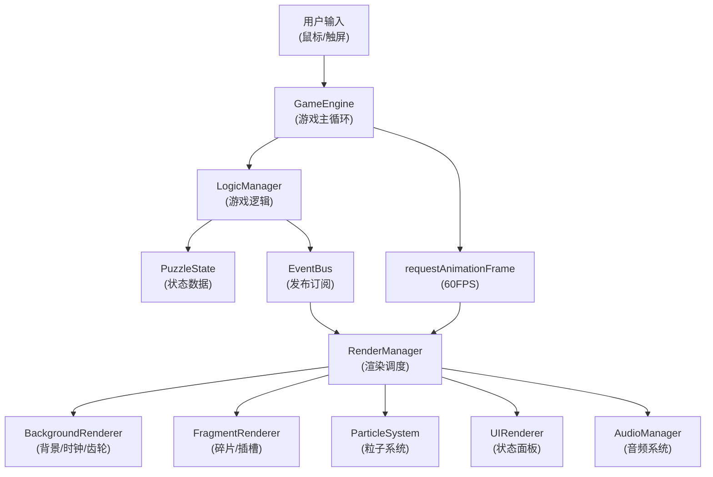

## 1. 架构设计



## 2. 技术描述

- **前端技术栈**：TypeScript 5.x + HTML5 Canvas + Vite 5.x
- **包管理**：npm
- **依赖库**：typescript、vite、uuid（用于唯一标识）
- **架构模式**：模块化分层架构，逻辑与渲染分离
- **通信机制**：中央事件总线（发布订阅模式）
- **数据流向**：用户交互 → LogicManager更新状态 → 事件触发 → RenderManager重绘

### 2.1 核心模块划分

| 模块 | 职责 | 关键文件 |
|-----|-----|---------|
| 游戏引擎层 | 主循环、帧率控制、模块协调 | src/game/GameEngine.ts |
| 业务逻辑层 | 碎片管理、碰撞检测、插槽验证、时间轴状态 | src/game/LogicManager.ts |
| 状态数据层 | 类型定义、数据结构、状态枚举 | src/game/PuzzleState.ts |
| 渲染调度层 | Canvas绘制调度、层级管理 | src/render/RenderManager.ts |
| 粒子系统层 | 各类粒子生成、更新、生命周期管理 | src/render/ParticleSystem.ts |
| 音频系统层 | Web Audio API音效生成与播放 | src/render/AudioManager.ts |

## 3. 项目文件结构

```
auto96/
├── package.json
├── vite.config.js
├── tsconfig.json
├── index.html
└── src/
    ├── game/
    │   ├── GameEngine.ts      # 游戏主循环，帧率控制，事件总线
    │   ├── LogicManager.ts    # 碎片生成、拖拽、合并、插槽验证
    │   └── PuzzleState.ts     # 类型定义、数据结构、状态枚举
    └── render/
        ├── RenderManager.ts   # Canvas渲染调度，层级管理
        ├── ParticleSystem.ts  # 粒子系统（合并/天气/拖尾）
        └── AudioManager.ts    # Web Audio API音效管理
```

## 4. 核心数据模型

### 4.1 碎片数据结构

```typescript
interface Fragment {
  id: string;                    // UUID唯一标识
  x: number;                     // 中心X坐标
  y: number;                     // 中心Y坐标
  color: FragmentColor;          // 颜色枚举
  size: number;                  // 边长（基础40px，合并+10px）
  rotation: number;              // 旋转角度
  isDragging: boolean;           // 是否被拖拽
  mergedFrom: [string, string]?; // 来源碎片ID（合并后的碎片）
  glowPhase: number;             // 发光动画相位
}

type FragmentColor = 'red' | 'orange' | 'yellow' | 'green' | 'blue' | 'purple';
```

### 4.2 插槽数据结构

```typescript
interface Slot {
  id: SlotPosition;
  x: number;
  y: number;
  requiredColors: FragmentColor[];
  state: SlotState;
  shakeOffset: { x: number; y: number };
  glowIntensity: number;
}

type SlotPosition = '12' | '3' | '6' | '9';
type SlotState = 'empty' | 'active' | 'error';
```

### 4.3 时间轴状态

```typescript
interface TimelineState {
  timeSpeed: number;           // 时间流速倍率（1x/2x）
  timeOfDay: 'day' | 'night';  // 日夜状态
  weather: 'clear' | 'rain';   // 天气状态
  skyGradient: [string, string]; // 背景渐变色
  darkness: number;            // 暗化系数（0-1）
  progress: number;            // 时间进度（0-1）
}
```

### 4.4 粒子数据结构

```typescript
interface Particle {
  id: string;
  x: number;
  y: number;
  vx: number;
  vy: number;
  size: number;
  color: string;
  opacity: number;
  life: number;          // 剩余生命值（秒）
  maxLife: number;       // 最大生命值
  type: ParticleType;
}

type ParticleType = 'merge' | 'rain' | 'trail' | 'singularity';
```

## 5. 事件总线事件定义

```typescript
type GameEvent =
  | { type: 'fragment:created'; payload: Fragment }
  | { type: 'fragment:moved'; payload: { id: string; x: number; y: number } }
  | { type: 'fragment:merged'; payload: { fragmentIds: [string, string]; newFragment: Fragment } }
  | { type: 'slot:activated'; payload: { slotId: SlotPosition; colors: FragmentColor[] } }
  | { type: 'slot:error'; payload: { slotId: SlotPosition } }
  | { type: 'timeline:changed'; payload: Partial<TimelineState> }
  | { type: 'particles:spawn'; payload: Particle[] }
  | { type: 'audio:play'; payload: AudioType }
  | { type: 'game:complete'; payload: { score: number } };

type AudioType = 'pendulum' | 'gears' | 'rain' | 'merge' | 'error' | 'singularity';
```

## 6. 性能优化策略

1. **帧率控制**：requestAnimationFrame，固定60FPS逻辑更新
2. **粒子池**：对象池复用粒子，减少GC压力
3. **粒子上限**：单帧粒子≤200，超出丢弃最老粒子
4. **离屏Canvas**：静态背景预渲染到离屏Canvas
5. **脏区渲染**：仅重绘变化区域（可选优化）
6. **CSS分层**：UI层使用DOM + CSS，Canvas专注游戏内容
7. **节流防抖**：鼠标移动事件节流处理
