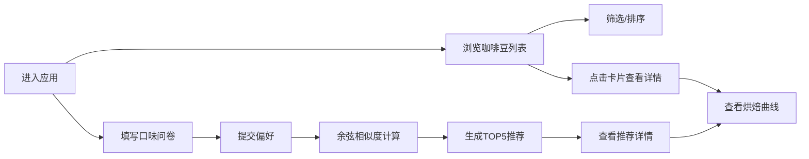

## 1. 产品概述

一款为手冲咖啡馆打造的线上咖啡豆溯源与风味推荐应用，让顾客能够浏览不同产区的咖啡豆信息、查看烘焙数据曲线，并根据个人口味偏好获得个性化冲煮建议。

- **核心目标**：通过数字化手段提升咖啡豆选购体验，帮助顾客发现符合口味的咖啡豆
- **目标用户**：手冲咖啡爱好者、咖啡馆到店顾客、精品咖啡消费者
- **市场价值**：差异化的线上体验，增强用户对咖啡风味的理解与购买意愿

## 2. 核心功能

### 2.1 功能模块

1. **咖啡豆列表页**：咖啡豆卡片网格展示、三级筛选器、分页虚拟滚动
2. **咖啡豆详情页**：单豆图文信息、风味标签、Canvas烘焙曲线、推荐徽章
3. **口味问卷页**：四维口味滑块（酸度/苦度/甜度/醇厚度）、推荐触发按钮
4. **推荐列表页**：TOP5推荐结果、匹配度圆形进度环、排序功能

### 2.2 页面详情

| 页面名称 | 模块名称 | 功能描述 |
|---------|---------|---------|
| 咖啡豆列表页 | 筛选器模块 | 产地、处理法、杯测分数三级下拉筛选，重置按钮 |
| 咖啡豆列表页 | 卡片网格模块 | 虚拟滚动渲染，悬停浮动动画，点击跳转详情 |
| 咖啡豆详情页 | 信息展示模块 | 大图、产地、海拔、处理法、杯测分数展示 |
| 咖啡豆详情页 | 烘焙曲线模块 | Canvas绘制温度曲线，数据点悬停提示，颜色渐变 |
| 咖啡豆详情页 | 推荐徽章模块 | 动态显示"为你推荐"金边徽章，脉动动画 |
| 口味问卷页 | 滑块组模块 | 四维口味评分滑块，实时数值显示，颜色渐变填充 |
| 推荐列表页 | 推荐结果模块 | TOP5卡片展示，SVG进度环，排序切换 |

## 3. 核心流程

用户浏览咖啡豆列表，可通过三级筛选器过滤；点击卡片进入详情页查看烘焙曲线；或进入口味问卷页完成四维评分后获得个性化推荐，最终导向感兴趣的咖啡豆详情。

## 4. 用户界面设计

### 4.1 设计风格

- **主色调**：咖啡棕 #6F4E37、奶油色 #FFF8F0、深褐 #3E2723
- **强调色**：亮橙色 #FF8C00（推荐按钮）、柠檬黄、深棕、粉红、赭石（滑块渐变）
- **卡片风格**：圆角 16px，柔和阴影 0 4px 12px rgba(0,0,0,0.08)
- **背景**：浅米色到暗棕的径向渐变
- **动效风格**：淡入淡出 0.3s、悬停浮动 0.3s ease-out、水波纹点击反馈 0.4s

### 4.2 页面设计概览

| 页面名称 | 模块名称 | UI元素 |
|---------|---------|--------|
| 咖啡豆列表页 | 顶部导航 | 固定定位，应用名称，亮橙色"推荐"入口按钮 |
| 咖啡豆列表页 | 筛选器栏 | 三个下拉菜单，选中项加深，右侧重置按钮，圆角 8px |
| 咖啡豆列表页 | 卡片网格 | 三列布局，悬停上浮 3px + 缩放 1.02 + 阴影加深 |
| 咖啡豆详情页 | 头部区域 | 大图（风味主色调随机图案），标题，"为你推荐"徽章 |
| 咖啡豆详情页 | 风味标签 | 方底圆角标签，HSL随机彩色，至少4个风味词 |
| 咖啡豆详情页 | 烘焙曲线 | Canvas，横轴0-20分钟，纵轴100-250°C，数据点渐变颜色，悬停提示 |
| 口味问卷页 | 卡片容器 | 浅米色背景 #FFF8F0，居中布局，圆角 16px |
| 口味问卷页 | 滑块控件 | 宽 300px，轨道高 6px 圆角，拖拽柄直径 20px，实时数值标签 |
| 口味问卷页 | 提交按钮 | 圆角 16px，浅灰到深咖啡渐变，按下反转，水波纹效果 |
| 推荐列表页 | 进度环 | SVG圆形进度环，直径 50px，环宽 6px，颜色分段 |

### 4.3 响应式设计

- **桌面端**：列表页三列卡片网格，详情页左右布局
- **移动端 <768px**：列表页单列卡片占满宽度，滑块缩至屏幕宽度 80%
- **触摸优化**：增大按钮点击区域，移除悬停效果，改为点击态反馈

### 4.4 性能指标

- **虚拟滚动**：100+卡片时维持 55FPS 以上
- **推荐计算**：余弦相似度计算 ≤5ms
- **Canvas重绘**：烘焙曲线重绘 ≤10次/秒
