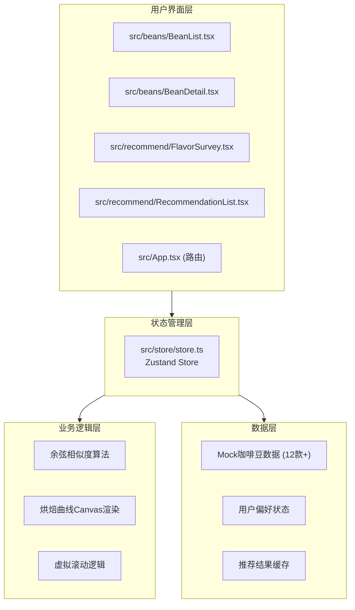
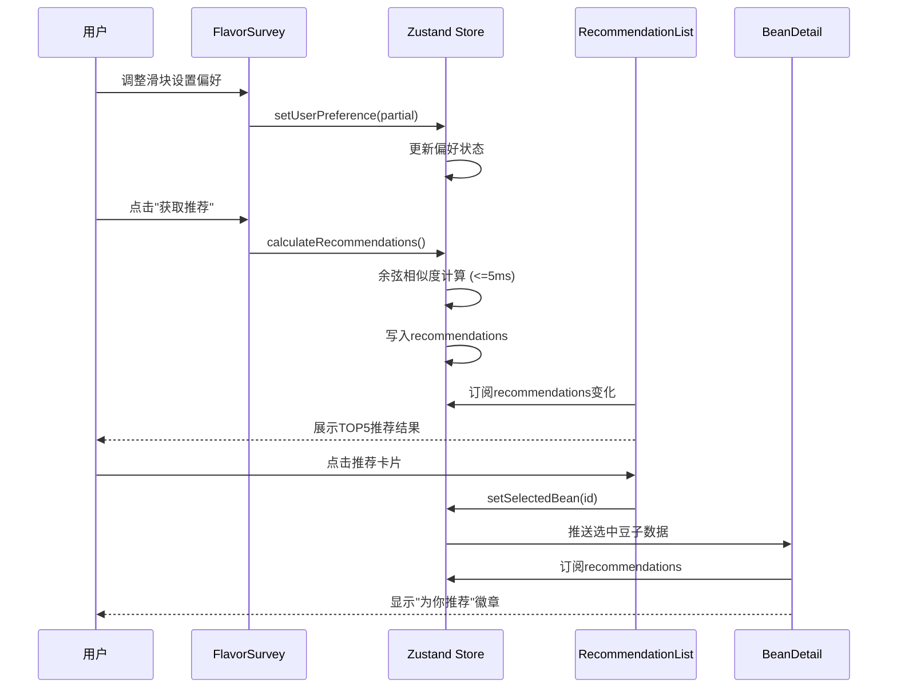

## 1. 架构设计



## 2. 技术选型

- **前端框架**：React@18 + TypeScript@5
- **构建工具**：Vite@5 + @vitejs/plugin-react@4
- **状态管理**：Zustand@4（轻量、高性能）
- **路由**：react-router-dom@6
- **工具库**：uuid@9（生成唯一ID）
- **样式方案**：CSS Modules + CSS Variables（主题化）
- **无UI组件库**：完全自定义组件，确保视觉独特性

## 3. 目录结构与路由定义

### 3.1 目录结构

```
src/
├── beans/
│   ├── BeanList.tsx        # 咖啡豆列表页（虚拟滚动+筛选）
│   └── BeanDetail.tsx      # 咖啡豆详情页（Canvas烘焙曲线）
├── recommend/
│   ├── FlavorSurvey.tsx    # 口味问卷页（四维滑块）
│   └── RecommendationList.tsx  # 推荐列表页（SVG进度环）
├── store/
│   └── store.ts            # Zustand全局状态管理
├── types/
│   └── index.ts            # TypeScript类型定义
├── data/
│   └── beans.ts            # Mock咖啡豆数据（12款+）
├── utils/
│   ├── cosineSimilarity.ts # 余弦相似度算法
│   └── canvas.ts           # Canvas绘制工具函数
├── hooks/
│   ├── useVirtualScroll.ts # 虚拟滚动Hook
│   └── useDebounce.ts      # 防抖Hook
├── App.tsx                 # 主应用与路由
├── main.tsx                # React入口
└── index.css               # 全局样式与主题变量
```

### 3.2 路由定义

| 路由 | 页面 | 组件 |
|------|------|------|
| `/` | 咖啡豆列表页 | BeanList |
| `/bean/:id` | 咖啡豆详情页 | BeanDetail |
| `/survey` | 口味问卷页 | FlavorSurvey |
| `/recommendations` | 推荐列表页 | RecommendationList |

## 4. 数据模型

### 4.1 类型定义

```typescript
// 咖啡豆数据结构
interface CoffeeBean {
  id: string;
  name: string;
  origin: string;
  altitude: number;
  process: 'washed' | 'natural' | 'honey';
  cuppingScore: number;
  flavors: string[];
  roastProfile: RoastDataPoint[];
  flavorProfile: FlavorProfile;
  dominantHue: number;
}

// 烘焙数据点
interface RoastDataPoint {
  time: number;
  temperature: number;
}

// 风味画像（四维）
interface FlavorProfile {
  acidity: number;
  bitterness: number;
  sweetness: number;
  body: number;
}

// 用户偏好
interface UserPreference extends FlavorProfile {}

// 推荐结果
interface RecommendationResult {
  beanId: string;
  matchScore: number;
}

// Store状态
interface CoffeeStore {
  beans: CoffeeBean[];
  selectedBeanId: string | null;
  userPreference: UserPreference;
  recommendations: RecommendationResult[];
  filters: {
    origin: string | null;
    process: string | null;
    minScore: number | null;
  };
  
  // Actions
  setSelectedBean: (id: string) => void;
  setUserPreference: (pref: Partial<UserPreference>) => void;
  setFilter: (key: string, value: any) => void;
  resetFilters: () => void;
  calculateRecommendations: () => void;
}
```

### 4.2 数据流



## 5. 核心算法与性能优化

### 5.1 余弦相似度算法

```typescript
function cosineSimilarity(a: number[], b: number[]): number {
  if (a.length !== b.length) return 0;
  
  let dotProduct = 0;
  let normA = 0;
  let normB = 0;
  
  for (let i = 0; i < a.length; i++) {
    dotProduct += a[i] * b[i];
    normA += a[i] * a[i];
    normB += b[i] * b[i];
  }
  
  const normProduct = Math.sqrt(normA) * Math.sqrt(normB);
  return normProduct === 0 ? 0 : dotProduct / normProduct;
}
```

### 5.2 虚拟滚动实现

- 使用 `useVirtualScroll` Hook 计算可视区域
- 仅渲染可视范围内的卡片（约6-9张）
- 使用 `transform: translateY()` 实现平滑滚动
- 滚动容器监听 `requestAnimationFrame` 节流

### 5.3 Canvas烘焙曲线

- 使用节流控制重绘频率（≤10次/秒）
- 离屏Canvas预渲染静态元素（坐标轴、刻度）
- 数据点颜色映射：温度 → HSL(120→0, 80%, 50%) 绿到红渐变
- 鼠标悬停检测使用空间分区（R-tree）优化

## 6. 视觉实现规范

### 6.1 CSS主题变量

```css
:root {
  --color-primary: #6F4E37;
  --color-secondary: #FFF8F0;
  --color-accent: #FF8C00;
  --color-dark: #3E2723;
  
  --flavor-acidity: #FFE135;
  --flavor-bitterness: #3E2723;
  --flavor-sweetness: #FF69B4;
  --flavor-body: #CC7722;
  
  --card-radius: 16px;
  --control-radius: 8px;
  
  --shadow-card: 0 4px 12px rgba(0,0,0,0.08);
  --shadow-card-hover: 0 6px 20px rgba(0,0,0,0.2);
}
```

### 6.2 动画规范

| 动画名称 | 时长 | 缓动 | 应用场景 |
|---------|------|------|---------|
| 悬停浮动 | 0.3s | ease-out | 卡片悬停 |
| 淡入淡出 | 0.3s | ease-in-out | 页面切换 |
| 水波纹 | 0.4s | ease-out | 按钮点击 |
| 徽章脉动 | 1.5s | ease-in-out infinite | 推荐徽章 |
| 放大过渡 | 0.4s | ease-out | 卡片到详情页 |
