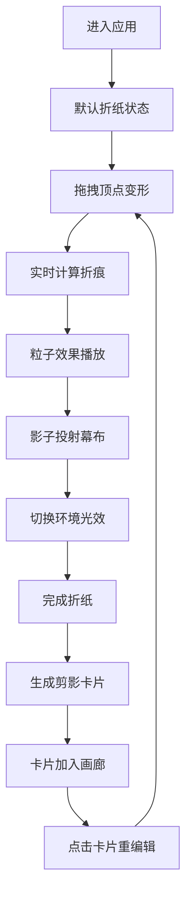

## 1. 产品概述

影子戏法折纸工坊是一款基于浏览器的交互式折纸模拟应用，用户通过拖拽虚拟纸张顶点实时体验折纸变形过程，配合多种环境光效营造传统皮影戏表演氛围。

- 核心价值：将传统折纸艺术与数字光影结合，提供沉浸式的创意折纸体验
- 目标用户：手工爱好者、艺术创作者、教育场景用户
- 产品特色：柔性折纸物理模拟、动态光影效果、影子剪影收藏

## 2. 核心功能

### 2.1 功能模块

1. **折纸工作台**：虚拟纸张拖拽变形、折痕计算、粒子特效
2. **影子幕布**：皮影戏幕布渲染、五种环境光效切换
3. **剪影画廊**：折纸完成后自动生成剪影卡片、重编辑功能
4. **表演记录**：实时轨迹绘制、计时功能、GIF帧序列捕获

### 2.2 页面详情

| 页面名称 | 模块名称 | 功能描述 |
|----------|----------|----------|
| 主页面 | 折纸工作台 | 淡米色纹理工作台、300px正方形折纸、四角彩色圆点标记、拖拽变形、折痕虚线、粒子飞散效果 |
| 主页面 | 影子幕布 | 浅灰到深灰垂直渐变幕布、影子投射、旋转角度同步 |
| 主页面 | 环境光效切换 | 篝火/月光/雷雨/蜡烛/霓虹五种光效、底部按钮切换、实时影子颜色变化 |
| 主页面 | 剪影画廊 | 右侧卡片排列、缩略图预览放大、点击重编辑、参考虚线保留 |
| 主页面 | 反折操作 | 中央金色旋转按钮、沿折痕对折动画、镜像翻转透明度变化 |
| 主页面 | 表演记录 | 实时影子轮廓轨迹、计时器、20分钟自动保存GIF帧 |

## 3. 核心流程

## 4. 用户界面设计

### 4.1 设计风格

- **主色调**：暖木色、淡米色纹理，营造传统手工氛围
- **点缀色**：琥珀色、金色高亮交互元素
- **纸张色彩**：白色半透明，四角标记为红、蓝、绿、黄
- **按钮风格**：60x30px圆角12px按钮，选中态底部亮边
- **整体调性**：东方传统皮影戏美学 + 现代交互设计

### 4.2 布局结构

- 左侧/中央：折纸工作台（占屏幕60%宽度）
- 后方：影子幕布（渐变背景）
- 右侧：剪影画廊（占屏幕25%宽度）
- 底部：环境光效切换按钮
- 右下角：表演记录小画布 + 计时器

### 4.3 交互动效

- 按钮悬停：放大1.1倍，0.3s平滑过渡
- 卡片悬停：放大1.2倍，0.2s过渡
- 折纸拖拽：延迟不超过200ms，柔性变形
- 粒子效果：20个随机颜色粒子，渐隐消失
- 光效动画：60fps流畅渲染

### 4.4 响应式

- 桌面端优先设计
- 自适应屏幕高度
- 触控设备支持触摸拖拽

## 5. 性能要求

- 折纸拖拽变形延迟 ≤ 200ms
- 幕布动画和光效切换达到 60fps
- 粒子效果流畅不掉帧
- 整体交互响应迅速
