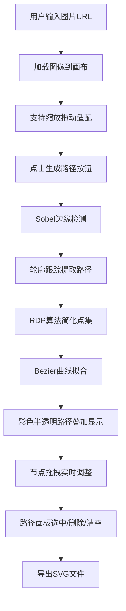

## 1. 产品概述
本产品是一款面向插画师和动画创作者的手绘草图转矢量路径工具，通过自动化边缘检测和Bezier曲线拟合技术，快速将位图草图转换为可编辑的矢量路径，解决传统描摹工具精度低、交互性差的问题。

- 核心目标：实现从手绘草图到可编辑矢量路径的一键转换，支持节点级别的精确调整，提升动画制作流程效率
- 目标用户：插画师、动画设计师、游戏美术创作者
- 市场价值：填补手绘数字化与矢量动画制作之间的效率鸿沟，提供专业级的路径编辑交互体验

## 2. 核心功能

### 2.1 用户角色
| 角色 | 注册方式 | 核心权限 |
|------|---------|----------|
| 设计师用户 | 无需注册，直接使用 | 上传图片、生成路径、编辑节点、管理路径、导出SVG |

### 2.2 功能模块
1. **画布编辑区**：图像显示、矢量路径叠加渲染、节点拖拽交互、坐标提示
2. **路径管理面板**：路径列表展示、选中高亮、删除/清空操作
3. **图像处理模块**：Sobel边缘检测、阈值分割、轮廓提取
4. **路径生成模块**：RDP算法简化、Bezier曲线拟合、节点坐标计算
5. **SVG导出功能**：将编辑后的矢量路径导出为标准SVG格式

### 2.3 页面详情
| 页面名称 | 模块名称 | 功能描述 |
|---------|----------|----------|
| 主应用页面 | 图像上传区 | 图片URL输入框、上传按钮、说明文字 |
| 主应用页面 | 画布编辑区 | 图像缩放拖动、路径叠加显示、节点拖拽编辑、坐标悬停提示 |
| 主应用页面 | 路径管理面板 | 路径列表（缩略图+长度）、选中高亮、删除/清空按钮 |

## 3. 核心流程
用户输入手绘草图图片URL，系统自动加载图像并在画布显示；用户可缩放拖动图像适配画布，点击生成按钮后，系统执行Sobel边缘检测提取边缘点，通过轮廓跟踪提取独立路径，使用Ramer-Douglas-Peucker算法简化轮廓点集，最后拟合为Bezier曲线并在画布上以彩色半透明曲线叠加显示；用户可拖拽红色节点方块实时调整曲线形状，通过右侧路径管理面板选中、删除或清空路径；所有操作实时反馈到画布，最终可导出为SVG格式。

## 4. 用户界面设计

### 4.1 设计风格
- 主色调：深灰蓝 `#2c3e50` 作为背景，营造专业创作氛围
- 面板风格：磨砂玻璃效果（毛玻璃半透明 `rgba(255,255,255,0.08)`、白色半透明边框 `rgba(255,255,255,0.15)`、柔和阴影）
- 路径显示：彩色半透明曲线叠加，关键节点红色小方块 `8px x 8px`
- 按钮风格：圆角4px，hover有背景色渐变过渡
- 字体：采用现代无衬线字体，标题16px粗体，正文14px常规
- 图标：使用lucide-react图标库，保持风格统一

### 4.2 页面设计概述
| 页面名称 | 模块名称 | UI元素 |
|---------|----------|--------|
| 主应用页面 | 顶部上传区 | 输入框（圆角4px，深灰背景）、上传按钮（蓝色主色调）、说明文字（浅灰色） |
| 主应用页面 | 画布区域 | 占比60%+，深灰蓝背景，图像支持缩放拖动，路径彩色半透明叠加，节点红色方块 |
| 主应用页面 | 路径管理面板 | 磨砂玻璃卡片，路径列表（缩略图+长度），悬停上浮动画（translateY -2px），背景渐变（透明到淡蓝半透明） |

### 4.3 交互动效
- 节点悬停：黄色高亮 + 坐标 tooltip 淡入（0.2s ease）
- 节点拖拽：波纹扩散动画（scale 1→2, opacity 1→0，0.4s）
- 路径选中：颜色加深、线宽变粗（0.3s fade 过渡）
- 路径行悬停：轻微上浮 + 背景渐变（0.2s ease-out）
- 按钮点击：缩放反馈（scale 0.95，0.1s）

### 4.4 响应式设计
- Desktop-first 设计，断点 1200px 和 800px
- 窗口宽度 ≥ 1200px：左右布局（画布左，面板右）
- 窗口宽度 800px - 1200px：保持左右布局，面板宽度自适应
- 窗口宽度 < 800px：上下堆叠布局（画布在上，面板在下），全宽显示
- 触摸设备：增大节点热区到 24px x 24px，优化拖拽体验

### 4.5 性能指标
- 图像加载到生成首条路径：≤ 2秒
- 节点拖拽帧率：≥ 60FPS（单帧响应 ≤ 16ms）
- 路径管理操作响应：≤ 100ms
- 内存占用：单张4K图像处理 ≤ 500MB
