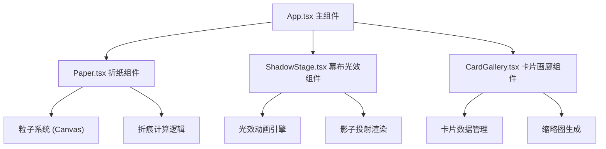

## 1. 架构设计



## 2. 技术描述

- **前端框架**: React 18 + TypeScript
- **构建工具**: Vite 5
- **状态管理**: React useState / useRef (局部状态)
- **图形渲染**: HTML5 Canvas API + SVG
- **动画实现**: requestAnimationFrame + CSS动画
- **依赖库**: uuid (唯一标识符)

## 3. 组件划分

| 组件 | 文件 | 职责 |
|------|------|------|
| App | src/App.tsx | 整体布局管理、状态协调、光效模式切换 |
| Paper | src/Paper.tsx | 顶点拖拽、折痕计算、粒子效果、反折动画 |
| ShadowStage | src/ShadowStage.tsx | 幕布渲染、环境光效、影子投射 |
| CardGallery | src/CardGallery.tsx | 剪影卡片列表、预览、重编辑触发 |

## 4. 数据模型

### 4.1 折纸顶点数据
```typescript
interface Point {
  x: number;
  y: number;
}

interface PaperState {
  vertices: Point[];  // 四个顶点坐标
  foldLine: Point[];  // 折痕线段
  isCompleted: boolean;
  rotation: number;   // 旋转角度
}
```

### 4.2 光效模式
```typescript
type LightMode = 'bonfire' | 'moonlight' | 'thunder' | 'candle' | 'neon';

interface LightEffect {
  mode: LightMode;
  color: string;
  intensity: number;
  position?: Point;
}
```

### 4.3 剪影卡片
```typescript
interface SilhouetteCard {
  id: string;
  vertices: Point[];
  foldLine: Point[];
  rotation: number;
  thumbnail: string;  // base64 缩略图
  createdAt: number;
}
```

### 4.4 粒子系统
```typescript
interface Particle {
  x: number;
  y: number;
  vx: number;
  vy: number;
  size: number;
  color: string;
  opacity: number;
  life: number;
}
```

## 5. 核心算法

### 5.1 折痕计算
- 拖拽一个顶点时，计算对边中点连线作为折痕
- 根据拖拽距离计算变形程度
- 使用贝塞尔曲线实现柔性变形效果

### 5.2 影子投射
- 将折纸轮廓投射到幕布上
- 根据光效模式调整影子颜色和透明度
- 保持与折纸相同的旋转角度

### 5.3 粒子系统
- 拖拽时在顶点附近生成粒子
- 使用 requestAnimationFrame 更新粒子位置
- 粒子渐隐消失效果

## 6. 性能优化

- 使用 useRef 管理 Canvas 和动画状态，避免不必要的重渲染
- 粒子对象池复用，减少垃圾回收
- requestAnimationFrame 统一动画循环
- 离屏画布预渲染影子轮廓

## 7. 项目结构

```
src/
├── App.tsx           # 主组件
├── Paper.tsx         # 折纸组件
├── ShadowStage.tsx   # 幕布光效组件
├── CardGallery.tsx   # 卡片画廊组件
└── main.tsx          # 入口文件
```

## 8. 构建配置

- TypeScript 严格模式，target ES2020
- Vite 支持 React + TypeScript
- 开发服务器热更新
- 生产构建优化
