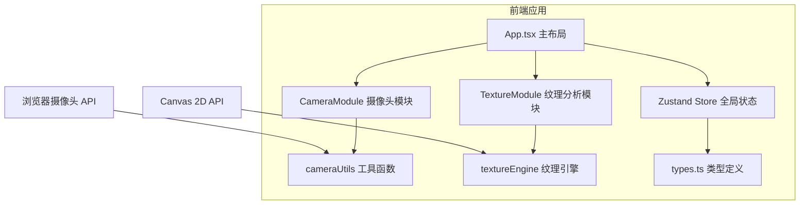

## 1. 架构设计



## 2. 技术栈说明
- **前端框架**：React 18 + TypeScript 严格模式
- **构建工具**：Vite + @vitejs/plugin-react
- **状态管理**：Zustand
- **唯一ID**：uuid
- **核心 API**：MediaDevices.getUserMedia、Canvas 2D Context

## 3. 项目文件结构

```
src/
├── App.tsx                    # 主布局组件
├── store.ts                   # Zustand 全局状态
├── types.ts                   # 类型定义
└── modules/
    ├── camera/
    │   ├── CameraModule.tsx   # 摄像头UI模块
    │   └── cameraUtils.ts     # 摄像头工具函数
    └── texture/
        ├── TextureModule.tsx  # 纹理分析UI模块
        └── textureEngine.ts   # 纹理计算引擎
```

## 4. 状态管理（Zustand Store）

| 状态 | 类型 | 说明 |
|------|------|------|
| capturedImage | string \| null | 抓取的照片base64数据 |
| sensitivity | number | 敏感度值（0-100，默认50） |
| wrinkleStats | WrinkleStats \| null | 褶皱统计信息 |

## 5. 类型定义

```typescript
interface WrinkleStats {
  averageIntensity: number;  // 平均强度百分比 0-100
  maxIntensity: number;      // 最大强度百分比
  maxLocation: { x: number; y: number };  // 最大褶皱坐标
}

interface PixelData {
  x: number;
  y: number;
  grayscale: number;  // 0-255
  intensity: number;  // 0-1 褶皱强度
}
```

## 6. 核心算法说明

### 6.1 褶皱强度计算
1. 将图像转为灰度
2. 以20px网格间距采样像素点
3. 基于局部对比度计算褶皱强度值
4. 应用敏感度参数调整强度曲线
5. 颜色映射：高强度→红色#E53935（透明度0.8），低强度→蓝色#1E88E5（透明度0.2）

### 6.2 热力图渲染
- 使用Canvas绘制半透明网格线（透明度0.3）
- 网格交点根据强度值绘制渐变色圆点
- 整体叠加于原始照片之上

## 7. 性能优化策略
- 使用requestAnimationFrame同步渲染
- 敏感度调节采用debounce 200ms
- Canvas图像数据缓存，避免重复读取
- Grid采样而非全像素计算
