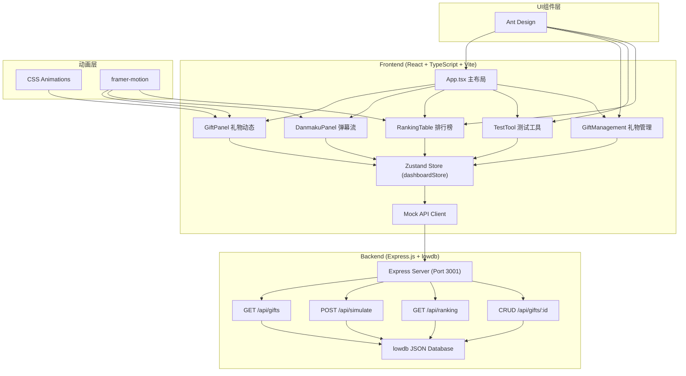
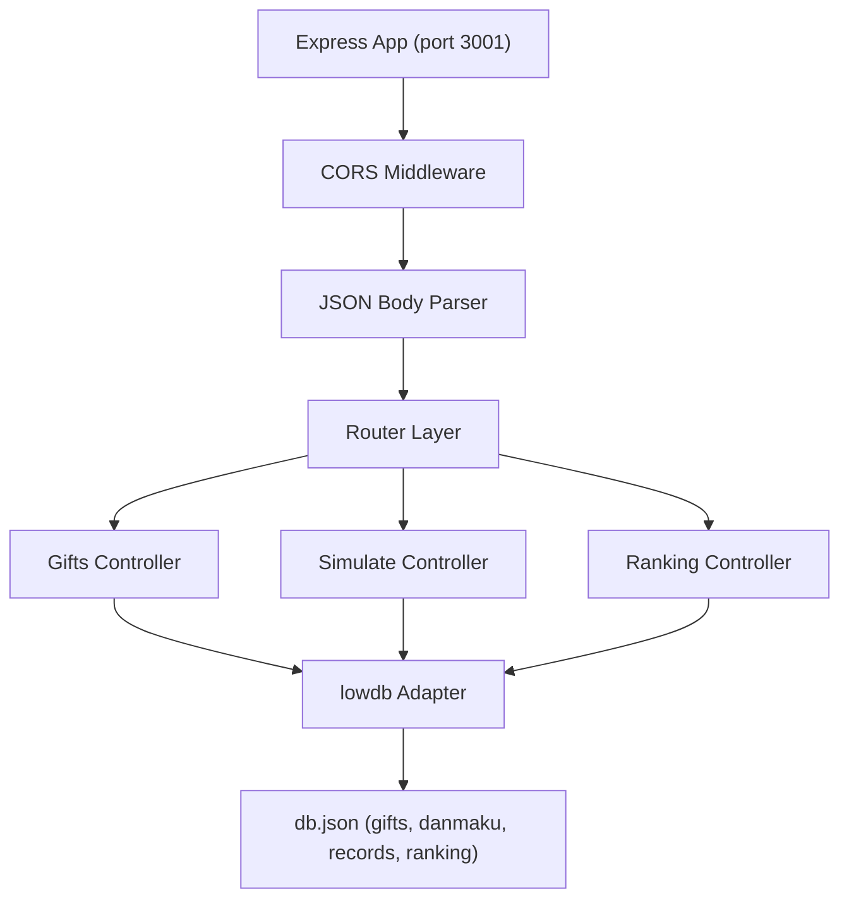
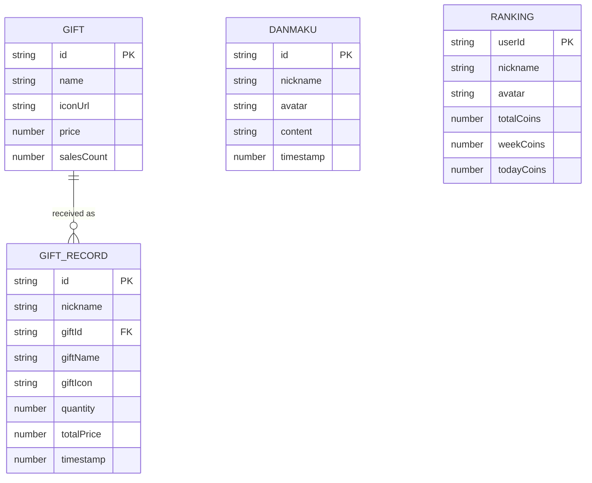

## 1. 架构设计



## 2. 技术栈说明

- **前端框架**：React@18 + TypeScript@5
- **构建工具**：Vite@5 + @vitejs/plugin-react
- **UI组件库**：antd@5 + @ant-design/icons
- **状态管理**：zustand@4
- **动画库**：framer-motion@11 + CSS Animations
- **工具库**：uuid@9
- **后端框架**：Express@4 + cors@2
- **数据持久化**：lowdb@7
- **包管理**：npm

## 3. 项目目录结构

```
auto10/
├── package.json
├── vite.config.js
├── tsconfig.json
├── index.html
├── src/
│   ├── main.tsx              # 应用入口
│   ├── App.tsx               # 主布局组件
│   ├── stores/
│   │   └── dashboardStore.ts # Zustand 状态管理
│   ├── components/
│   │   ├── GiftPanel.tsx     # 礼物动态区域
│   │   ├── DanmakuPanel.tsx  # 弹幕流组件
│   │   ├── RankingTable.tsx  # 贡献排行榜
│   │   ├── TestTool.tsx      # 测试工具模态框
│   │   └── GiftManager.tsx   # 礼物管理（新增/编辑/删除）
│   └── api/
│       └── index.ts          # 前端 API 封装
├── api/
│   └── mockServer.ts         # Express 模拟服务器
└── db.json                   # lowdb 数据文件
```

## 4. API 定义

### 4.1 类型定义

```typescript
interface Gift {
  id: string;
  name: string;
  iconUrl: string;
  price: number;
  salesCount: number;
}

interface Danmaku {
  id: string;
  nickname: string;
  avatar: string;
  content: string;
  timestamp: number;
}

interface GiftRecord {
  id: string;
  nickname: string;
  giftId: string;
  giftName: string;
  giftIcon: string;
  quantity: number;
  totalPrice: number;
  timestamp: number;
}

interface RankingItem {
  rank: number;
  userId: string;
  nickname: string;
  avatar: string;
  totalCoins: number;
}

type RankingPeriod = 'today' | 'week' | 'all';
```

### 4.2 接口清单

| 方法 | 路径 | 描述 | 请求体 | 响应体 |
|------|------|------|--------|--------|
| GET | /api/gifts | 获取礼物列表 | - | Gift[] |
| POST | /api/gifts | 创建礼物 | { name, iconUrl, price } | Gift |
| PUT | /api/gifts/:id | 更新礼物 | { name, iconUrl, price } | Gift |
| DELETE | /api/gifts/:id | 删除礼物 | - | { success: boolean } |
| POST | /api/simulate/danmaku | 模拟发送弹幕 | { nickname, content } | Danmaku |
| POST | /api/simulate/gift | 模拟发送礼物 | { nickname, giftId, quantity } | GiftRecord |
| GET | /api/ranking?period=today | 获取排行榜数据 | - | RankingItem[] |

## 5. 服务器架构



## 6. 数据模型

### 6.1 ER 图



### 6.2 lowdb 数据结构

```json
{
  "gifts": [
    {
      "id": "uuid-string",
      "name": "小心心",
      "iconUrl": "https://example.com/heart.png",
      "price": 10,
      "salesCount": 0
    }
  ],
  "danmaku": [],
  "giftRecords": [],
  "ranking": [
    {
      "userId": "uuid",
      "nickname": "观众A",
      "avatar": "",
      "totalCoins": 0,
      "weekCoins": 0,
      "todayCoins": 0
    }
  ]
}
```

### 6.3 初始数据

```json
{
  "gifts": [
    { "id": "g1", "name": "小心心", "iconUrl": "💖", "price": 10, "salesCount": 156 },
    { "id": "g2", "name": "棒棒糖", "iconUrl": "🍭", "price": 50, "salesCount": 89 },
    { "id": "g3", "name": "小飞机", "iconUrl": "✈️", "price": 200, "salesCount": 34 },
    { "id": "g4", "name": "火箭", "iconUrl": "🚀", "price": 1000, "salesCount": 12 },
    { "id": "g5", "name": "皇冠", "iconUrl": "👑", "price": 5000, "salesCount": 3 }
  ],
  "ranking": [
    { "userId": "u1", "nickname": "土豪大哥", "avatar": "🥇", "totalCoins": 128800, "weekCoins": 45600, "todayCoins": 12800 },
    { "userId": "u2", "nickname": "老板来了", "avatar": "🥈", "totalCoins": 98500, "weekCoins": 32400, "todayCoins": 9600 },
    { "userId": "u3", "nickname": "忠实粉丝", "avatar": "🥉", "totalCoins": 67200, "weekCoins": 21800, "todayCoins": 5400 }
  ]
}
```
