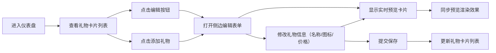
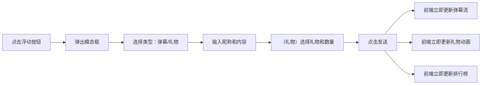

## 1. 产品概述

直播实时仪表盘应用，为小型直播团队提供礼物管理、弹幕互动与观众贡献排行的一站式实时数据看板。解决直播过程中礼物特效反馈延迟、弹幕与数据看板脱节、无法快速了解核心观众贡献的问题，提升直播运营效率和观众互动体验。

- 主要用途：直播运营管理、实时互动监控、观众数据分析
- 目标用户：小型直播团队、主播、直播运营人员
- 市场价值：降低直播管理成本，提升互动反馈速度，优化核心观众识别

## 2. 核心功能

### 2.1 功能模块

1. **礼物管理模块**：虚拟礼物增删改、礼物卡片展示、编辑侧边表单、实时预览卡片效果
2. **弹幕流模块**：实时弹幕滚动显示、发送时间标记、自定义滚动条、用户彩色标记点（根据昵称生成固定色值）
3. **礼物动态模块**：礼物动画滑入效果、金色闪光特效、送礼信息展示
4. **贡献排行榜模块**：带底部横线指示器的标签切换（今日/本周/全部）、排名高亮配色、5秒自动刷新、0.3秒滑动动画过渡
5. **测试工具模块**：模拟发送弹幕、模拟发送礼物、半屏模态框交互

### 2.2 页面详情

| 页面名称 | 模块名称 | 功能描述 |
|-----------|-------------|---------------------|
| 主仪表盘 | 礼物管理区 | 礼物卡片列表（160px宽、白色背景、圆角12px）、悬浮阴影上移动效、编辑按钮打开侧边表单（360px宽）、侧边表单内嵌实时预览卡片（同步展示名称/图标/价格） |
| 主仪表盘 | 弹幕流区 | 左侧320px宽弹幕列表、浅灰背景圆角卡片、圆形头像36px、底部时间戳、每条弹幕左侧彩色小圆点（根据昵称哈希生成固定HSL色值） |
| 主仪表盘 | 礼物动态区 | 右侧320px宽礼物动画列表、从右向左滑入动画（0.4s ease-out）、金色#FFD700闪光一次 |
| 主仪表盘 | 排行榜区 | 中央贡献排行、底部横线指示器标签切换（今日/本周/全部，选中项2px高#FF6B00下划线、0.3s滑动过渡）、前三名特殊配色（金/银/铜）、5秒刷新 |
| 主仪表盘 | 测试工具 | 右下角浮动圆形按钮、半屏模态框（半透明背景#00000044）、发送弹幕和礼物表单 |

## 3. 核心流程

### 3.1 礼物管理流程

### 3.2 模拟发送流程

## 4. 用户界面设计

### 4.1 设计风格

- **主色调**：深色模式，背景#1E1E2E，卡片背景#2D2D44
- **文字主色**：#E0E0E0
- **强调色**：#FF6B00（按钮、关键数据）
- **圆角规范**：所有卡片12px，弹幕/礼物项8px，模态框16px，按钮与设计系统一致
- **字体**：系统默认无衬线字体，层级清晰（标题/正文/辅助文字）
- **布局**：三栏式主布局（左弹幕、中排行、右礼物），顶部礼物管理区
- **动画**：cubic-bezier(0.25, 0.46, 0.45, 0.94) 过渡曲线，目标60FPS

### 4.2 页面设计概览

| 页面名称 | 模块名称 | UI元素 |
|-----------|-------------|-------------|
| 主仪表盘 | 礼物管理卡片 | 白色卡片、悬浮阴影+上移5px、编辑图标按钮、底部价格+销量 |
| 主仪表盘 | 编辑侧边栏 | 360px宽、#FAFAFA背景、表单间距16px、#FF6B00主按钮、内嵌实时预览卡片（160px宽，同步表单字段变化） |
| 主仪表盘 | 弹幕流 | 320px宽容器、自定义滚动条10px、圆形头像、浅灰#F5F5F5气泡、左侧8px彩色圆点（根据昵称哈希生成固定HSL色相） |
| 主仪表盘 | 礼物动态 | 320px宽容器、从右滑入动画、金色闪光、送礼者+礼物图标+数量 |
| 主仪表盘 | 排行榜 | 自定义Tab栏（底部2px高#FF6B00横线指示器、0.3s滑动过渡）、前三名金银铜色背景、排名序号/头像/昵称/金币数 |
| 主仪表盘 | 测试模态框 | 半透明遮罩、白色圆角16px内容、浅灰X关闭按钮、表单控件 |

### 4.3 响应式设计

- **桌面端（>768px）**：三栏并排布局（左弹幕、中排行、右礼物）
- **移动端（≤768px）**：弹幕区与礼物区折叠为上下排列，排行榜居中展示
- **触控优化**：按钮最小可点击区域44px，列表项触控反馈

### 4.4 性能目标

- 弹幕与礼物更新响应时间：< 100ms（发送到渲染）
- 排行榜刷新间隔：5秒
- 动画帧率：稳定60FPS
- 列表虚拟化：视口内渲染，避免长列表卡顿
