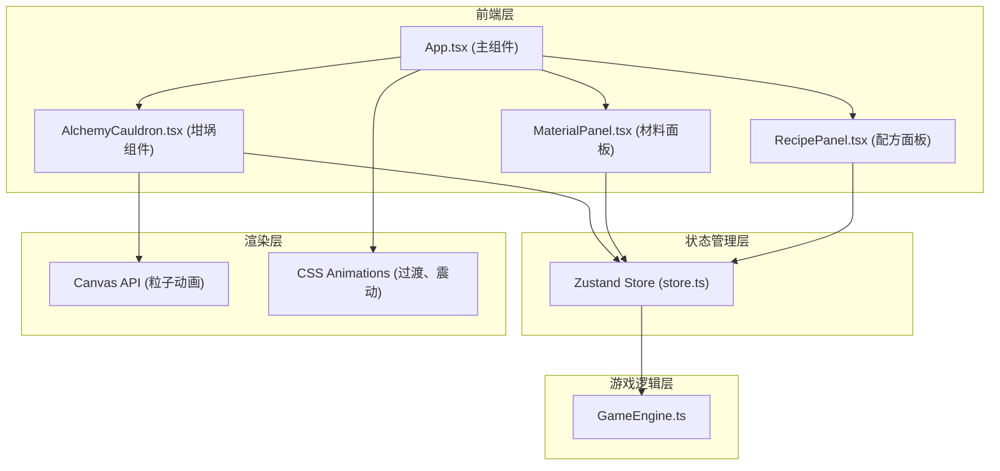

## 1. 架构设计



## 2. 技术说明

- **前端框架**: React@18 + TypeScript
- **构建工具**: Vite@5 + @vitejs/plugin-react
- **状态管理**: Zustand@4
- **路径别名**: @/ 映射到 src/
- **初始化方式**: Vite react-ts 模板
- **后端**: 无（纯前端应用，游戏数据内置）

## 3. 文件结构

| 文件路径 | 说明 |
|---------|------|
| package.json | 项目依赖与脚本配置 |
| vite.config.js | Vite构建配置，路径别名设置 |
| tsconfig.json | TypeScript严格模式配置 |
| index.html | 入口HTML，标题：炼金术模拟器 |
| src/GameEngine.ts | 游戏引擎：材料/配方数据、匹配算法、反应状态机 |
| src/App.tsx | 主组件：组合子组件、事件分发 |
| src/AlchemyCauldron.tsx | 坩埚组件：Canvas粒子动画、颜色混合渲染 |
| src/MaterialPanel.tsx | 材料面板：16材料网格、选择状态管理 |
| src/RecipePanel.tsx | 配方面板：已选材料、日志滚动、解锁列表 |
| src/store.ts | Zustand全局状态管理 |

## 4. 数据模型

### 4.1 材料类型定义
```typescript
interface Material {
  id: string;
  name: string;
  icon: string;      // Unicode字符或CSS类名
  color: {           // HSL颜色空间
    h: number;       // 色相 0-360
    s: number;       // 饱和度 0-100
    l: number;       // 亮度 0-100
  };
  property: string;  // 属性描述
}
```

### 4.2 配方类型定义
```typescript
interface Recipe {
  id: string;
  name: string;
  description: string;
  materials: string[];    // 需要的材料ID数组
  themeColor: {           // 主题色（成功粒子喷泉使用）
    h: number;
    s: number;
    l: number;
  };
}
```

### 4.3 Store状态定义
```typescript
interface AlchemyState {
  selectedMaterials: Material[];
  reactionLog: ReactionLogEntry[];
  unlockedRecipes: Recipe[];
  cauldronState: {
    mixedColor: HSLColor;
    isShaking: boolean;
    successAnimation: boolean;
    currentRecipe: Recipe | null;
  };
  // Actions
  addMaterial: (materialId: string) => void;
  removeMaterial: (index: number) => void;
  clearReaction: () => void;
}
```

## 5. 核心算法

### 5.1 HSL颜色混合算法
- 每种材料按等权重混合HSL三个通道
- 色相H采用循环平均值计算（考虑0/360边界）
- 饱和度S和亮度L采用算术平均值

### 5.2 配方匹配算法
- 将选中材料ID数组排序后与配方要求的排序后数组比对
- 完全匹配即返回对应配方，否则返回null
- checkRecipe(selectedMaterials: string[]): Recipe | null

### 5.3 粒子系统
- **气泡粒子**：直径4-8px随机，补色+0.3透明度，上升速度20-40px/s
- **成功喷泉粒子**：约50个，配方主题色，喷射半径80px，1.5秒消散
- 使用requestAnimationFrame驱动，Canvas 2D渲染
