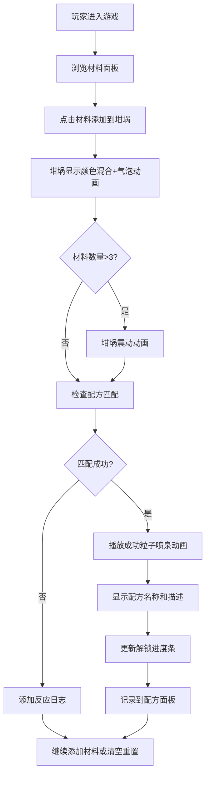

## 1. 产品概述
炼金术模拟器是一款在浏览器中运行的互动式游戏应用，让玩家体验古代炼金术士合成配方与魔法药剂调配的乐趣。通过视觉化的坩埚反应、材料颜色混合和粒子动画效果，解决传统回合制配方实验缺乏即时反馈和视觉表现的问题，让玩家能够直观地观察材料反应过程。

## 2. 核心功能

### 2.1 功能模块
1. **坩埚可视化区域**：中央圆形玻璃坩埚，实时展示材料颜色混合、气泡粒子上升、震动动画和配方成功粒子喷泉
2. **材料选择面板**：左侧16种基础材料网格，支持选择/取消选择、悬停提示和选中高亮
3. **配方与日志面板**：右侧显示已选材料列表、动态反应日志和已解锁配方
4. **进度条系统**：顶部显示配方解锁进度

### 2.2 页面详情
| 页面名称 | 模块名称 | 功能描述 |
|-----------|-------------|---------------------|
| 主页面 | 坩埚区域 | HSL颜色混合、气泡粒子、震动动画、成功粒子喷泉 |
| 主页面 | 材料面板 | 2列16材料网格、悬停放大、属性提示、选中发光 |
| 主页面 | 配方面板 | 已选材料列表（可删除）、动态滚动日志、已解锁配方 |
| 主页面 | 进度条 | 配方解锁进度可视化、实时文本显示 |

## 3. 核心流程
玩家从材料面板选择材料添加到坩埚 → 坩埚实时显示颜色混合和气泡动画 → 系统自动检查配方匹配 → 匹配成功播放粒子喷泉并解锁配方 → 进度条更新显示解锁进度

## 4. 用户界面设计

### 4.1 设计风格
- **主色调**：深色复古羊皮纸风格
  - 主背景：#2B1B17
  - 容器背景：#3E2723
  - 文字颜色：#D7CCC8
  - 按钮颜色：#6D4C41（悬浮：#5D4037）
  - 坩埚渐变：#8D6E63 到 #4E342E
  - 成功绿色：#A5D6A7
  - 失败红色：#EF9A9A
  - 警告黄色：#FFF9C4
  - 高亮金色：#FFD54F
- **布局**：三栏布局（左材料面板 - 中坩埚 - 右配方面板）
- **动画**：所有交互元素0.3s ease过渡，粒子动画使用Canvas + requestAnimationFrame
- **字体**：使用具有中世纪炼金术风格的衬线字体

### 4.2 页面设计概述
| 页面名称 | 模块名称 | UI元素 |
|-----------|-------------|-------------|
| 主页面 | 坩埚区域 | 圆形径向渐变、边缘高光、Canvas粒子层、震动动画 |
| 主页面 | 材料面板 | 圆角12px卡片、2列网格、40x40图标、悬停放大1.05倍、外发光选中效果 |
| 主页面 | 配方面板 | 圆角12px容器、材料列表（带×删除按钮）、最大高度240px滚动日志区 |
| 主页面 | 进度条 | 居中60%宽度、12px高度、0.5s填充过渡动画 |

### 4.3 响应式设计
- **桌面端（>768px）**：三栏水平布局
- **移动端（≤768px）**：上下布局（材料面板在上 - 坩埚居中 - 配方面板在下）
- **触控优化**：材料卡片点击区域≥44x44px

### 4.4 性能要求
- 粒子动画保持30FPS以上
- 状态更新响应时间≤200ms
- 使用requestAnimationFrame管理动画循环
