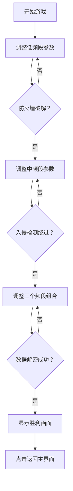

## 1. 产品概述

光谱入侵是一款基于光谱能量调制的黑客入侵模拟游戏，玩家扮演网络渗透者，通过调整不同频段的能量波来破解安全系统、绕过防火墙并窃取数据。

- 目标用户：对网络安全和黑客文化感兴趣的玩家
- 产品价值：提供沉浸式的黑客模拟体验，融合策略性和实时操作的游戏玩法

## 2. 核心功能

### 2.1 用户角色

| 角色 | 注册方式 | 核心权限 |
|------|----------|----------|
| 玩家 | 无需注册，直接进入 | 完整游戏体验，调整频段参数，破解安全系统 |

### 2.2 功能模块

1. **控制面板**：频段滑块控制、波形预览显示
2. **安全系统状态面板**：三层防御状态显示、安全阈值范围指示
3. **日志面板**：警报日志实时显示、破解记录
4. **频谱引擎**：能量波生成、频谱分析、威胁评分计算
5. **安全模块**：防火墙模拟、入侵检测、数据加密解密

### 2.3 页面详情

| 页面名称 | 模块名称 | 功能描述 |
|----------|----------|----------|
| 主游戏界面 | 控制面板 | 三个频段（低/中/高频）强度和相位滑块，实时波形Canvas绘制 |
| 主游戏界面 | 状态显示 | 三层防御状态、威胁评分、警报信息、破解成功动画 |
| 主游戏界面 | 日志面板 | 实时警报日志、系统事件记录 |
| 胜利界面 | 结果展示 | 渗透成功提示、用时统计、破解次数统计 |

## 3. 核心流程

玩家进入游戏 → 调整低频段能量至3-7Hz并保持2秒破解防火墙 → 调整中频段能量至20-40Hz且相位差45度保持1.5秒绕过入侵检测 → 同时激活三个频段特定组合保持3秒解密数据 → 破解所有三层防御 → 显示胜利画面

## 4. 用户界面设计

### 4.1 设计风格
- 主背景色：#0A0F1A（深蓝黑）
- 容器背景：#1A2332（深蓝灰）
- 卡片背景：#252E3E（蓝灰色）
- 强调色：#00FF88（霓虹绿）、#00BFFF（亮蓝）、#FFD700（金色）
- 警示色：#FF4444（红色）
- 按钮样式：圆角8px，背景色过渡动画0.2s
- 字体：标题使用宋体，正文使用等宽字体
- 布局风格：三栏布局（左控制面板、中状态面板、右日志面板）

### 4.2 页面设计概述

| 页面名称 | 模块名称 | UI元素 |
|----------|----------|--------|
| 主游戏界面 | 标题栏 | 高度56px，"光谱入侵 - v1.0" 霓虹绿色，宋体16px |
| 主游戏界面 | 控制面板 | 三个频段滑块（宽度16px，轨道#1A1A2E，滑块#00FF88，悬浮发光），Canvas波形图和频谱柱状图 |
| 主游戏界面 | 状态面板 | 三层防御状态卡片，安全阈值范围指示，绿色脉冲破解成功动画 |
| 主游戏界面 | 日志面板 | 背景#1A1A2E，红色警报文字#FF4444，行高24px |
| 胜利界面 | 结果展示 | 全屏黑色半透明覆盖，金色"渗透成功"缩放动画，统计信息 |

### 4.3 响应式设计
- 桌面端（≥768px）：三栏横向布局，左栏280px，右栏240px，中间自适应
- 移动端（<768px）：上下纵向布局，控制面板在上，状态面板在中，日志在下，各占33%高度

### 4.4 动画效果
- 波形移动：0.5px/帧，60fps刷新率
- 滑块悬浮：外发光#00FF8850
- 破解成功：绿色脉冲动画，文字淡出效果
- 警报触发：红色闪烁边框，1秒持续，3秒间隔
- 胜利画面：缩放动画从0.5到1
