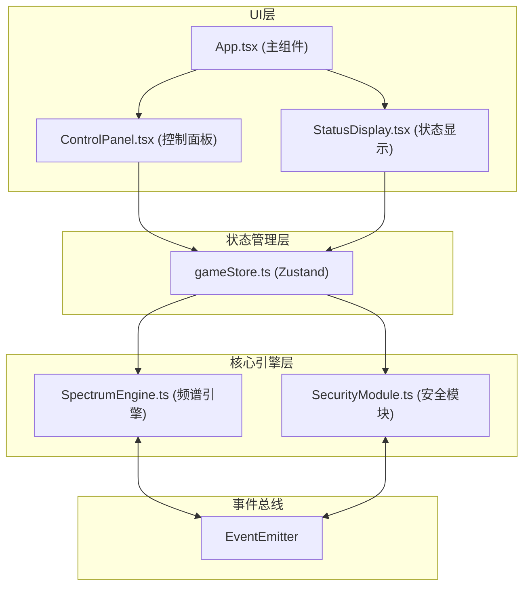

## 1. 架构设计



## 2. 技术描述

- **前端框架**：React 18 + TypeScript
- **构建工具**：Vite 5
- **状态管理**：Zustand
- **核心依赖**：react, react-dom, typescript, vite, @vitejs/plugin-react, zustand
- **初始化方式**：手动配置项目结构，不使用脚手架
- **后端**：无后端，纯前端游戏应用

## 3. 文件结构

| 文件路径 | 用途 |
|----------|------|
| package.json | 项目依赖和脚本配置 |
| vite.config.js | Vite构建配置，支持TypeScript |
| tsconfig.json | TypeScript严格模式配置 |
| index.html | 入口页面，标题"光谱入侵" |
| src/SpectrumEngine.ts | 能量波生成和频谱分析 |
| src/SecurityModule.ts | 安全系统模拟（防火墙、入侵检测、加密） |
| src/App.tsx | 主组件，组织UI布局和模块连接 |
| src/components/ControlPanel.tsx | 控制面板组件（频段滑块、波形显示） |
| src/components/StatusDisplay.tsx | 状态显示组件（安全状态、威胁评分、警报） |
| src/store/gameStore.ts | Zustand状态管理 |

## 4. 核心数据模型

### 4.1 频段参数
```typescript
interface BandParams {
  low: { frequency: number; intensity: number; phase: number };
  mid: { frequency: number; intensity: number; phase: number };
  high: { frequency: number; intensity: number; phase: number };
}
```

### 4.2 波形数据
```typescript
interface WaveformData {
  points: number[];
  spectrum: number[];
  threatScore: number;
}
```

### 4.3 安全状态
```typescript
interface SecurityStatus {
  firewall: { breached: boolean; progress: number; threshold: { min: number; max: number } };
  ids: { breached: boolean; progress: number; threshold: { min: number; max: number; phaseDiff: number } };
  encryption: { breached: boolean; progress: number; threshold: { bandCombination: string } };
  alertActive: boolean;
  alertLogs: string[];
}
```

### 4.4 游戏状态
```typescript
interface GameState {
  bandParams: BandParams;
  waveformData: WaveformData | null;
  securityStatus: SecurityStatus;
  gameTime: number;
  breachCount: number;
  gameWon: boolean;
  startTime: number;
}
```

## 5. 事件总线定义

### 5.1 事件类型
```typescript
enum EventType {
  WAVEFORM_UPDATED = 'waveform:updated',
  SECURITY_ALERT = 'security:alert',
  DEFENSE_BREACHED = 'defense:breached',
  PARAMS_CHANGED = 'params:changed',
  GAME_WON = 'game:won',
}
```

## 6. 性能优化策略

1. **Canvas渲染优化**：使用requestAnimationFrame，60fps刷新率，只重绘变化区域
2. **状态更新防抖**：滑块参数变化时使用防抖处理，避免频繁计算
3. **内存管理**：及时清理Canvas绘制上下文，避免内存泄漏
4. **动画优化**：使用CSS transform和opacity实现动画，避免重排重绘
5. **计算优化**：波形计算采用增量计算，减少重复运算
