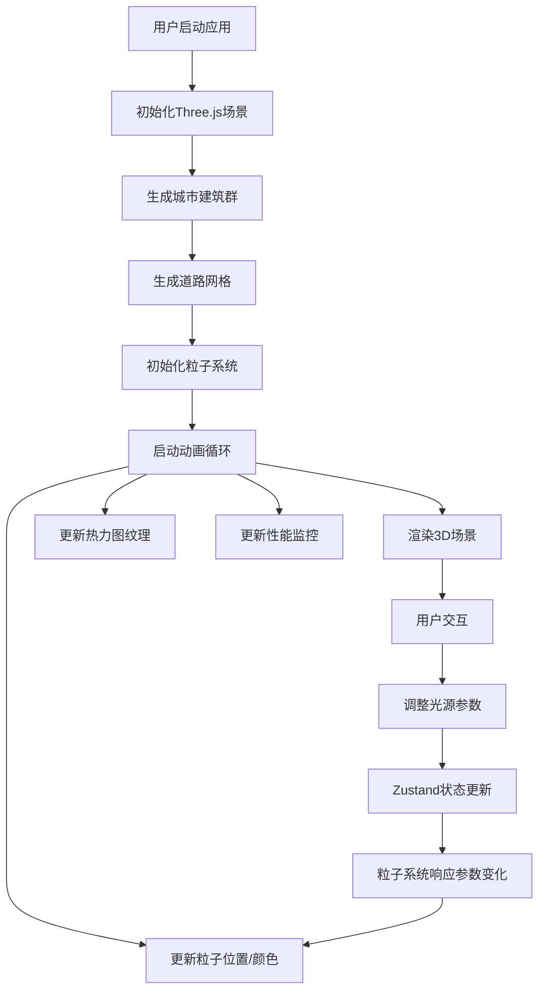

## 1. 产品概述

城市光污染粒子模拟器是一个基于WebGL的3D可视化应用，用于模拟城市上空光污染粒子的流动和扩散轨迹。通过可视化不同光源（建筑灯光、广告屏、路灯）对周围环境光照强度分布的影响，帮助用户理解光污染的传播规律。

- 主要目的：提供交互式3D环境，让用户直观观察城市光污染的扩散过程
- 解决问题：将抽象的光污染概念转化为可视化的粒子系统，便于研究和教学
- 目标用户：环境科学研究者、城市规划师、教育工作者

---

## 2. 核心功能

### 2.1 功能模块

1. **城市场景模块**：生成400-600个随机高度的建筑，带窗格纹理和随机亮灯效果，铺设网格道路
2. **粒子系统模块**：2000-3000个光粒子从光源发射，模拟光污染扩散，支持碰撞反弹和拖尾效果
3. **光源控制模块**：左侧控制面板调整三类光源的强度、色温、方向参数
4. **热力图模块**：16x16网格地面热力图实时显示光照强度分布
5. **性能监控模块**：左上角显示FPS和粒子数量

### 2.2 页面详情

| 页面名称 | 模块名称 | 功能描述 |
|---------|---------|----------|
| 主页面 | 3D城市场景 | 随机生成的建筑群、道路网格、可交互视角控制 |
| 主页面 | 粒子系统 | 光粒子发射、扩散、碰撞反弹、拖尾效果 |
| 主页面 | 光源控制面板 | 三个光源组的滑块控制（强度、色温、方向角） |
| 主页面 | 热力图图层 | 地面光照强度热力图实时渲染 |
| 主页面 | 性能监控器 | FPS计数器和粒子数量显示 |

---

## 3. 核心流程

---

## 4. 用户界面设计

### 4.1 设计风格

- **主色调**：深色科技蓝（背景#0A1128，地面#1A233A，UI组件#1E2733）
- **强调色**：蓝色光效（#2891FF），青色粒子（#00F0FF），热力图从深蓝#000080到亮红#FF0040
- **按钮/滑块**：圆角设计，悬停颜色渐变过渡0.2s，点击凹陷效果scale(0.95)
- **字体**：现代无衬线字体，白色文字，数字使用等宽字体
- **布局**：居中3D场景，左侧控制面板，左上角性能监控，右侧热力图覆盖

### 4.2 页面设计概述

| 页面名称 | 模块名称 | UI Elements |
|---------|---------|-------------|
| 主页面 | 3D城市场景 | 深色背景，方块建筑带半透明窗格，边缘微弱蓝光，道路深灰色网格，俯视视角，鼠标拖拽旋转（阻尼0.1），滚轮缩放（10-150单位） |
| 主页面 | 粒子系统 | 点精灵渲染，双层光晕（内2px外8px，透明度0.2），半透明拖尾线条留存0.5秒，末端渐变光晕 |
| 主页面 | 光源控制面板 | 半透明毛玻璃背景#1E2733CC，圆角12px，自定义滑块（轨道#4A5568，滑块#68D391，悬停#9AE6B4） |
| 主页面 | 热力图 | 16x16网格覆盖地面，颜色映射深蓝到亮红 |
| 主页面 | 性能监控 | 白色14px字体，背景#00000080，圆角4px，固定左上角 |

### 4.3 动画效果

- **场景加载**：建筑从地面升起动画（0.5秒easeOut），粒子系统淡入（0.3秒）
- **UI交互**：滑块悬停颜色过渡0.2s，点击凹陷效果scale(0.95)
- **粒子效果**：生命周期5-15秒，颜色从光源色渐变到环境色，碰撞反弹变色

### 4.4 响应式设计

- **桌面优先**：1920x1080和1440x900分辨率自适应
- **场景比例**：保持16:9宽高比
- **面板宽度**：左右面板不超过屏幕宽度的20%
- **元素适配**：所有UI组件按比例缩放，保证可用性

### 4.5 3D场景指导

- **环境**：深色背景，无天空盒，营造夜景氛围
- **光照**：环境光+方向光模拟月光，建筑自发光作为主要光源
- **相机**：透视相机，视角45度，近裁剪面0.1，远裁剪面500，俯视角度
- **控制器**：OrbitControls，阻尼0.1，旋转速度0.5，缩放范围10-150单位
- **后期处理**：轻微辉光效果增强粒子光晕
- **性能优化**：几何体合并，实例化渲染，粒子池管理，目标帧率60FPS

### 4.6 性能要求

- 粒子数量2000时：FPS ≥ 55
- 粒子数量3000时：FPS ≥ 40
- 建筑数量：400-600个
- 热力图更新：每帧重绘
